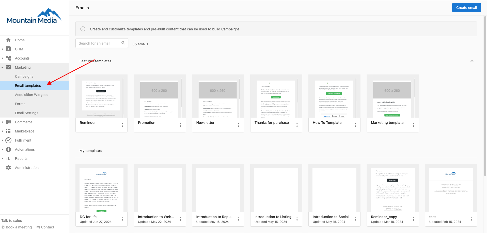
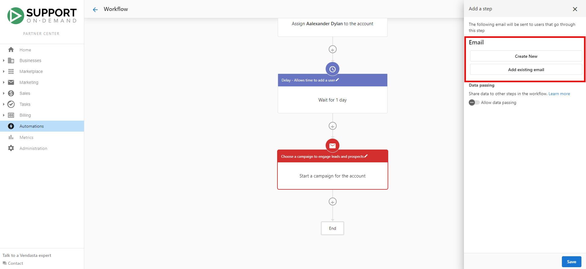

# Email Template Library: Streamline Your Email Campaigns

With the Email Template Library, you can now easily design, customize, and implement various email templates for your campaigns, enhancing your user experience and ensuring your emails resonate with your target audience.

## Getting Started with the Email Template Library

The Email Template Library offers several pre-made email templates designed to give you a quick and effective starting point. You can choose from a wide variety of templates and modify them as needed to align with your specific branding and messaging.

To access the Email Template Library:

1. Navigate to **Partner Center > Marketing > Emails Templates.**
2. From here, you'll find Featured templates and your personal templates. 
3. Click on any featured template to duplicate and customize. 
4. Click 'Save and Close' to save the template under 'My Templates.' 

## Using an Email Template

After selecting or creating a template, you can start customizing it. The template editor is user-friendly and gives you the flexibility to customize everything from the text and font to the color scheme, images, and more. You can also input your own HTML code if you're looking for a more tailored design.

Once you're satisfied with the design of your template, don't forget to save your changes. You can then incorporate these templates into your email campaigns or automation workflows.

## Incorporating Email Templates into Campaigns

To plug your newly created template into an email campaign:

1. Navigate to your email campaign.
2. Opt to add an existing email to the campaign.
3. From the library, search and select your desired template.

You can now deploy this campaign with your custom email template.

## Using Email Templates in Automations

Similarly, these templates can also be used in automation workflows. For instance, you can create an automation where a particular email (built from the template) is sent every time a new account is created.

To add your template into an automation:

1. Create or select an existing automation workflow.
2. Select the + button to add a step. Select 'Send email to user.'
3. You can then choose to either create a new email or add an existing one from the templates you've created.

Moreover, our new delay feature allows you to wait until a specific link within the email has been clicked, offering the ability to create more personalized user journeys.

## Keep in Mind

While the Email Template Library is a robust tool, there are a few things to keep in mind:

1. As of now, there is no functionality to send a single email outside of a campaign or an automation workflow. You can't send an email template directly to a user, it needs to be part of a campaign or an automation.
2. Email campaigns and email templates in automation workflows don't intersect. Emails sent from a campaign won't trigger an automation and vice versa.
3. If the same email is sent multiple times from the same or different automations, it may result in the email being marked as spam. Instead of reusing the same email multiple times, consider using a notification step.

Feel free to experiment and explore the new Email Template Library, and create stunning emails that captivate your users. If you have any questions, please reach out to our support team. Happy emailing!