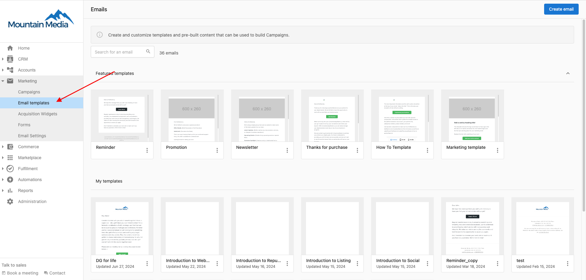
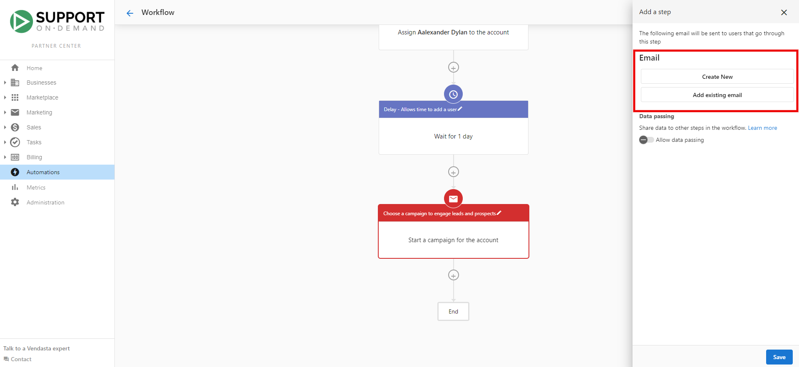

The Email Template Library lets you design, customize, and use email templates in your campaigns and automations. Choose from featured templates, save your own under `My Templates`, and use them in email campaigns or automation workflows.

## Getting started with the Email Template Library

The library offers pre-made templates you can duplicate and customize for your branding and messaging.

To access the Email Template Library:

1. Go to `Partner Center` → `Marketing` → `Email Templates`.
2. You'll see `Featured templates` and `My Templates`.
3. Click a featured template to duplicate and customize it.
4. Click `Save and Close` to save the template under `My Templates`.

## Using an email template

After selecting or creating a template, use the template editor to customize text, fonts, colors, images, and more. You can also add your own HTML for a custom design. Save your changes, then use the template in email campaigns or automation workflows.

## Incorporating email templates into campaigns

To use a template in an email campaign:

1. Open your email campaign.
2. Choose to add an existing email to the campaign.
3. From the library, search for and select your template.

You can then deploy the campaign with that template.

## Using email templates in automations

Templates can be used in automation workflows, for example, send an email (from a template) when a new account is created.

To add a template to an automation:

1. Create or open an automation workflow.
2. Click `+` to add a step and select `Send email to user`.
3. Create a new email or add an existing one from your templates.

You can also use the delay feature to wait until a specific link in the email is clicked, for more personalized journeys.

## Keep in mind

- **No standalone sends** – You can't send a single email outside a campaign or automation. Templates must be used inside a campaign or automation.
- **Campaigns and automations are separate** – Emails sent from a campaign don't trigger automations, and vice versa.
- **Reuse and spam** – Sending the same email multiple times from one or more automations can lead to spam flags. Prefer a notification step or different emails instead of reusing the same one.
