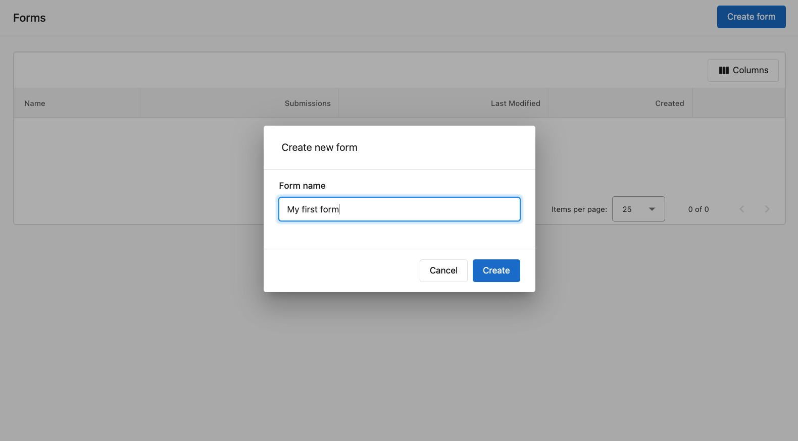
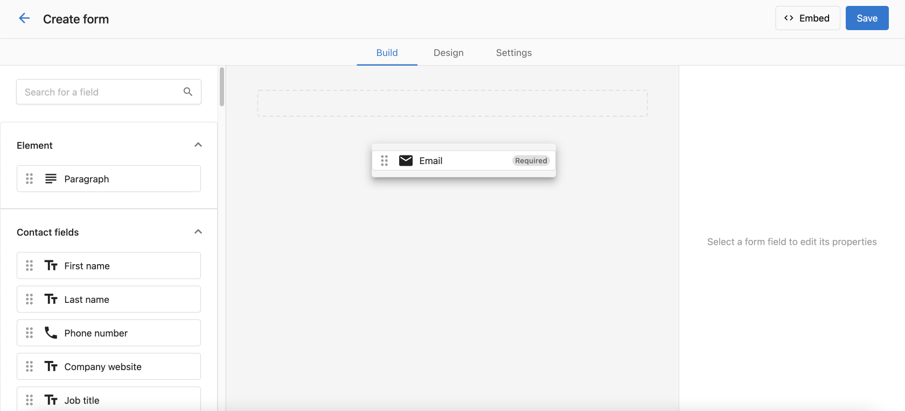
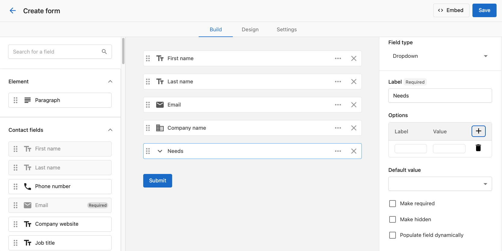
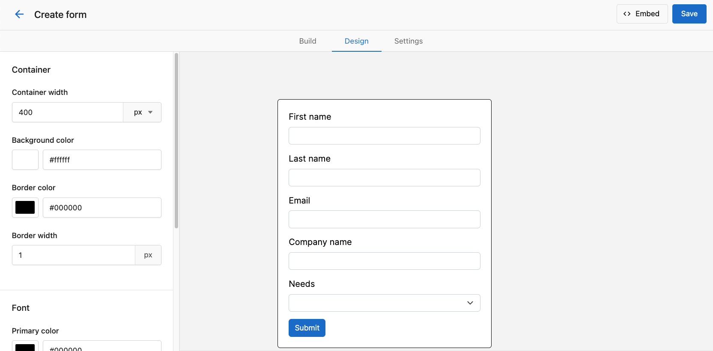
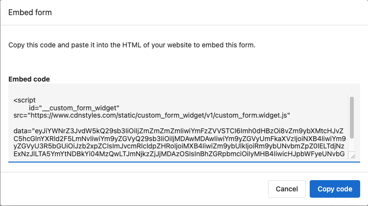
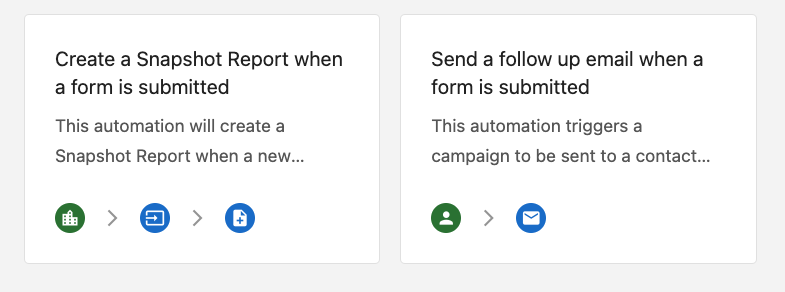
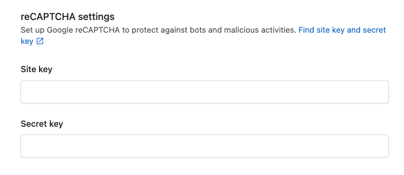

# Create a Form

Learn how to create lead capture forms for your website in Marketing Forms.

## Overview

Marketing Forms allows you to create lead capture forms to embed on your website. Forms can be used to collect prospect information, generate leads, and engage with your audience.

## Create a Form

To create a form, follow these steps:

1. Navigate to **Marketing** > **Forms**
2. Click **Create Form**
3. Enter a name for your form
4. Select a form type from the options
5. Click **Create**

## Add Form Fields

After creating your form, you can add and customize fields:

1. Click **Add Field**
2. Select a field type from the options:
   - First Name
   - Last Name
   - Email
   - Phone
   - Company
   - Text
   - Dropdown
   - Multi-select
   - Checkbox
   - Date
   - Time
   - File Upload
   - Hidden Field

## Customize Field Properties

After adding a field, you can customize its properties:

1. Click the field to open the properties panel
2. Modify the following settings:
   - Field Label
   - Placeholder Text
   - Required field (toggle on/off)
   - Field validation options
   - Default values
   - Help text

## Form Styling

Customize the appearance of your form:

1. Click the **Style** tab
2. Customize the following elements:
   - Form width
   - Background color
   - Border radius
   - Field styles
   - Button colors and text
   - Font styles

## Embedding Your Form

Once your form is complete, you can embed it on your website:

1. Click the **Embed** tab
2. Choose an embed option:
   - **JavaScript Embed**: Copy the JavaScript code to add to your website
   - **iFrame Embed**: Copy the iFrame code for platforms that don't support JavaScript
   - **Direct Link**: Share a direct link to the form

## Form Automations

Set up automations for when someone submits your form:

1. Click the **Automations** tab
2. Configure actions such as:
   - Send email notifications
   - Add contact to a specific list
   - Assign to a team member
   - Trigger a workflow

## reCAPTCHA Protection

Protect your forms from spam submissions:

1. Click the **Settings** tab
2. Toggle on **Enable reCAPTCHA**
3. Choose between invisible reCAPTCHA or checkbox verification

## Best Practices

- Keep forms short and only ask for essential information
- Use clear labels and helpful placeholder text
- Make sure required fields are clearly marked
- Test your form before embedding it on your website
- Review form analytics to optimize conversion rates

## Next Steps

- Learn about [Form Analytics](/marketing/forms/form-analytics)
- Explore [Advanced Form Features](/marketing/forms/advanced-features)