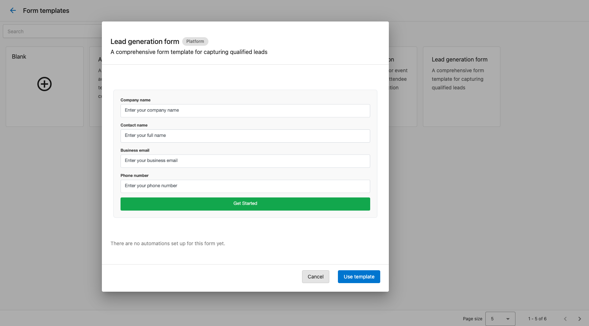
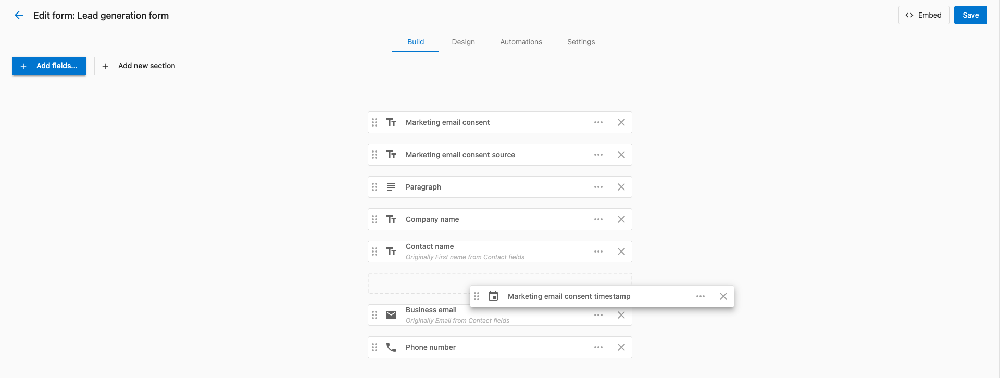
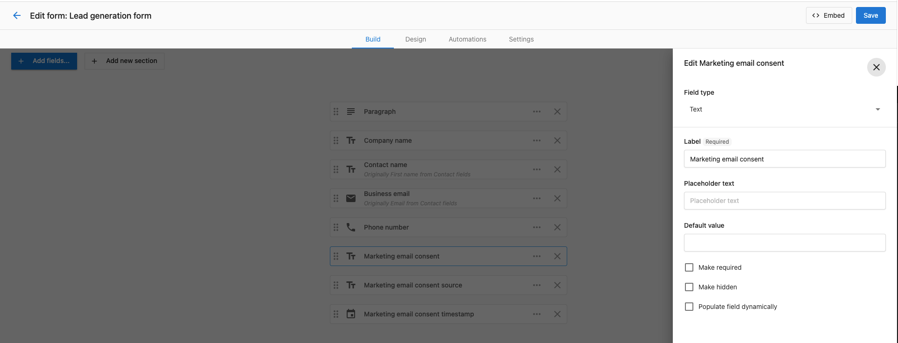
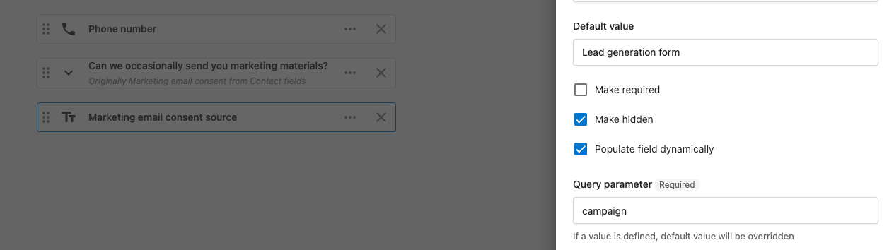
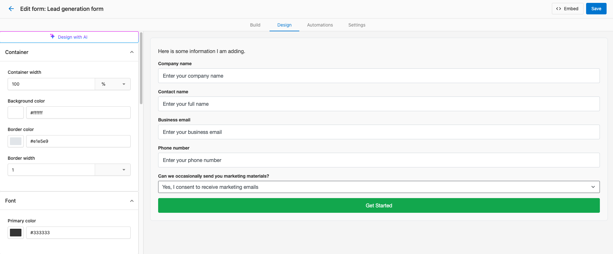
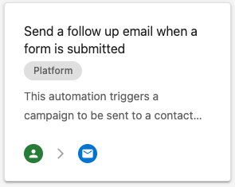
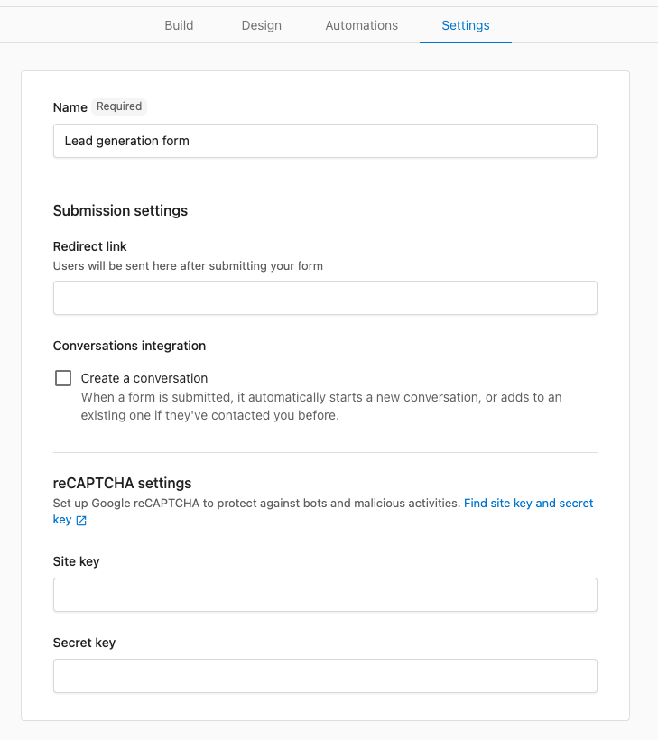
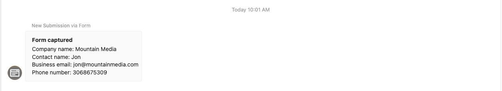

This tutorial will walk you through creating a high-converting lead generation form based on the Lead generation template. You will customize fields, optionally add a file upload, organize with sections, style with AI, connect automations, and publish.

## Step 1 — Start from the Lead generation template

1. Navigate to **Marketing** > **Forms**
2. Click **Create form**
3. Select the **Lead generation** template and click **Use template**



The lead generation template includes four fields by default: 
- Company Name
- Contact Name
- Business Email
- Phone Number

These fields will be used to automatically create a new contact and company record in the CRM with the information provided by the visitor.

## Step 2 — Add and organize additional fields to your form

You can add more fields to your form to capture more information from your visitor by clicking **Add Field** and selecting the field type you need.

- **Element** fields allow you to add information to the form that a user can see, but not interact with. These are useful for adding a description or instructions to your form.
- **Contact** fields are fields that will be linked to the Contact record in the CRM. These are useful for capturing information about the contact who is filling out the form.
- **Company** fields are fields that will be linked to the Company record in the CRM. These are useful for capturing information about the company who is filling out the form.
- **Generic** fields are fields that are not linked to a specific record in the CRM. These are useful for capturing information that is not related to a contact or company.


For this lead generation form, we are going to get consent from the visitor to send them more emails by adding the Contact fields **Marketing email consent** and **Marketing email consent source**.

Move the marketing consent fields to the bottom of the form by clicking and dragging them below the other fields. These types of consent fields are typically placed at the bottom of the form so that a user has filled out the other fields and is more likely to consent to receive more emails.



## Step 3 — Customize field properties

Once your fields are in place, you can customize how they behave and appear using field properties. Field properties control display options, default values, dynamic behaviors, and the information that gets captured when the form is submitted.



### Creating a dropdown field on forms

Click on the **Marketing email consent** field to open the properties panel. Click on the **Field type** dropdown and change the field type from `Text` to `Dropdown`. This will make it so the user can only select from one of our pre-defined options: `Yes` or `No`.


The **label** field is what will be displayed above the dropdown. For our field it will make sense to frame it as a question like: "Would you like to receive more emails from us?"


Click the + button to add a new option to the dropdown. Here, the **label** field is what will be displayed to the user as an option when they are filling out the form and the **value** field is what will be captured when the form is submitted. Add the options `Yes` and `No`.

Finally, set the default value to the `Yes` option that was created. This helps us ensure that the user is opted in to receive more emails by default.


### Hiding form fields 

Adding a hidden field to your form allows you to capture information that is not displayed to the user, but is still useful for your business, like knowing the source of the form submission. In this case, we will use a hidden field to set our consent source to the form name.


Click on **Marketing email consent source** to open the properties panel and check off the box **Make hidden** to hide this field from the user. Enter the name of the form as the **Default value** for the field so that the value is automatically set in the CRM when the form is submitted.

### Dynamically filling form fields

Form fields can be dynamically filled with the information from the URL using query parameters. Combined with hidden fields, this can be used to capture information about the source of the form submission. 

For example, if you have a form that is put on a link like this: ```https://www.example.com/form?campaign=spring-promotion```, the value of the `campaign` query parameter will be captured and set on any field that has the **Populate field dynamically** option checked and the query parameter `campaign` selected.

:::info UTM parameters automatically captured by Forms
Forms automatically capture common UTM parameters like `utm_source`, `utm_medium`, `utm_campaign`, `utm_content`, and `utm_term`. If you don't need to store these on other fields, you can rely on this automatic capture and skip adding extra hidden fields for UTMs.
:::



Click on the **Marketing email consent source** field to open the properties panel and check off the box  **Populate field dynamically** to enable this feature. Type in the query parameter `campaign` into the input box.

Now, whenever someone consents to receive more emails, the CRM will automatically update to show if they came from a specific campaign. This lets us know which campaigns are specifically driving more sign-ups to our email list.

For more detailed information on tracking form submissions, see [Track form submissions in GA4](./tracking-form-submissions-ga4.mdx).
:::

## Step 4 — Match your form design to your website

You can customize the appearance of the form to match your website's design and branding by clicking the **Design** tab. Simple changes like the form width and colors can be made using the interactive controls inside of the **Design** tab and will be reflected in the preview on the right.



More complex changes to other elements can be made by using the **Custom CSS** field visible in the **Design** tab. CSS code can be used to style virtually any element of the form to make it look exactly how you want it to look. 


Make note of the CSS class names used from our template that are used to style the form elements. These will be used to target specific elements when styling the form with CSS and are a good starting point for your own CSS code.

### Design and style your form with AI

If you are not familiar with CSS or it takes you a while to get the desired look and feel of your form, you can use our Design with AI feature to generate a starting point for your CSS code!


1. Go to the **Design** tab
2. Click **Design with AI**
3. Upload an image (for example, your website) and add a prompt with specific instructions if needed (for example, "A modern, clean form design with contact name and business email on the same row")
4. Review the generated CSS and fine-tune under **Custom CSS**


Give AI a screenshot of your website and ask it to style the form to match your website's design and branding with any additional formatting or styling you need. The CSS code will automatically be generated and present when you embed the form on your website later.

## Step 5 — Configure form automations

Automations can be used to trigger actions when a form is submitted. For example, you can send an email notification to a team member, add the contact to a specific list, assign the contact to a team member, or trigger a workflow.

While you can build your own automations from scratch, there are a few pre-built templates that you can use to get started quickly. Click on the automations tab and select the template "Send a follow up email when a form is submitted" and click **Use template**.


:::tip Automation trigger types for templates
Forms can either trigger an automation for a **contact** or a **company**. The green icon in an automation template lets you know which type of record the automation will be triggered for.


:::

You will see an error message when you select the template. This automation template requires you to choose an email campaign that will be sent to the contact when the form is submitted. Choose an existing campaign from the dropdown and then click **Save automation**.


:::tip Building campaigns for form automations
If you do not have an appropriate campaign created, you can save the automation and come back later. For more information on creating email templates for campaigns and automations, see [Create marketing emails](../campaigns/create-email-campaigns.mdx) to get started.
:::

:::info Building more complex automations for forms
You can edit existing form automation templates by using the **Advanced mode** toggle in Forms. The automation builder provides you many more actions and conditional logic you can use to build more complex automations for forms. 

For more information on building automations with the automation builder, see [Creating and configuring automations](../../automations/creating-and-configuring-automations.mdx).
:::

## Step 6 — Form submission settings and publishing

With the majority of the form setup complete, you can now configure the form settings and publish it to your website. These aren't directly related to how the form looks itself or the information it captures, but are important for how the form behaves and is used.



The **Redirect link** field lets you send users to another URL after they submit a form. Set this to an appropriate URL if you have one. If you leave this field blank, the user will get a confirmation message after they submit the form. 

The **Conversations integration** makes every new form submission appear as either a new conversation or a new message for an existing conversation. This is a great way to see form submissions as part of the holistic conversation history for a contact or company. Check the box next to **Create a conversation** if it is not already turned on.



:::tip Stopping spam submissions from forms
You can protect your forms from spam submissions by enabling reCAPTCHA. This will require users to complete a CAPTCHA challenge before they can submit the form. While this is important, it requires some additional setup and configuration.

For more information on enabling reCAPTCHA, see [reCAPTCHA key configuration](./recaptcha-key.mdx).
:::

Click on the `Embed` button to view the code you need to embed the form on your website. You can copy the code and paste it into your website's HTML code to embed the form.


## Step 7 — Test your form

Before turning your form live, you should test it to make sure it is working as expected. For this tutorial form that means:

- Submit a test lead and verify the contact/company are created
- Check that the automation sends a campaign as expected
- Verify that a conversation is created as expected

Once these steps are complete, you can turn your form live and start capturing leads!

:::tip Testing embed code for forms
You don't have to paste your form embed code into your website to test it! There are many great websites that allow you to test HTML code very simply and quickly. Some examples include:
- [CodePen](https://codepen.io/)
- [JSFiddle](https://jsfiddle.net/)
- [W3Schools](https://www.w3schools.com/html/html_examples.asp)
:::

## Frequently asked questions

<details>
<summary>Can I create forms without using templates?</summary>

Yes! While templates provide a quick starting point, you can create a blank form from scratch. Go to **Marketing > Forms** and click **Create form** to start with a completely empty form and build it exactly as you need.

</details>

<details>
<summary>How do I make my form mobile-responsive?</summary>

Forms are automatically mobile-responsive by default and the AI design assistant can help ensure your form looks great on all devices. Test your form on different screen sizes using your browser's developer tools.

</details>

<details>
<summary>Can I integrate forms with other platforms?</summary>

Yes! Forms can integrate with various platforms through automations and webhooks. For example, you can send form data to CRMs, marketing automation tools, or custom applications. Check the [Automations documentation](../../automations/index.mdx) for tips on how to build integrations with other systems.

</details>

<details>
<summary>How do I prevent spam submissions?</summary>

Enable reCAPTCHA protection in the form settings to prevent automated spam. You can choose between visible checkbox verification or invisible protection. See [reCAPTCHA key configuration](./recaptcha-key.mdx) for setup instructions.

</details>
