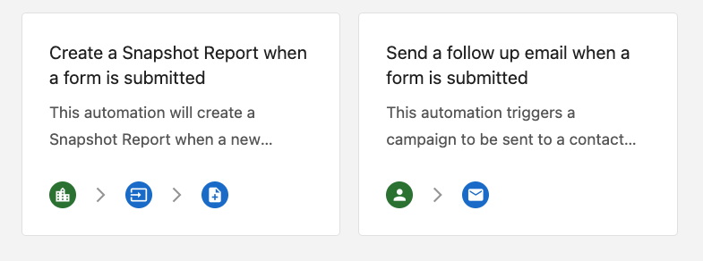
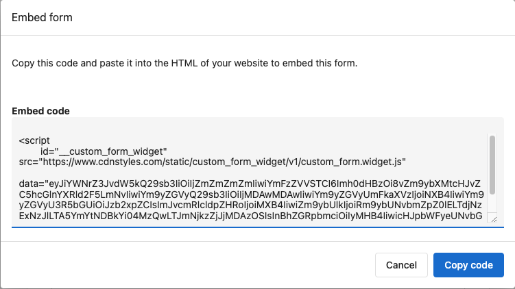
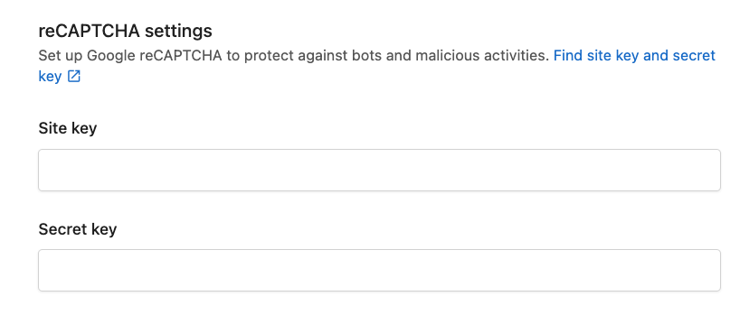

This tutorial will walk you creating a high-converting lead generation form based on the Lead generation template. You will customize fields, optionally add a file upload, organize with sections, style with AI, connect automations, and publish.

## Step 1 — Start from the Lead generation template

1. Navigate to **Marketing** > **Forms**
2. Click **Create form**
3. Select the **Lead generation** template and click **Use template**

The lead generation template includes four fields by default: 
- Company Name
- Contact Name
- Business Email
- Phone Number

These fields will be used to automaticaly create a new contact and company record in the CRM with the information provided by the visitor.

## Step 2 — Add additional fields to your form

You can add more fields to your form to capture more information from your visitor by clicking **Add Field** and selecting the field type you need.

- **Element** fields allow you to add information to the form that a user can see, but not interact with. These are useful for adding a description or instructions to your form.
- **Contact** fields are fields that will be linked to the Contact record in the CRM. These are useful for capturing information about the contact who is filling out the form.
- **Company** fields are fields that will be linked to the Company record in the CRM. These are useful for capturing information about the company who is filling out the form.
- **Generic** fields are fields that are not linked to a specific record in the CRM. These are useful for capturing information that is not related to a contact or company.

For this lead generation form, we are going to get consent from the visitor to send them more emails by adding the Contact fields **Marketing email consent** and **Marketing email consent source.

Move the Marketing consent fields to the bottom of the form by clicking and dragging them below the other fields. These types of consent fields are typically placed at the bottom of the form so that a user has filled out the other fields and is more likely to consent to receive more emails.

## Step 3 — Customize field properties

After adding a field, you can customize its properties. These properties impact the way a field is displayed (or not!) and the information that gets captured when the form is submitted.

### Creating a dropdown field on forms

Click on the **Marketing email consent** form to open the properties panel. Click on the **Field type** dropdown and change the field type from `Text` to `Dropdown`. This will make it so the user can only select from one of our pre-defined options: `Yes` or `No`.

The **label** field is what will be displayed above the dropdown. For our field it will make sense to frame it as a question like: "Would you like to receive more emails from us?"

Click the + button to add a new option to the dropdown. Here, the **label** field is what will be displayed to the user as an option when they are filling out the form and the **value** field is what will be captured when the form is submitted. Add the options `Yes` and `No`.

Finally, set the default value to the `Yes` option that was created. This helps us ensure that the user is opted in to receive more emails by default.

### Hiding form fields 

Adding a hidden field to your form allows you to capture information that is not displayed to the user, but is still useful for your business, like knowing the source of the form submission. In this case, we will use a hidden field to set our consent source to the form name.

Click on **Marketing email consent source** to open the properties panel and check off the box  **Make hidden** to hide this field from the user. Enter the name of the form as the **Default value** for the field so that the value is automatically set in the CRM when the form is submitted.

## Step 4 — Style your form

You can customize the appearance of match your website's design and branding by clicking the **Design** tab. Simple changes to things like the form width and colors can be made using the interactive controls. More complex changes to other elements can be made by using the **Custom CSS** field,

### Design form with AI

1. Go to the **Design** tab
2. Click **Design with AI**
3. Upload an image (for example, your website) and add a prompt (for example, “Match form design to my website”)
4. Add specific instructions if needed (for example, “Put first and last name on the same row”)
5. Review the generated CSS and fine-tune under **Custom CSS**

## Step 5 — Configure automations

Set up automations for when someone submits your form:

1. Click the **Automations** tab
2. Configure actions such as:
   - Send email notifications
   - Add contact to a specific list
   - Assign to a team member
   - Trigger a workflow

:::tip
From the linked automation, you can assign an owner, activate products, or notify team members. Toggle the automation on when ready.
:::

## Step 6 — Publish your form

Once your form is complete, you can embed it on your website:

1. Click the **Embed** tab
2. Choose an embed option:
   - **JavaScript Embed**: Copy the JavaScript code to add to your website
   - **iFrame Embed**: Copy the iFrame code for platforms that don't support JavaScript
   - **Direct Link**: Share a direct link to the form

## Step 7 — Test your form

- Submit a test lead and verify the contact/company are created
- Check that automations run as expected (campaigns, notifications, ownership)
- If using File upload, confirm the file appears on the CRM record with an AI summary

## reCAPTCHA protection

Protect your forms from spam submissions:

1. Click the **Settings** tab
2. Toggle on **Enable reCAPTCHA**
3. Choose between invisible reCAPTCHA or checkbox verification

## Best practices

- Keep forms short and only ask for essential information
- Use clear labels and helpful placeholder text
- Make sure required fields are clearly marked
- Test your form before embedding it on your website
- Review form analytics to optimize conversion rates

 