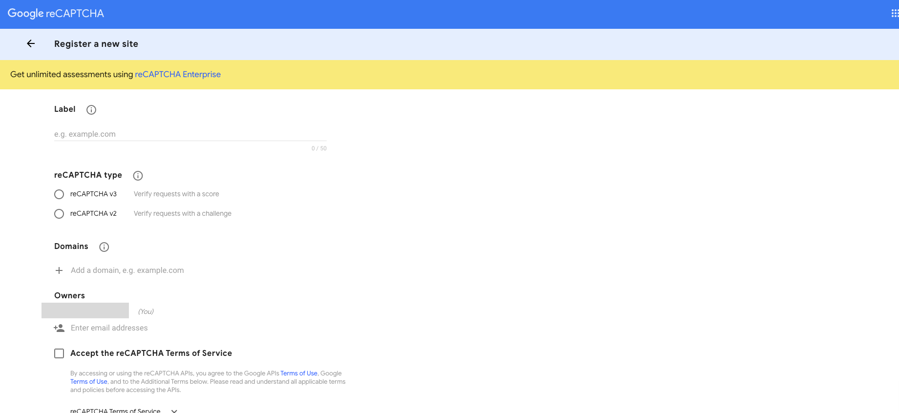
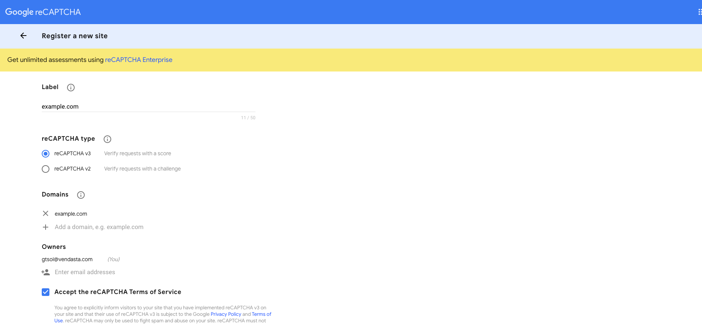
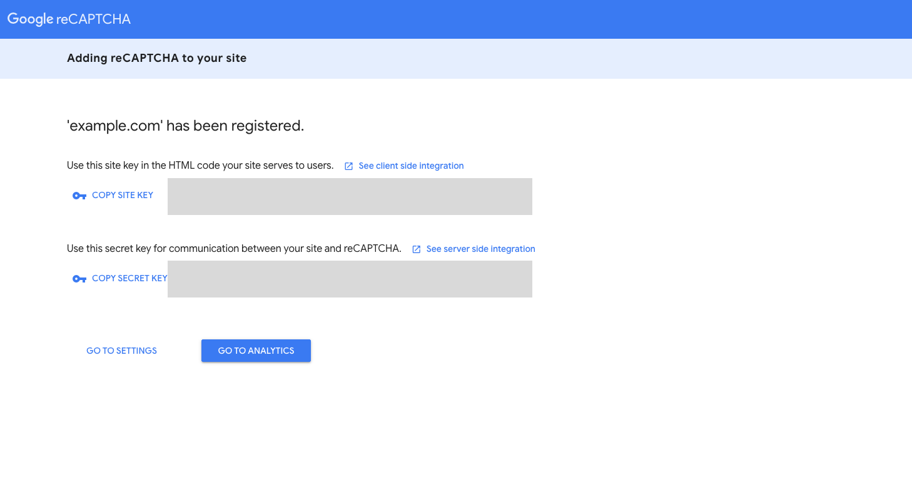

### **What is reCAPTCHA?**

[Google reCAPTCHA](https://google.com/recaptcha) stops spammers and bots from submitting the form.

Google's reCAPTCHA prompts visitors to check a box to prove they are human before submitting their results. Sometimes, they are prompted to complete another task (e.g, identifying a series of letters). reCAPTCHA makes it difficult for bots to automate form submissions.

### **How to get the Site Key and Secret Key**

**Step 1:** Go to [https://google.com/recaptcha/admin/create](https://google.com/recaptcha/admin/create)

**Step 2**: In your Google reCAPTCHA admin panel, you should see the 'Register a new site' screen by default (if you already have reCAPTCHA site(s) set up, click on the Create icon (+) on the top-right).

- **Label:** Enter the name of your site
- **reCAPTCHA type:** Choose "reCAPTCHA v3"
- **Domains:** Add the domain(s) that you intend to put the form on
- **Accept the reCAPTCHA Terms of Service**: Make sure to accept the terms and mark the checkbox, then click Submit.

**Step 3:** You should then be able to see the 'Adding reCAPTCHA to your site' screen. Copy and paste the Site Key and Secret Key values into the form builder. Then click the 'Save ReCAPTCHA' button below the fields, and then click the 'Save Changes' button at the top-right of the screen.

**Step 4:** Make sure to test your embed form to ensure that you see the reCAPTCHA in place and that there are no errors that can prevent new visitors from signing up.