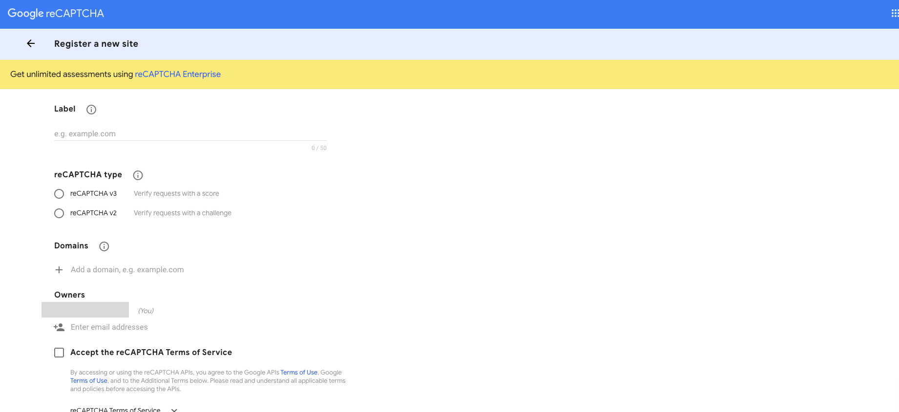
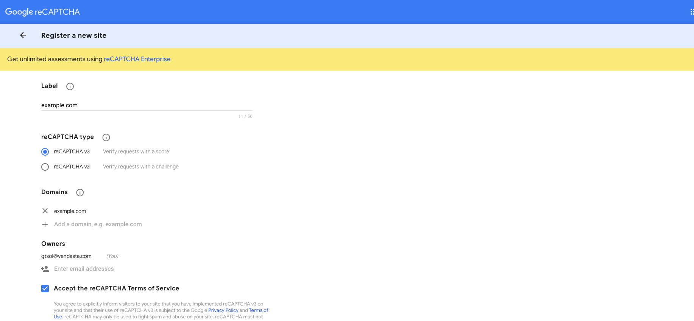
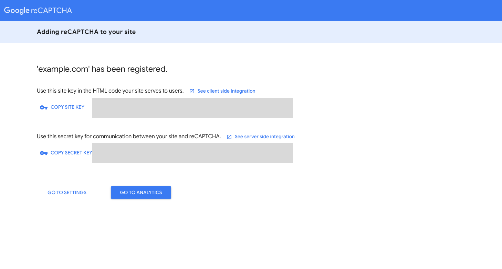

## What is reCAPTCHA?

[Google reCAPTCHA](https://google.com/recaptcha) stops spammers and bots from submitting the form.

Google's reCAPTCHA prompts visitors to check a box to prove they are human before submitting their results. Sometimes, they are prompted to complete another task (e.g, identifying a series of letters). reCAPTCHA makes it difficult for bots to automate form submissions.

## Get your Site Key and Secret Key

### Step 1 — Open the reCAPTCHA admin
Go to [https://google.com/recaptcha/admin/create](https://google.com/recaptcha/admin/create)

### Step 2 — Register your site
In your Google reCAPTCHA admin panel, you should see the 'Register a new site' screen by default (if you already have reCAPTCHA site(s) set up, click on the Create icon (+) on the top-right).

- **Label:** Enter the name of your site
- **reCAPTCHA type:** Choose "reCAPTCHA v3"
- **Domains:** Add the domain(s) that you intend to put the form on
- **Accept the reCAPTCHA Terms of Service**: Make sure to accept the terms and mark the checkbox, then click Submit.

### Step 3 — Copy your keys
You should then be able to see the 'Adding reCAPTCHA to your site' screen. Copy the Site Key and Secret Key values for use in Forms.

## Enable reCAPTCHA in Forms

1. Go to Marketing → Forms and open your form.
2. Open the Settings tab.
3. Toggle reCAPTCHA on (Enable reCAPTCHA).
4. Paste your Site Key and Secret Key into the fields.
5. Click Save reCAPTCHA, then click Save Changes.
6. Publish (embed/share) the form.

### Testing your form

- Submit a test entry to confirm reCAPTCHA appears (for visible types) or verifies invisibly (v3) and the submission succeeds.
- If errors occur, double‑check the domain list in your reCAPTCHA configuration and that keys were pasted correctly.