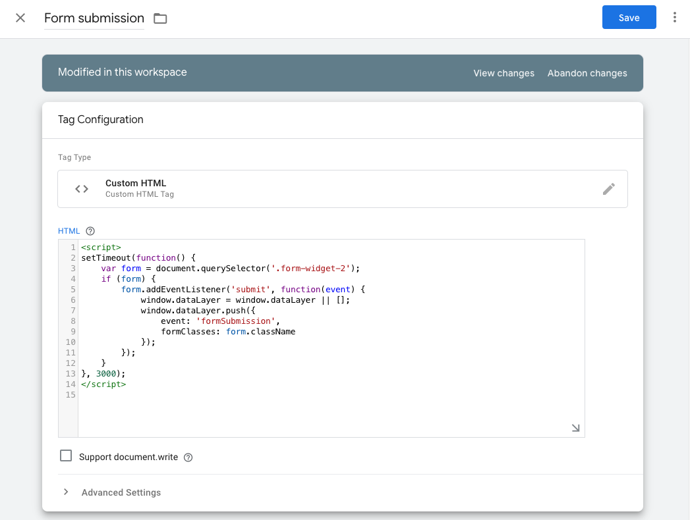
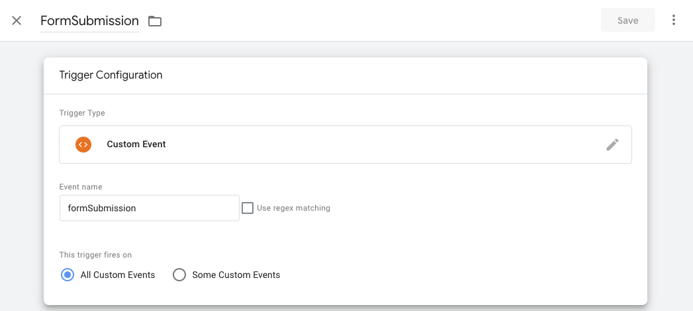
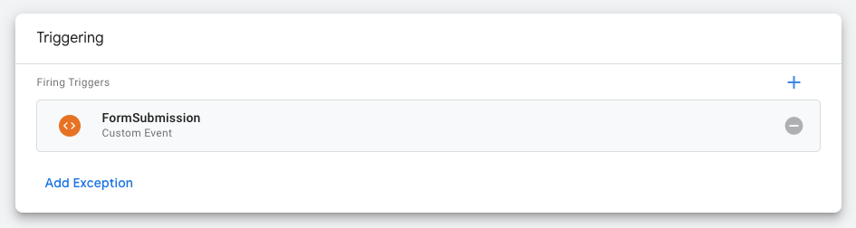
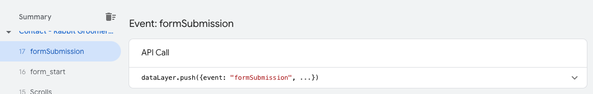
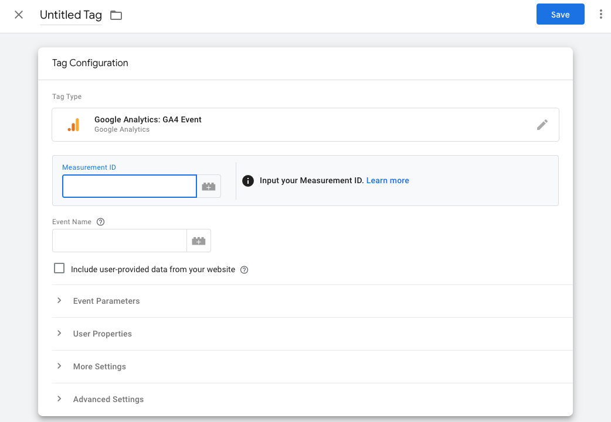

# Tracking Form Submissions on Google Analytics 4 through Google Tag Manager

This article will help you track form submissions on your website using Google Analytics 4 through Google Tag Manager. This is useful for anyone who wants to track user interactions with forms on their website.

## Prerequisites

Before you begin, make sure you have:

1. Google Tag Manager account setup
2. Google Analytics 4 property setup
3. Website with forms that you want to track

## Creating a Trigger for Form Submissions in Google Tag Manager

First, you'll need to create a trigger in Google Tag Manager that will fire when a form is submitted on your website.

1. Log in to your Google Tag Manager account
2. Navigate to the Triggers section and click on New
3. Choose the trigger type as "Form Submission"
4. Configure the trigger to fire on "All Forms" or specific forms based on your requirements
5. Name your trigger (e.g., "Form Submission Trigger") and save it

## Creating a Google Analytics 4 Event Tag

Next, you'll need to create a tag in Google Tag Manager that will send form submission data to Google Analytics 4.

1. Navigate to the Tags section and click on New
2. Choose the tag type as "Google Analytics: GA4 Event"
3. Configure the tag with your Google Analytics 4 Measurement ID
4. Set the Event Name to "form_submission" or any name you prefer
5. Add event parameters if needed (e.g., form_id, form_name)
6. Select the trigger you created earlier
7. Name your tag (e.g., "GA4 - Form Submission") and save it

## Testing Your Setup

After setting up the trigger and tag, it's important to test your configuration to make sure it's working correctly.

1. Click on the Preview button in Google Tag Manager
2. Navigate to your website and submit a form
3. In the Tag Assistant debug mode, verify that your form submission trigger fired and the GA4 event tag was executed

## Verifying Data in Google Analytics 4

Once you've confirmed that your tag is firing correctly, you should verify that the data is being recorded in Google Analytics 4.

1. Log in to your Google Analytics 4 property
2. Navigate to Reports > Realtime
3. Submit a form on your website
4. Check if the form_submission event appears in the Realtime report

## Setting Up Custom Reports

You can create custom reports in Google Analytics 4 to analyze your form submission data more effectively.

1. Navigate to Explore in your Google Analytics 4 property
2. Create a new exploration
3. Add form_submission as an event in your report
4. Add dimensions and metrics based on what you want to analyze
5. Save your exploration

## Troubleshooting

If you're not seeing form submission data in Google Analytics 4, check the following:

- Make sure your Google Tag Manager container is published
- Verify that your trigger conditions are correctly set up
- Check that your GA4 configuration tag is correctly implemented
- Ensure there are no JavaScript errors on your website that might prevent the tag from firing
- Confirm that your website's forms are actually submitting and not being blocked by validation errors

## Conclusion

By following these steps, you should be able to successfully track form submissions on your website using Google Analytics 4 through Google Tag Manager. This tracking will provide valuable insights into how users interact with forms on your website, which can help you optimize your forms and improve conversion rates.