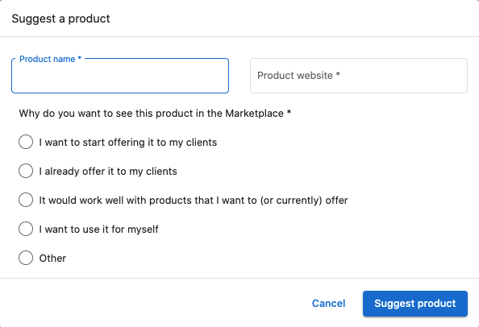
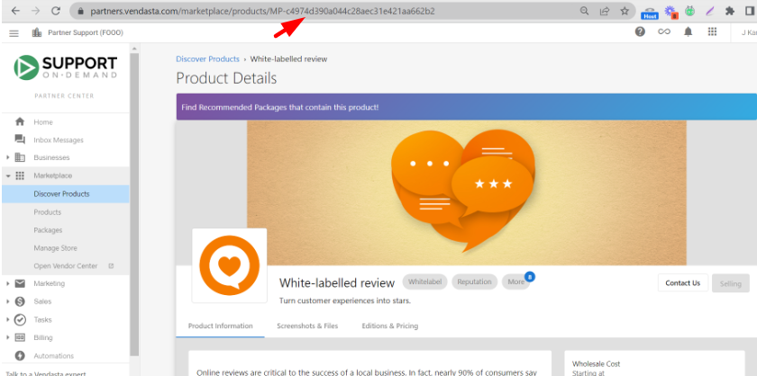

# Discover Products - Complete Guide

Discover Products is the hub for finding, evaluating, and enabling products that fit your clients' needs and budgets. Browse 250+ curated solutions, compare pricing and profitability, and start selling with a single click.

### At a glance
- Find and compare products with filters and search
- See wholesale costs vs. suggested retail; evaluate margins
- Open detailed marketing pages; start selling instantly

## What you can do

**Discover and compare**: Use filters and search to compare pricing and plans, see wholesale and suggested retail, and review curated lists of top, new, and trending products.

**Evaluate**: Open product marketing pages to see features, benefits, screenshots, files, FAQs, vendor details, editions, and country availability.

**Enable instantly**: Click Start Selling to add products at suggested retail; editions and add‑ons are included. Pricing converts to your store’s currency and appears across all markets if you use Markets.

## How to Use Discover Products

### Getting started

Open **Partner Center > Marketplace > Discover Products**. The All page lists products and add‑ons with name, description, wholesale cost (compare tiers via dropdown), and suggested retail price.

### Explore Featured
Switch to **Featured** for curated top products, new releases, trending, best‑sellers, and seasonal recommendations.

### Advanced filters and search

**Category filtering**
- Select a category, then refine with subcategories to explore by business function or industry.

**Add Filter options**
- Country: filter by regional availability
- Pricing Strategy: subscription, one‑time, freemium
- Billing Frequency: monthly, yearly, or custom
- Vendor: narrow to specific providers

**Suggest a product**
If a category has no local products, use Suggest a product to request additions.

### What’s on a product marketing page

**Product information**: Features, benefits, key selling points, technical requirements, integrations, and use cases.

**Editions & pricing**: Edition comparisons, pricing per tier, feature differences, and upgrade/downgrade paths.

**Screenshots & files**: UI screenshots, brochures, case studies, docs, and videos.

**FAQs**: Common questions, implementation details, billing clarifications, support and troubleshooting.

**Contact**: Vendor sales/support details, emails, phone numbers, escalation paths, and regional availability.

## Starting to Sell Products

### Quick enablement

**Single‑click activation**
1. Browse/search in Discover Products
2. Click **Start Selling** on a product
3. It’s added at suggested retail with editions and add‑ons included

**Automatic inclusions**
- Editions and add‑ons enabled
- Appears in the ALL category of your public store
- Added to all configured markets (if you use Markets)

### Manage enabled products

Open **Partner Center > Marketplace > Products**.

**Overview**: See active accounts, growth metrics (activations/deactivations), market visibility, and trends.

**Configure**: Adjust retail prices, white‑label branding, upgrade paths, free trials, team access, and add‑ons.

### Manage store integration
Go to **Partner Center > Marketplace > Manage Store** to preview your store, adjust settings and appearance, configure share/embed, set up contact forms, and organize categories.

### Currency and pricing

**Automatic conversion**
- Suggested retail available in USD, CAD, and AUD
- For other currencies, set conversion in **Manage Store > Currency** (prices derive from USD)

**Custom pricing**
- Override suggested prices; set market‑specific pricing; configure promotions and dynamic strategies

## Customer Purchase Experience

### Edition selection
Product details pages include comprehensive info, an Editions & Pricing tab for comparison, and a Buy it Now path into the shopping cart.

### Purchase options
- Add to Shopping Cart (standard checkout)
- Contact Sales (lead form)
- External URL (redirect)

## Stopping Product Sales

### Stop selling a product
1. Go to **Marketplace > Products** and open the product
2. Click **Stop Selling** and confirm

Impact: Packages containing it are archived; existing sales orders continue; it’s removed from new order creation and store display; existing activations continue.

## Best Practices

**Product Selection Strategy:**
- Start with products that complement your existing services
- Consider your target market's most common needs
- Evaluate profit margins at your current subscription tier
- Test products with small customer segments before full rollout

**Store Organization:**
- Group related products into logical categories
- Use clear, customer-friendly product descriptions
- Maintain consistent pricing strategies across similar products
- Regularly review and update product offerings

**Customer Education:**
- Leverage product marketing materials for sales conversations
- Share relevant case studies and documentation with prospects
- Use FAQs to proactively address common concerns
- Provide clear information about product capabilities and limitations

## Frequently asked questions

What countries are supported in the Marketplace?

Product availability varies by country depending on the specific product. There are two easy ways to check if a product is available in your desired country:

1. **Product Page Method:** Navigate to Partner Center > Marketplace > Discover Products, search for the product, and view the "Available In" section on the right side of the product page.

2. **Filter Method:** Use Partner Center > Marketplace > Discover Products > Explore All > + Add filter to filter products by country availability.

For custom products, you can change country availability in Vendor Center > Products > Product info > Country availability.

Where can I find Product and Package IDs?

**Product ID** can be found in two locations within the page URL:

1. **Discover Products:** Go to Partner Center > Marketplace > Discover Products, search and select the product, then click to view marketing materials. The Product ID is the alphanumeric portion at the end of the URL starting with MP (example: MP-QQF46WQ8W4TXTD8CBX8P6X7XBV4KBNW4).

2. **Products Section:** Under Marketplace > Products, select a product. The Product ID appears in the page URL starting with MP.

**Package IDs** are located within Marketplace > Packages. When you select a package, the URL contains a portion starting with SOL-\{letters and numbers\}, which is the package ID (example: SOL-620466a2-ea3f-4cb3-9cd7-26c2a8f3e539).

## Conclusion

With Discover Products, you have access to a comprehensive ecosystem of vetted solutions that can immediately expand your service offerings and grow your revenue. The platform's intuitive interface and powerful filtering capabilities ensure you can quickly find and enable the right products for your business and customers.