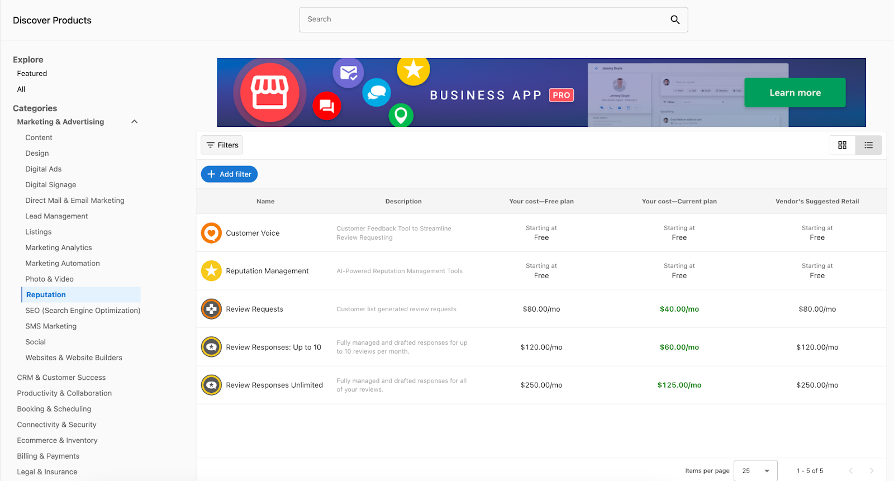

# Discover Products

## What is Discover Products?

Discover Products is the hub for finding, evaluating, and enabling products that fit your clients' needs and budgets. Browse 250+ curated solutions, compare pricing and profitability, and start selling with a single click.

## Why is Discover Products important?

Discover Products streamlines product research and enables faster business growth:

- Find and compare products with filters and search
- See wholesale costs vs. suggested retail prices to evaluate margins
- Open detailed marketing pages with complete product information
- Start selling instantly with one click

## What's Included with Discover Products?

### Product Discovery
- Browse 250+ curated marketplace products
- Filter by category, country, pricing strategy, billing frequency, and vendor
- Search for specific solutions
- View curated collections (top, new, trending, best-sellers, seasonal)

### Product Evaluation
- Detailed marketing pages with features and benefits
- Screenshots and supporting files (brochures, case studies, documentation)
- Edition comparisons and pricing per tier
- FAQs and vendor contact information
- Country availability information

### Instant Enablement
- One-click product activation with `Start Selling` button
- Automatic inclusion of all editions and add-ons
- Immediate availability in your store's ALL category
- Automatic currency conversion and multi-market distribution

## How to Use Discover Products

### Browse all products
1. Open **Partner Center > Marketplace > Discover Products**
2. View the All page with product names, descriptions, wholesale costs, and suggested retail prices
3. Use the dropdown to compare tiers and evaluate profit margins

### Explore featured collections
1. Switch to **Featured** tab
2. Browse curated collections:
   - Top products
   - New releases
   - Trending solutions
   - Best-sellers
   - Seasonal recommendations

### Filter and search products
1. **Filter by category**: Select broad categories, then refine with subcategories
2. **Add additional filters**:
   - Country: Filter by regional availability
   - Pricing Strategy: Subscription, one‑time, freemium
   - Billing Frequency: Monthly, yearly, custom
   - Vendor: Narrow to specific providers
3. **Use search**: Enter keywords to find specific solutions

### Suggest products
If you don't find what you need, use the "Suggest a product" feature to request additions to the marketplace.

## Product Marketing Pages

Each product has a detailed marketing page with comprehensive information:

### Product Information
- Features and benefits
- Key selling points
- Technical requirements
- Integration capabilities
- Real-world use cases

### Editions & Pricing
- Side-by-side edition comparisons
- Pricing across all tiers
- Feature differences
- Upgrade/downgrade paths

### Screenshots & Files
- UI screenshots
- Brochures and case studies
- Documentation
- Video content

### FAQs
- Implementation details
- Billing clarifications
- Support and troubleshooting

### Contact Information
- Vendor sales and support details
- Email addresses and phone numbers
- Escalation paths
- Regional availability

## Starting to Sell Products

### Enable products with one click
1. Browse or search in Discover Products
2. Click **Start Selling** on a product
3. Product is added at suggested retail price with all editions and add-ons included
4. Product appears automatically in:
   - ALL category of your public store
   - All configured markets (if using Markets)

### Manage enabled products
Go to **Partner Center > Marketplace > Products** to:

- **View performance**: Active accounts, growth metrics, market visibility, trends
- **Configure settings**: Retail pricing, white-label branding, upgrade paths, free trials, team access, add-ons

### Store integration
Use **Partner Center > Marketplace > Manage Store** to:

- Preview your store appearance
- Adjust visual settings and branding
- Configure sharing and embedding options
- Set up contact forms
- Organize categories

### Currency and pricing
- **Automatic conversion**: Suggested retail available in USD, CAD, and AUD
- **Custom pricing**: Override suggested prices, set market-specific pricing, configure promotions
- **Currency settings**: Set conversion rates in **Manage Store > Currency**

## Customer Purchase Experience

### Edition selection
Product details pages include comprehensive info, an Editions & Pricing tab for comparison, and a Buy it Now path into the shopping cart.

### Purchase options
- Add to Shopping Cart (standard checkout)
- Contact Sales (lead form)
- External URL (redirect)

## Stopping Product Sales

### Stop selling a product
1. Go to **Marketplace > Products** and open the product
2. Click **Stop Selling** and confirm

Impact: Packages containing it are archived; existing sales orders continue; it’s removed from new order creation and store display; existing activations continue.

## Best Practices

### Product Selection
- Start with products that complement your existing services
- Consider your target market's most common needs
- Evaluate profit margins at your current subscription tier
- Test products with small customer segments before full rollout

### Store Organization
- Group related products into logical categories
- Use clear, customer-friendly product descriptions
- Maintain consistent pricing strategies across similar products
- Regularly review and update product offerings

### Customer Education
- Leverage product marketing materials for sales conversations
- Share relevant case studies and documentation with prospects
- Use FAQs to proactively address common concerns
- Provide clear information about product capabilities and limitations

## Frequently asked questions

What countries are supported in the Marketplace?

Product availability varies by country depending on the specific product. There are two easy ways to check if a product is available in your desired country:

1. **Product Page Method:** Navigate to Partner Center > Marketplace > Discover Products, search for the product, and view the "Available In" section on the right side of the product page.

2. **Filter Method:** Use Partner Center > Marketplace > Discover Products > Explore All > + Add filter to filter products by country availability.

For custom products, you can change country availability in Vendor Center > Products > Product info > Country availability.

Where can I find Product and Package IDs?

**Product ID** can be found in two locations within the page URL:

1. **Discover Products:** Go to Partner Center > Marketplace > Discover Products, search and select the product, then click to view marketing materials. The Product ID is the alphanumeric portion at the end of the URL starting with MP (example: MP-QQF46WQ8W4TXTD8CBX8P6X7XBV4KBNW4).

2. **Products Section:** Under Marketplace > Products, select a product. The Product ID appears in the page URL starting with MP.

**Package IDs** are located within Marketplace > Packages. When you select a package, the URL contains a portion starting with SOL-\{letters and numbers\}, which is the package ID (example: SOL-620466a2-ea3f-4cb3-9cd7-26c2a8f3e539).

## Conclusion

With Discover Products, you have access to a comprehensive ecosystem of vetted solutions that can immediately expand your service offerings and grow your revenue. The platform's intuitive interface and powerful filtering capabilities ensure you can quickly find and enable the right products for your business and customers.