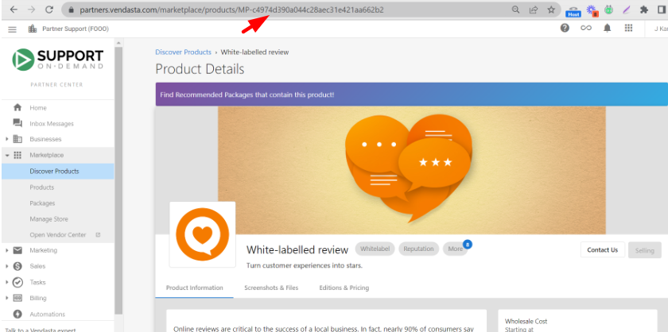

# Discover Products - Complete Guide

Discover Products in the Marketplace is your central hub for finding, evaluating, and enabling the best products to fit your clients' needs and budgets. With access to over 250+ curated solutions aligned with common local business needs, you can easily compare pricing, evaluate profitability, and start selling products with a single click.

## What You Can Do with Discover Products

**Product Discovery & Comparison:**
- Find the best products using advanced filtering and search capabilities
- Compare pricing between different products and subscription plans
- See wholesale costs and suggested retail prices at a glance
- Evaluate profitability and margins across different subscription tiers
- Access curated displays of top products, new releases, and trending items

**Product Evaluation:**
- Review comprehensive product marketing pages with features, benefits, and key selling points
- Access product screenshots, files, case studies, and documentation
- Read FAQs and vendor contact information
- Compare different product editions and pricing structures
- Check country availability for specific products

**Instant Product Enablement:**
- Start selling products with a single click at suggested retail prices
- Automatically include all product editions and add-ons
- Auto-conversion of pricing to your store's currency
- Immediate availability across all markets (if using Markets feature)

## How to Use Discover Products

### Getting Started with Product Discovery

When you first open **Partner Center > Marketplace > Discover Products**, you'll land on the **All** page, which displays every product and add-on available in the marketplace with the following information:

- **Product Name** - Clear identification of the product or service
- **Product Description** - Brief overview of what the product offers
- **Wholesale Cost** - Your cost for the product based on your current subscription plan
  - Use the dropdown to compare wholesale costs at different subscription tiers
  - This helps you find the best subscription plan for your business
- **Suggested Retail Price** - Recommended selling price to customers

### Exploring Featured Products

Switch to the **Featured** page to view a curated display of:
- Top products in the Vendasta Marketplace
- New releases and trending products
- Best-selling products and seasonal recommendations
- Products specifically recommended for your market segment

### Advanced Filtering and Search

**Category Filtering:**
- Click on any category to view all products within that category
- Subcategories appear when you select a main category for further refinement
- Use the category structure to explore products by business function or industry

**Advanced Filter Options:**
Use the **Add Filter** option to refine results by:
- **Country** - View products available in specific regions
- **Pricing Strategy** - Filter by pricing models (subscription, one-time, freemium)
- **Billing Frequency** - Monthly, yearly, or custom billing cycles
- **Vendor** - Find products from specific marketplace vendors

**Product Suggestions:**
When viewing categories without products in your region, use the **Suggest a product** feature to let Vendasta know what products you'd like to see. These suggestions help prioritize future marketplace additions.

### Understanding Product Marketing Pages

Each product includes a comprehensive Product Marketing Page designed to help you understand and sell the solution effectively. These pages contain:

**Product Information Section:**
- Detailed features, benefits, and key selling points
- Technical specifications and requirements
- Integration capabilities and compatibility information
- Use cases and target customer profiles

**Editions & Pricing:**
- Comparison of different product editions (if applicable)
- Detailed pricing structure for each tier
- Feature differences between editions
- Upgrade and downgrade paths

**Screenshots & Files:**
- Product interface screenshots showcasing user experience
- Marketing materials including brochures and case studies
- Technical documentation and implementation guides
- Video demonstrations and tutorials

**FAQs Section:**
- Common questions from partners and customers
- Technical implementation details
- Billing and pricing clarifications
- Support and troubleshooting information

**Contact Information:**
- Vendor contact details for sales and support
- Direct email addresses and phone numbers
- Escalation paths for technical issues
- Regional support availability

## Starting to Sell Products

### Quick Product Enablement

**Single-Click Activation:**
1. Browse or search for products in **Discover Products**
2. Hover over any product card
3. Click **Start Selling** to immediately add it to your store
4. The product appears at suggested retail price with all editions and add-ons included

**Automatic Inclusions:**
When you click **Start Selling**:
- All product editions are automatically enabled
- All available add-ons become available for sale
- Product appears in the ALL category of your public store
- For Markets users: Product is added to all configured markets

### Managing Enabled Products

Once products are enabled, manage them through **Partner Center > Marketplace > Products**:

**Product Overview:**
- View detailed breakdown of active accounts using each product
- Monitor growth metrics including activations and deactivations
- Control product visibility by market
- Track performance trends over time

**Product Configuration:**
- Adjust retail pricing displayed in your store
- Configure white-label branding (when applicable)
- Set up upgrade paths and free trial experiences
- Manage team access and permissions

**Add-On Management:**
- Review all applicable add-ons for each product
- Monitor add-on sales and active accounts
- Configure add-on pricing and availability

### Store Management Integration

Access **Partner Center > Marketplace > Manage Store** to:
- View interactive preview of your store
- Manage store settings and appearance
- Configure public store URL and embed codes
- Set up contact forms and customer communication
- Organize product categories and display options

### Currency and Pricing Management

**Automatic Price Conversion:**
- Products come with suggested retail prices in USD, CAD, and AUD
- Stores using these currencies automatically use suggested prices
- Other currencies: Set conversion rates in **Manage Store > Currency**
- Automatic retail price calculation based on USD pricing

**Custom Pricing:**
- Override suggested retail prices for any product
- Set market-specific pricing when using Markets
- Configure promotional pricing and discounts
- Implement dynamic pricing strategies

## Customer Purchase Experience

### Edition Selection
When customers view products in your store:
- Product details page shows comprehensive information
- **Editions & Pricing** tab allows edition comparison
- **Buy it Now** button leads to edition selection
- Shopping cart integration for immediate purchase

### Purchase Options
Products can be configured with different purchase behaviors:
- **Add to Shopping Cart** - Standard e-commerce flow
- **Contact Sales** - Lead generation with contact form
- **External URL** - Redirect to custom landing pages

## Stopping Product Sales

### Discontinuing Products

To stop selling a marketplace product:
1. Navigate to **Partner Center > Marketplace > Products**
2. Click on the product to view its details page
3. Scroll to bottom and click **Stop Selling**
4. Confirm the action to discontinue sales

**Impact of Stopping Sales:**
- Existing packages containing the product are automatically archived
- Current sales orders remain unaffected and can still be approved
- Product no longer appears in new sales order creation
- Administrators cannot select the product for new packages
- Existing customer activations continue without disruption
- Product removed from public store display

## Best Practices

**Product Selection Strategy:**
- Start with products that complement your existing services
- Consider your target market's most common needs
- Evaluate profit margins at your current subscription tier
- Test products with small customer segments before full rollout

**Store Organization:**
- Group related products into logical categories
- Use clear, customer-friendly product descriptions
- Maintain consistent pricing strategies across similar products
- Regularly review and update product offerings

**Customer Education:**
- Leverage product marketing materials for sales conversations
- Share relevant case studies and documentation with prospects
- Use FAQs to proactively address common concerns
- Provide clear information about product capabilities and limitations

## Frequently Asked Questions

### What countries are supported in the Marketplace?

Product availability varies by country depending on the specific product. There are two easy ways to check if a product is available in your desired country:

1. **Product Page Method:** Navigate to Partner Center > Marketplace > Discover Products, search for the product, and view the "Available In" section on the right side of the product page.

2. **Filter Method:** Use Partner Center > Marketplace > Discover Products > Explore All > + Add filter to filter products by country availability.

For custom products, you can change country availability in Vendor Center > Products > Product info > Country availability.

### Where can I find Product and Package IDs?

**Product ID** can be found in two locations within the page URL:

1. **Discover Products:** Go to Partner Center > Marketplace > Discover Products, search and select the product, then click to view marketing materials. The Product ID is the alphanumeric portion at the end of the URL starting with MP (example: MP-QQF46WQ8W4TXTD8CBX8P6X7XBV4KBNW4).

2. **Products Section:** Under Marketplace > Products, select a product. The Product ID appears in the page URL starting with MP.

**Package IDs** are located within Marketplace > Packages. When you select a package, the URL contains a portion starting with SOL-{letters and numbers}, which is the package ID (example: SOL-620466a2-ea3f-4cb3-9cd7-26c2a8f3e539).

## Conclusion

With Discover Products, you have access to a comprehensive ecosystem of vetted solutions that can immediately expand your service offerings and grow your revenue. The platform's intuitive interface and powerful filtering capabilities ensure you can quickly find and enable the right products for your business and customers.