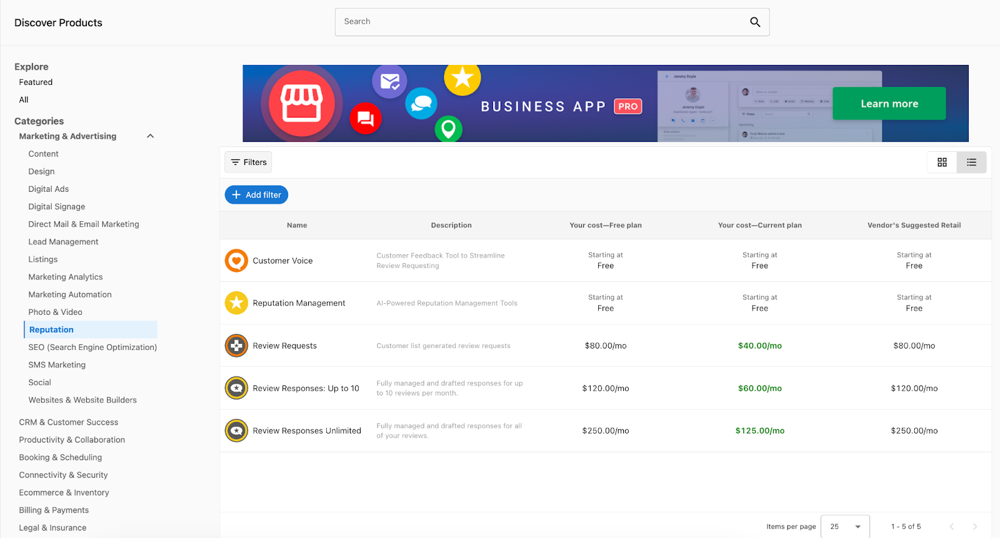

Discover Products in the Marketplace is a central location for Partners to find the best products to fit their clients' needs and budgets. Selecting, pricing, and comparing products to sell can be a time-consuming process, with Discover Products, Partners can easily compare pricing between products and subscription plans with the pricing overview. We've also created a view of Discover Products that allows Partners to quickly evaluate their profitability and margins and see if it's the right time to upgrade their subscription.

**Within Discover Products, Partners can:**

- Find the best products to offer using filtering and search to compare pricing between different products, and see the Wholesale Cost and suggested retail price of any product at a glance;
- Find the best subscription plan for their business by comparing product Wholesale Costs at each subscription level

## How to Use Discover Product:

Partners opening Discover Products for the first time will land on the All page. Each product and add-on in the Marketplace will be displayed here with the following information:

- Product Name
- Product Description
- Wholesale Cost
  - The current wholesale cost for the product, according to each partner subscription plan
  - Choose a different subscription plan from the dropdown to compare wholesale costs at different subscription tiers
- Suggested Retail Price

By switching to the Featured page Partners can view a curated display of the top products in the Vendasta Marketplace, including new releases, trending products, best-selling products, and more.

Clicking on a category will show you all the products in the category and reveal a list of subcategories. Click on a subcategory to further refine your search.

Utilizing the Add Filter option, Partners can refine their results further by using the Country filter, as well as other filters including Pricing Strategy, Billing Frequency, and Vendor.

When viewing a category that does not have any products available in a specific region, Partners can also click Suggest a product to let Vendasta know of any products that they would like to see in the Marketplace. We'll use submitted suggestions to help prioritize the future products and Vendors that we bring into the Marketplace.

Hovering the cursor on a product will allow Partners to Start Selling to quickly publish the product to your Store, or click Learn More to view the product's details.