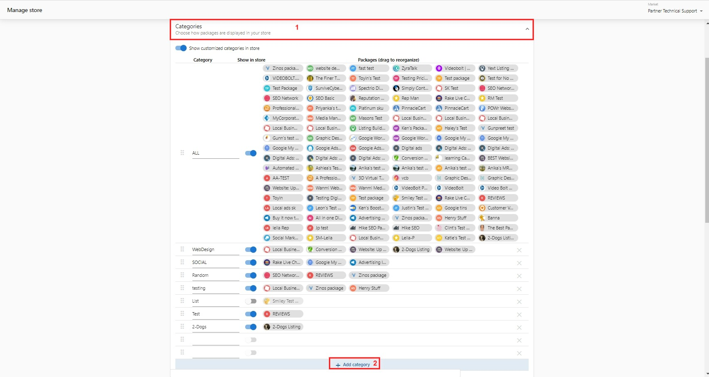

# Create Custom Categories for the Store

A number of product categories are available by default in the Public Store, however, you can also add your preferred Custom Categories. Follow the steps below to get started:

1. In **Partner Center** > Navigate to the **Marketplace** tab > **Manage Store.**
2. Click the dropdown next to **Categories** to expand the tab.
3. Select the **Market** to publish the new category to (*if applicable*).
4. Click on **+ Add Category.**
5. Type in the category name in the blank field provided.

Once done, assign packages to these categories and publish it to your Public Store and Business App.

Note: Categories are only applicable for the packages.

### Walkthrough Video

<iframe 
  src="https://drive.google.com/file/d/1vsnI6rKVtBRJTzeYNsFNqEaL6QHID-Xq/preview" 
  width="640" 
  height="480"
  allowFullScreen
></iframe>