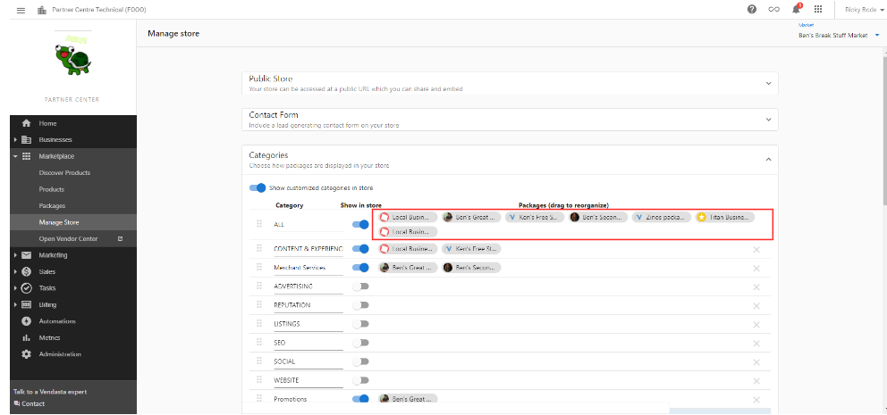
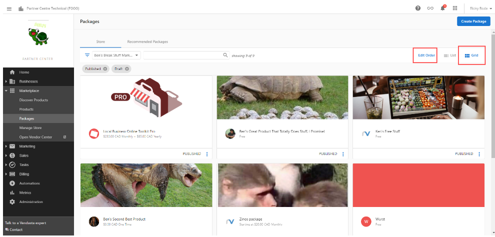
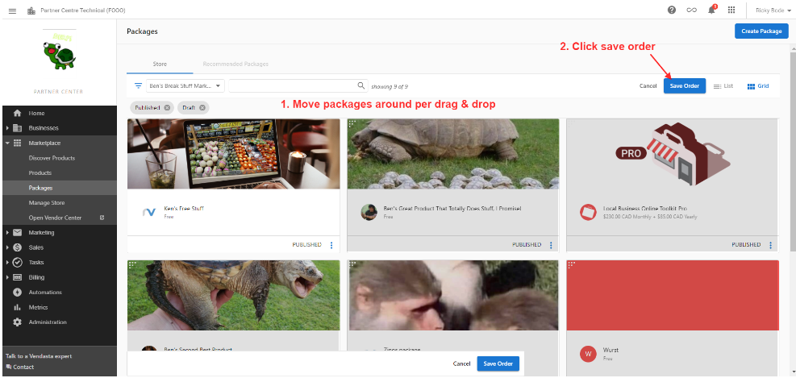
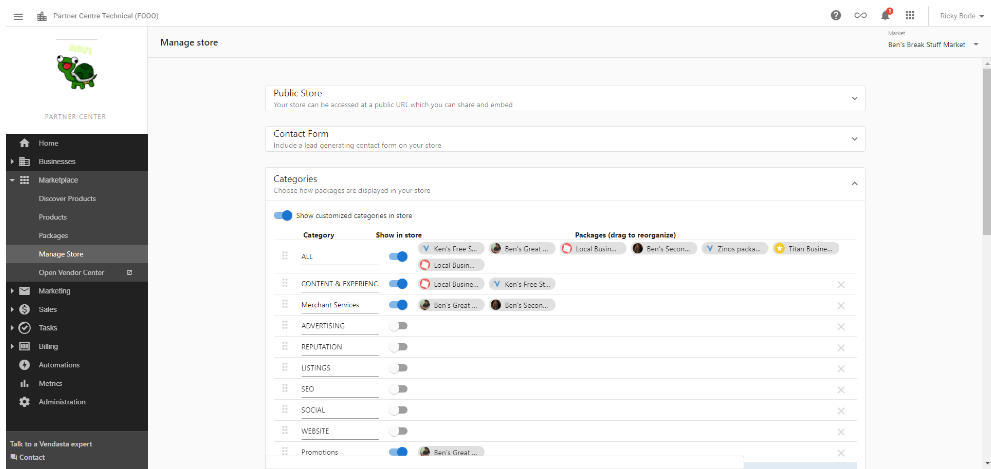

# Shopping Cart & Payment Processing

The Shopping Cart provides a seamless path from selection to payment. This guide covers cart functionality, payment setup, and order management to keep transactions smooth and revenue flowing.

## Shopping cart overview

The Shopping Cart allows customers to add multiple products and packages to their cart and complete purchases in a single transaction. The cart functionality adapts based on your payment processing setup and product configurations, providing flexibility for different business models and customer needs.

## Shopping cart functionality

### Add items to cart

**Ways to add products**
Customers can add items to their shopping cart through multiple pathways:

**Individual Product Addition:**
1. **Product Detail Pages** - Click "Add to Cart" button on specific product pages
2. **Package Detail Pages** - Add complete packages with all included components
3. **Direct Links** - Use shared package links that automatically add items to cart

**Notifications**
- **Addition Confirmation** - Visual notification confirms item was added successfully
- **Cart Counter Update** - Shopping cart icon displays current number of items
- **Real-Time Updates** - Immediate reflection of cart changes throughout the store

### Manage the cart

**View contents**
1. **Cart Access** - Click shopping cart icon in top-right corner of any Marketplace page
2. **Item Review** - View all products and packages currently in cart
3. **Pricing Overview** - See individual item prices and total cart value

**Modify the cart**
- **Item Removal** - Click trash icon next to unwanted items
- **Quantity Adjustment** - Modify quantities using dropdown menus (for applicable products)
- **Continue Shopping** - Return to browsing while preserving cart contents
- **Cart Persistence** - Cart contents saved when leaving and returning to store

**Organization**
- **Product Grouping** - Related items displayed together logically
- **Price Breakdown** - Clear display of individual and total pricing
- **Package Components** - Detailed view of package contents and inclusions

## Payment processing configuration

### Vendasta Payments integration

**Options**
The shopping cart's checkout functionality varies based on your payment processing setup:

With Vendasta Payments enabled
- **Credit Card Processing** - Direct credit card payment acceptance
- **Immediate Activation** - Automatic product activation upon payment
- **Email Receipts** - Automatic receipt delivery to customers
- **Real-Time Transactions** - Instant payment processing and confirmation

Without Vendasta Payments
- **Sales Order Generation** - Cart contents submitted as sales orders
- **Manual Review Process** - Orders require approval before activation
- **Customer Notification** - Customers notified when products are activated
- **Business App Access** - Product access through Business App after approval

### Supported currencies and cards

When Vendasta Payments is enabled, the following cards and currency behaviors apply:

- **Supported cards**: Visa, Mastercard, American Express, Discover
- **Default currency**: Follows your Vendasta contract currency
- **Additional currencies**: May be available based on your configuration and market

### Supported payment methods

**Credit cards**
When Vendasta Payments is configured, the following cards are accepted:
- **Visa** - All standard Visa credit and debit cards
- **Mastercard** - Standard Mastercard credit and debit options
- **American Express** - Amex cards with standard processing
- **Discover** - Discover network credit cards

**Currency**
- **Default Currency** - Based on your contract currency with Vendasta
- **Multi-Currency Options** - Additional currencies available based on business needs
- **Exchange Rate Management** - Automatic currency conversion when applicable

### Checkout process

**Standard flow**
1. **Cart Review** - Customer reviews all items and quantities
2. **Checkout Initiation** - Click "Checkout" button to begin purchase process
3. **Payment Method Selection** - Choose from available payment options
4. **Order Summary Review** - Final review of purchase details and pricing
5. **Order Completion** - Click "Place Order" to finalize transaction

**Authentication**
- **Existing Customers** - Sign-in required for order completion
- **New Customers** - Account creation option during checkout
- **Guest Checkout** - Limited guest options based on configuration

## Payment processing setup

### Store configuration for payments

**Prerequisites**
Before customers can complete purchases, configure essential store settings:

**Currency and pricing**
1. Navigate to **Store Settings** tab in store configuration
2. **Currency Selection** - Choose customer-facing display currency
3. **Seller Cost Calculation** - Configure your cost structure:
   - Percentage of retail price
   - Flat fee per transaction
   - Free to seller (no charges)
4. **Markup Configuration** - Set percentage or flat fee collection amounts

**Price display**
Choose how customers see pricing information:
- **Show Total Cost at Checkout** - Pricing revealed during checkout process
- **Display Price and Allow Purchase** - Full pricing visibility with purchase capability
- **Display Price Without Purchase** - Pricing shown but no direct purchase option
- **Contact for Pricing** - Custom pricing consultation required

**Purchase behavior**
Determine where customers complete transactions:
- **In Marketplace Store** - Complete purchase within your store environment
- **External Site/Platform** - Redirect to external checkout system
- **Custom URL Configuration** - Specify external checkout URL if applicable

### Advanced payment features

**Tax rates**
- **Automatic Tax Calculation** - Defined tax rates automatically applied to purchases
- **Regional Tax Support** - Tax application based on customer address
- **Sales Order Integration** - Tax rates applied to both direct purchases and sales orders
- **No-Tax Regions** - Areas without defined tax rates process without tax

**Order management**
- **Order Tracking** - Complete visibility into order status and progression
- **Customer Notifications** - Automatic updates throughout order lifecycle
- **Activation Coordination** - Seamless product activation upon payment completion

## Package purchase compatibility

### Shopping cart‑compatible packages

**Requirements**
Packages must meet specific criteria for shopping cart compatibility:

Compatible settings
- **Purchase Behavior** - Set to "Add to Shopping Cart"
- **Standard Pricing** - Fixed pricing without "Starting at" options
- **No Contact Sales** - Direct purchase capability enabled
- **Current Package Format** - Using updated package pricing settings

Incompatible configurations
Packages with the following settings cannot be purchased through shopping cart:
- **Starting Price Options** - Packages showing "Starting at" pricing
- **Contact Sales Settings** - Packages requiring sales consultation
- **Legacy Package Settings** - Packages using older pricing configurations

> If any item in the cart is incompatible with direct purchase, checkout switches to sales order submission (no credit card).

### Purchase behavior impact

**Configure for cart**
1. Navigate to **Partner Center > Packages**
2. **Edit Target Package** - Select package for configuration
3. **Purchase Behavior Settings** - Choose "Add to Shopping Cart"
4. **Pricing Configuration** - Ensure fixed pricing without consultation requirements
5. **Save Changes** - Apply settings for immediate cart compatibility

## Order processing and management

### Sales order generation

**When sales orders are created**
The system generates sales orders instead of processing direct payments in these scenarios:
- **No Vendasta Payments** - Payment processing not configured
- **Incompatible Packages** - Cart contains packages requiring consultation
- **Mixed Cart Contents** - Combination of compatible and incompatible items
- **Custom Business Rules** - Specific business process requirements

**Workflow**
1. **Order Submission** - Customer submits cart contents as sales order
2. **Review Process** - Partner reviews and approves order
3. **Customer Notification** - Approval notification sent to customer
4. **Product Activation** - Products activated upon approval
5. **Business App Access** - Customer gains access through Business App

### Package organization and display

**Arrange packages**
Organize packages effectively for customer discovery and purchase:

**Ordering process**
If packages in the "ALL" category don't maintain desired order:
1. Navigate to **Marketplace > Packages**
2. **Switch to Grid View** - Select Grid layout (not List view)
3. **Edit Order** - Click "Edit Order" button
4. **Drag and Drop** - Rearrange packages in desired sequence
5. **Save Order** - Apply new arrangement to Public Store

**Display impact**
- **Public Store Reflection** - New order immediately visible to customers
- **Customer Navigation** - Improved browsing experience through logical organization
- **Sales Impact** - Strategic positioning can influence purchase decisions

## Troubleshooting payment and cart issues

### Common cart problems

**Cart not showing payment options**
If customers cannot see credit card payment options:

**Troubleshooting**
1. **Verify Vendasta Payments Setup** - Confirm payment processing is configured
2. **Check Package Compatibility** - Ensure all cart items support direct purchase
3. **Review Package Settings** - Confirm packages use "Add to Shopping Cart" behavior
4. **Test Package Configuration** - Remove problematic packages and test cart functionality

### Tax rate application

Tax rates are automatically applied to shopping cart purchases and sales orders based on your tax settings and the customer’s address. For regions without defined rates, no tax is applied.

**Package purchase problems**
When packages cannot be added to shopping cart:

**Solution**
1. Navigate to **Partner Center > Packages**
2. **Locate Problem Package** - Search for package experiencing issues
3. **Edit Package Settings** - Review purchase behavior configuration
4. **Update to "Add to Shopping Cart"** - Change setting to enable cart functionality
5. **Save Changes** - Apply updated settings immediately

### Payment processing issues

**Card declines**
- **Payment Method Verification** - Confirm card information accuracy
- **Alternative Payment Options** - Provide backup payment methods
- **Customer Communication** - Clear instructions for resolving payment issues
- **Support Escalation** - Process for handling persistent payment problems

### Order processing behavior

When credit card payment isn’t available due to settings or configuration, the checkout submits a sales order for manual review and approval. Customers are notified when products are activated.

**Delays**
- **Status Communication** - Keep customers informed of order processing status
- **Escalation Procedures** - Clear process for handling delayed orders
- **Customer Service** - Responsive support for order-related inquiries

## Best practices for cart and payments

### Conversion rate optimization

**Cart design**
- **Clear Pricing** - Transparent pricing display without hidden fees
- **Simple Navigation** - Intuitive cart modification and checkout process
- **Trust Indicators** - Security badges and payment protection information
- **Mobile Optimization** - Seamless cart functionality across all devices

**Purchase flow**
- **Minimal Steps** - Streamlined checkout process with minimal required information
- **Guest Options** - Balance between account creation and purchase friction
- **Error Handling** - Clear error messages and resolution guidance
- **Confirmation Process** - Immediate confirmation and receipt delivery

### Customer communication

**Communication strategy**
- **Pre-Purchase** - Clear information about products, pricing, and purchase process
- **During Purchase** - Real-time updates and confirmation during checkout
- **Post-Purchase** - Immediate confirmation, receipt, and next steps
- **Follow-Up** - Ongoing communication about product access and support

### Performance monitoring

**Key metrics**
- **Cart Abandonment Rate** - Monitor and address checkout friction points
- **Conversion Rate** - Track visitor-to-customer conversion optimization
- **Average Order Value** - Monitor transaction size and upselling effectiveness
- **Payment Success Rate** - Track payment processing effectiveness and issues

**Continuous improvement**
- **Customer Feedback** - Regular collection of cart and payment experience feedback
- **A/B Testing** - Test different cart configurations and checkout flows
- **Performance Analysis** - Regular review of cart and payment metrics
- **Feature Updates** - Stay current with platform improvements and new features

Effective shopping cart and payment processing creates a seamless customer experience that drives revenue growth and customer satisfaction. By properly configuring these systems and continuously optimizing based on customer feedback and performance data, you'll create a purchasing experience that converts visitors into loyal customers.