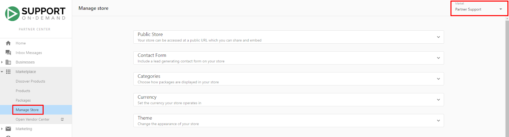

# Store Sharing & Customer Experience

Your Marketplace store is a customer‑facing storefront where prospects can discover solutions, compare options, and purchase. This guide covers embedding on your site, sharing links, optimizing interactions, and managing the customer experience.

## Store sharing overview

Use the **Public Store** for a standalone, embeddable store that integrates with your customer management. Share it via website embed, direct links, or within marketing campaigns.

## Store embedding options

### Embed your store on your website

**Embedding process**
1. Navigate to **Partner Center > Marketplace > Manage Store > Public Store**
2. **Choose Embedding Version:**
   - **Store with Sign-In** - Includes customer authentication options
   - **Store without Sign-In** - Streamlined experience without authentication UI
   - **Store without Sign-In and Top Bar** - Minimal interface for seamless website integration
3. **Copy Embed Code** - Select appropriate code snippet for your website
4. **Website Integration** - Use your website's HTML editor to embed the code

**Benefits**
- **Automatic Updates** - New products and packages automatically appear on your website
- **Seamless Integration** - Store content appears as part of your website
- **Customizable Appearance** - Theme settings ensure brand consistency
- **Multi-Version Support** - Choose the best integration method for your site design

#### Remove the "Sign In" button when embedding

If you want to hide the Sign In button on the embedded Public Store:

1. Go to **Partner Center > Marketplace > Manage Store > Public Store**
2. Under Embed Code, select **Store without sign-in** (or **Store without sign-in and top bar** for a minimal header)
3. Copy the updated code and replace any previously embedded version on your website

### Share a direct link

**Configure share URL**
1. Follow steps 1-2 from the embedding process above
2. **Copy Share URL** - Direct link to your standalone store
3. **Distribution Options:**
   - Email signature buttons
   - Social media sharing
   - Marketing campaign integration
   - Direct customer communication

**Benefits**
- **Standalone Experience** - Complete store functionality without website integration
- **Easy Distribution** - Simple URL sharing across multiple channels
- **Performance Tracking** - Monitor link usage and customer engagement
- **Multi-Channel Marketing** - Use across various marketing campaigns

#### Public Store URL

Find your standalone store URL at **Partner Center > Marketplace > Manage Store > Public Store > Copy Share URL**. Share this URL directly or use it in marketing campaigns.

## Public Store features and functionality

### Customer account management

**Account creation and sign‑in**
Customers can interact with your Public Store in multiple ways depending on your configuration:

**Sign-In Button Integration:**
- **Embedded Sign-In** - Top-of-store authentication for existing customers
- **Checkout Authentication** - Required sign-in during purchase process
- **New Account Creation** - Streamlined account setup for prospects

**New account creation**
Customers without existing accounts can create accounts through two methods:

**Automatic Business Lookup:**
1. Customer clicks **Create an Account**
2. Email address input and business search
3. Automatic account creation if business found
4. Manual account creation option if business not found

**Manual account creation**
Required information for manual account setup:
- Email address and full name
- Business name and category
- Complete address information (country, street, city, state, postal code)
- Business phone number

**After account creation**
- Password setup email sent to customer
- Full Business App access upon password configuration
- Shopping cart contents preserved during account creation
- Automatic salesperson assignment (if configured)

### Shopping cart integration

**Functionality**
The shopping cart provides seamless product selection and purchase capabilities:

**Add items to cart**
- **Product Pages** - Add individual products from detail pages
- **Package Pages** - Add complete packages with all components
- **Cross-Platform Continuity** - Cart contents preserved across Public Store and Business App

**Manage the cart**
- **Item Removal** - Remove unwanted products or packages
- **Quantity Adjustment** - Modify quantities for applicable products
- **Continue Shopping** - Return to browsing while preserving cart contents
- **Real-Time Updates** - Immediate cart total and item count updates

**Checkout**
- **Order Review** - Complete cart contents and pricing review
- **Payment Processing** - Integrated payment options (when configured)
- **Order Confirmation** - Immediate confirmation and receipt delivery
- **Account Integration** - Automatic integration with customer Business App account

### Multi‑market store management

**Configuration**
For partners using Markets to serve different customer segments:

**Market Selection:**
- **Store Display** - Choose which market's store appears on your website
- **Market Selector** - Available in **Marketplace > Manage Store** page
- **Consistent Experience** - Packages visible in Public Store also appear in Business App store

Public Store and Business App synchronize: packages visible in Public Store also appear in Business App for the selected market.

**Benefits**
- **Unified Customer Experience** - Same packages across all customer touchpoints
- **Simplified Management** - Single configuration affects multiple channels
- **Regional Customization** - Tailor offerings for specific geographic markets

## Customer experience optimization

### Auto‑assignment and lead management

**Configure salesperson assignment**
Streamline customer management by automatically assigning new accounts to sales team members:

**Setup**
1. Navigate to **Partner Center > Marketplace > Manage Store > Contact Form**
2. **Select Salesperson** from dropdown menu
3. **Troubleshooting** - If no salespeople appear, verify salesperson setup in account or selected market

**Benefits**
- **Immediate Follow-Up** - New accounts automatically assigned for prompt contact
- **Load Distribution** - Systematic distribution of leads across sales team
- **Hot Lead Notifications** - Automatic notifications when prospects request information
- **CRM Integration** - Seamless integration with existing customer relationship management

**Rules**
New accounts created through Public Store utilize the same auto-assignment rules as Partner Center account creation:
- **Email Campaign Assignment** - Automatic enrollment in appropriate campaigns
- **Salesperson Distribution** - Based on configured assignment rules
- **Territory Management** - Geographic or industry-based assignment options

### Purchase flow optimization

**Streamlined experience**
Design customer purchase flows for maximum conversion and satisfaction:

**Authentication**
- **Guest Browsing** - Customers can explore without account creation
- **Progressive Authentication** - Account creation only required for purchase
- **Existing Customer Access** - Quick sign-in for returning customers
- **Account Benefits** - Clear value proposition for account creation

**Cross‑platform**
- **Cart Synchronization** - Shopping cart contents synchronized between Public Store and Business App
- **Order History** - Purchase history available across all platforms
- **Account Access** - Full product access through Business App after purchase

## Advanced customer experience features

### Contact form and lead capture

**Functionality**
The contact form system captures prospect information and routes inquiries to appropriate team members:

**Configuration**
- **Salesperson Assignment** - Direct inquiries to specific team members
- **Automatic Notifications** - Immediate alerts for new prospect contacts
- **Lead Qualification** - Capture relevant customer information for follow-up
- **Response Time Optimization** - Ensure prompt follow-up for all inquiries

### Product and package display optimization

**Visibility**
Ensure customers can easily find and understand your offerings:

**Product visibility requirements**
- **Product Enablement** - Products must be enabled through "Start Selling"
- **Market Availability** - Products must be available in target market
- **Category Configuration** - "ALL" category must be enabled for individual product display

**Package organization**
- **Category Assignment** - Proper package categorization for easy discovery
- **Logical Grouping** - Group related packages for customer convenience
- **Clear Navigation** - Intuitive browsing structure for customer exploration

### Performance monitoring and optimization

**Analytics**
Track key metrics to optimize customer interactions:

**Key metrics**
- **Conversion Rates** - Monitor visitor-to-customer conversion
- **Cart Abandonment** - Identify and address purchase friction points
- **Popular Products** - Understand which offerings drive most interest
- **Customer Journey Analysis** - Track customer path through store

**Optimization**
- **A/B Testing** - Test different store configurations and layouts
- **Customer Feedback** - Gather insights on store usability and experience
- **Load Time Optimization** - Ensure fast store performance across devices
- **Mobile Experience** - Optimize for mobile browsing and purchasing

## Troubleshooting customer experience issues

### Common visibility problems

**Product not appearing in store**
If customers cannot see products that should be available:

**Solution 1: Verify Product Enablement**
1. Navigate to **Marketplace > Discover Products**
2. Search for the missing product
3. Check "Start Selling" button status (should be greyed out and say "Selling")
4. Enable product if not already selling

**Solution 2: Market availability check**
1. Navigate to **Marketplace > Products**
2. Review "Available in Store" section in product Overview
3. Verify product is enabled for correct market
4. Add product to appropriate markets if needed

**Solution 3: Category configuration**
1. Navigate to **Marketplace > Manage Store**
2. Expand Categories section
3. Toggle "ALL" category to enabled status
4. Note: Individual products only appear in Public Store when "ALL" category is enabled

> Individual products not in packages do not appear in Categories and cannot be reorganized via the ALL category.

### Authentication and account issues

**Sign‑in problems**
- **Account Verification** - Confirm customer account exists and is properly configured
- **Password Reset** - Provide password reset assistance for existing customers
- **Account Linking** - Ensure proper connection between Public Store and Business App accounts

**New account creation issues**
- **Business Lookup Problems** - Assist with manual account creation when automatic lookup fails
- **Email Delivery** - Verify password setup emails are delivered and not blocked
- **Account Activation** - Confirm accounts are properly activated after creation

### Integration and technical issues

If the embedded store isn’t displaying or functioning correctly on your website:

- **Verify embed code** is copied fully and implemented in the correct location
- **Test different themes** or remove conflicting website styles/scripts
- **Check across browsers/devices** to rule out environment-specific issues
- **Escalate to support** if problems persist

### Data and synchronization issues

If customer data or order history appears inconsistent between Public Store and Business App:

1. **Verify data consistency** for the affected account
2. **Check sync processes** and try a manual sync if available
3. **Confirm user permissions** and access levels are correct
4. **Contact support** if inconsistencies continue

## Best practices for customer experience

### Store design and navigation

**User‑friendly design**
- **Clear Navigation** - Intuitive category structure and product organization
- **Visual Consistency** - Maintain brand standards throughout store experience
- **Loading Performance** - Optimize store speed for better user experience
- **Mobile Optimization** - Ensure functionality across all device types

### Customer communication

**Proactive communication**
- **Welcome Messages** - Clear orientation for new store visitors
- **Product Information** - Comprehensive product descriptions and benefits
- **Support Access** - Easy access to help and support resources
- **Follow-Up Process** - Systematic follow-up for inquiries and purchases

### Conversion optimization

**Purchase flow**
- **Simplified Checkout** - Minimize steps required for purchase completion
- **Clear Pricing** - Transparent pricing information and value propositions
- **Trust Indicators** - Security badges, testimonials, and credibility signals
- **Multiple Purchase Options** - Various ways for customers to buy or request information

Creating an exceptional customer experience through your Public Store requires careful attention to design, functionality, and ongoing optimization. By following these guidelines and continuously monitoring performance, you'll create a store that effectively converts visitors into customers while providing outstanding service throughout the customer journey.