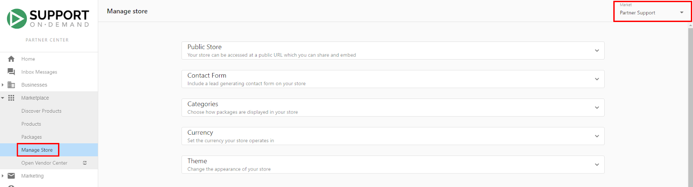

# Store Troubleshooting & FAQs

This comprehensive guide addresses common store management issues, provides step-by-step troubleshooting solutions, and answers frequently asked questions about Marketplace store functionality. Whether you're experiencing visibility problems, payment issues, or configuration challenges, this guide provides the solutions you need.

## Product Visibility Troubleshooting

### Products Not Appearing in Store Categories

**Issue:** Products that should be visible are not appearing in **Marketplace > Manage Store > Categories** or in the customer-facing store.

**Common Root Causes:**
- Product not enabled for sale ("Start Selling" not completed)
- Product not available in the correct market
- "ALL" category not enabled in store settings

#### Solution 1: Verify Product Enablement

**Diagnostic Steps:**
1. Navigate to **Marketplace > Discover Products**
2. Search for the missing product using the search functionality
3. **Check Start Selling Status** - Look for the "Start Selling" button on the right side of the product page
4. **Status Verification** - Button should be greyed out and display "Selling" if properly enabled

**Resolution:**
- If button shows "Start Selling" (not greyed out), click to enable the product
- If already enabled but still not visible, proceed to Solution 2

#### Solution 2: Market Availability Verification

**Diagnostic Steps:**
1. Navigate to **Marketplace > Products**
2. Locate the problem product in your enabled products list
3. **Review Overview Section** - Check the "Available in Store" card
4. **Market Assignment** - Verify product is assigned to the correct market

**Resolution:**
- If product is not assigned to target market, edit market assignments
- Enable product for appropriate markets based on customer needs
- Save changes and verify visibility in target market store

#### Solution 3: Category Configuration

**Diagnostic Steps:**
1. Navigate to **Marketplace > Manage Store**
2. **Expand Categories Section** - Click to open category management
3. **Check ALL Category Status** - Verify "ALL" category toggle is enabled

**Critical Note:** Individual products will only appear in your Public Store when the "ALL" category is toggled on.

**Resolution:**
1. Toggle the "ALL" category to enabled status
2. Save category configuration changes
3. Verify products now appear in customer-facing store

**Important Limitations:**
- Individual products NOT included in packages will not appear in the Categories section
- You cannot rearrange individual products within the ALL category through the Manage Store interface
- Package organization must be done through the Packages section

## Store Configuration and Display Issues

### Public Store and Business App Synchronization

Does my Public Store have all the same packages that my Business App Store has?

Yes - any packages visible in your Public Store will also be visible in your Business App store. This ensures consistent customer experience across all touchpoints.

**Multi-Market Considerations:**
If using Markets to offer different stores to different customer segments:
1. Navigate to **Marketplace > Manage Store**
2. Use the **Market selector** to choose which market's Public Store displays on your website
3. Each market can have different package offerings while maintaining synchronization between Public Store and Business App for that specific market

### Store Access and Visibility Management

Who can see my Public Store?

If you have published your Public Store to your website, any visitor to your website will be able to view your Public Store and add products to their Shopping Cart. This provides maximum accessibility for customer acquisition.

Where can I find my Public Store URL?

Access your Public Store URL through: **Partner Center > Marketplace > Manage Store > Public Store > Copy Share URL**. This URL can be shared directly with customers or integrated into marketing materials.

### Sign-In Button Management

How do I remove the "Sign In" button on my Public Store?

The default Public Store includes a "Sign In" button in the top right corner. To remove this button when embedding your store:

1. Navigate to **Partner Center > Marketplace > Manage Store > Public Store**
2. **Choose Embed Version** - Under 'Embed Code', select 'Store without sign-in'
3. **Copy and Implement** - Copy the modified code and embed it on your website
4. **Replace Previous Version** - This will replace any previously embedded Public Store on your website

**Sign-In Options:**
- **Store with Sign-In** - Full authentication capability
- **Store without Sign-In** - Streamlined appearance without authentication UI
- **Store without Sign-In and Top Bar** - Minimal interface for seamless website integration

## Payment and Shopping Cart Troubleshooting

### Tax Rate Application Issues

Why does my Shopping Cart automatically apply tax rates?

Tax rates are automatically applied to Shopping Cart purchases and sales orders based on your configured tax settings. The application follows these rules:

**Tax Application Logic:**
- **Customer Address** - Tax rates applied based on customer account address
- **Regional Configuration** - Rates match regions where you've specified tax requirements
- **No Rate Regions** - Areas without defined tax rates process without tax application

**Tax Rate Sources:**
- Shopping Cart direct purchases
- Sales orders generated from Shopping Carts containing non-purchasable items
- All transactions follow the same tax application rules

### Payment Method Limitations

Which currencies/payment methods can the Shopping Cart accept?

Payment acceptance depends on your Vendasta Payments configuration:

**Supported Credit Cards:**
- **Mastercard** - All standard Mastercard products
- **Visa** - Standard Visa credit and debit cards
- **American Express** - Amex cards with standard processing
- **Discover** - Discover network credit cards

**Currency Support:**
- **Default Currency** - Matches your billing relationship currency with Vendasta (contract currency)
- **Multi-Currency Options** - Additional currencies available based on business configuration
- **Regional Adaptation** - Currency options may vary by market

### Shopping Cart Payment Issues

Why doesn't my Shopping Cart show the option to pay with a credit card?

Credit card payment options may be unavailable due to several factors:

**Package Configuration Issues:**
If a customer's cart contains packages with these settings, credit card payment will not be available:
- **Starting Price Packages** - Packages using "Starting at" pricing options
- **Contact Sales Packages** - Packages configured for sales consultation
- **Legacy Package Settings** - Packages using older pricing configurations

**Payment Setup Issues:**
- **Vendasta Payments Not Configured** - Payment processing not set up for your account
- **Incomplete Payment Configuration** - Missing required payment setup components

**Resolution Process:**
1. **Review Package Settings** - Ensure all packages use "Add to Shopping Cart" purchase behavior
2. **Verify Payment Setup** - Confirm Vendasta Payments is properly configured
3. **Test Cart Functionality** - Remove problematic packages and test payment options

**Alternative Workflow:**
When credit card payment isn't available, the checkout process submits a sales order for manual review and approval.

### Package Purchase Compatibility

Why can't my package be purchased through the Shopping Cart?

Package purchase capability depends on the Purchase Behavior setting configuration:

**Solution Process:**
1. Navigate to **Partner Center > Packages**
2. **Search and Edit** - Locate the problematic package
3. **Review Purchase Behavior** - Check current purchase behavior setting
4. **Update Configuration** - Select "Add to Shopping Cart" under Purchase Behavior
5. **Save Changes** - Apply updated settings immediately

**Purchase Behavior Options:**
- **Add to Shopping Cart** - Enables direct cart functionality
- **Contact Sales** - Launches contact form instead of cart addition
- **External URL** - Redirects to specified external URL

**Recommendation:** Use "Add to Shopping Cart" for standard packages to enable seamless customer purchasing.

## Store Organization and Performance Issues

### Package Organization Problems

**Issue:** Packages in the "ALL" category don't maintain desired order when rearranged.

**Root Cause:** Package organization in the ALL category requires specific interface usage.

**Solution Process:**
1. Navigate to **Marketplace > Packages**
2. **Switch to Grid View** - Select Grid layout (NOT List view)
3. **Edit Order** - Click "Edit Order" button to enable drag-and-drop
4. **Rearrange Packages** - Drag packages to desired positions
5. **Save Order** - Click "Save Order" to apply changes

**Result:** Public store will display packages in the new order immediately.

**Interface Requirements:**
- Must use Grid view (List view doesn't support reordering)
- Edit Order mode must be activated
- Changes apply immediately to customer-facing store

### Store Performance Optimization

**Common Performance Issues:**
- **Slow Loading** - Large images or excessive content causing delays
- **Mobile Compatibility** - Store not optimizing properly for mobile devices
- **Browser Compatibility** - Inconsistent appearance across different browsers

**Optimization Strategies:**
- **Image Optimization** - Compress custom icons and banners for faster loading
- **Content Streamlining** - Focus on essential information for better performance
- **Regular Testing** - Test store functionality across devices and browsers
- **Performance Monitoring** - Track loading times and customer experience metrics

## Advanced Troubleshooting

### Multi-Market Configuration Issues

**Complex Market Problems:**
- **Package Availability Inconsistencies** - Different packages appearing in different markets
- **Pricing Variations** - Unexpected pricing differences across markets
- **Customer Access Problems** - Customers unable to access appropriate market store

**Diagnostic Approach:**
1. **Market-by-Market Review** - Systematically check each market configuration
2. **Package Assignment Verification** - Confirm packages are assigned to appropriate markets
3. **Pricing Consistency Check** - Verify pricing strategies across markets
4. **Customer Assignment Review** - Ensure customers are assigned to correct markets

### Integration and Technical Issues

**Website Integration Problems:**
- **Embed Code Issues** - Store not displaying properly when embedded
- **Theme Conflicts** - Store appearance conflicts with website design
- **Functionality Problems** - Cart or checkout not working on embedded store

**Resolution Strategies:**
- **Code Verification** - Ensure embed code is properly implemented
- **Theme Testing** - Test different store themes for website compatibility
- **Browser Testing** - Verify functionality across different browsers and devices
- **Support Escalation** - Contact technical support for complex integration issues

### Data and Synchronization Issues

**Customer Data Problems:**
- **Account Synchronization** - Business App and Public Store account data not matching
- **Purchase History** - Orders not appearing correctly across platforms
- **User Permissions** - Access rights not properly synchronized

**Resolution Process:**
1. **Data Verification** - Confirm customer data consistency across platforms
2. **Synchronization Check** - Verify automatic sync processes are functioning
3. **Manual Sync** - Force synchronization if automatic processes fail
4. **Support Escalation** - Contact support for persistent data issues

## Preventive Maintenance

### Regular Store Health Checks

**Monthly Review Checklist:**
- **Product Visibility** - Verify all products appear correctly in store
- **Package Functionality** - Test package addition to cart and purchase flows
- **Payment Processing** - Confirm credit card and payment options work properly
- **Mobile Experience** - Test store functionality on mobile devices
- **Performance Metrics** - Review loading times and customer experience data

### Proactive Issue Prevention

**Best Practices:**
- **Regular Configuration Backup** - Document store settings for quick restoration
- **Systematic Testing** - Regular testing of customer-facing functionality
- **Performance Monitoring** - Track key metrics to identify issues early
- **Customer Feedback** - Regular collection of customer experience feedback
- **Team Training** - Ensure team members understand common issues and solutions

### Emergency Response

**Critical Issue Response:**
1. **Issue Assessment** - Quickly determine impact scope and severity
2. **Customer Communication** - Notify affected customers if necessary
3. **Temporary Workarounds** - Implement quick fixes to restore basic functionality
4. **Permanent Resolution** - Address root causes systematically
5. **Prevention Planning** - Implement safeguards against similar future issues

This comprehensive troubleshooting guide provides solutions for the most common store management challenges. Regular application of these diagnostic and resolution procedures will help maintain a high-performing store that delivers excellent customer experiences while minimizing operational disruptions.