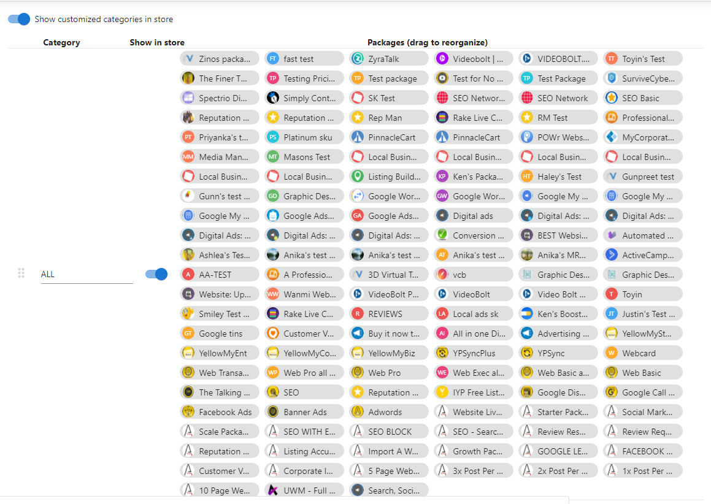

# Troubleshooting Guide for Product Visibility

This guide helps troubleshoot issues with not being able to see products in Marketplace > Manage Store > Categories.

## Common Causes

Products not visible in Manage Store > Categories is likely due to:

- Failing to start selling the product
- Product not available in the correct market
- Category is not set to ALL

## Troubleshooting Methods

### Method #1: Failed to Select Start Selling

1. Navigate to Marketplace > Discover Products
2. Search for the product in question
3. On the right side of the page, there is a Start Selling Button. It will be greyed out and say Selling if you have completed this step successfully.

### Method #2: Product not available in the correct market

1. Navigate to Marketplace > Products
2. Within the Overview, you should see the Available in Store card
3. Check to see if product has been added to the correct Market

### Method #3: Category is not set to ALL

1. Navigate to Marketplace > Manage Store
2. Expand Categories and Toggle the ALL category to on
3. **_Individual products will only show in your Public Store if the "ALL" category is toggled on._**

**_NOTE:_** _Individual products that are NOT inside a package will not appear in the Categories section. You also cannot move the packages around in the ALL category through this section._

