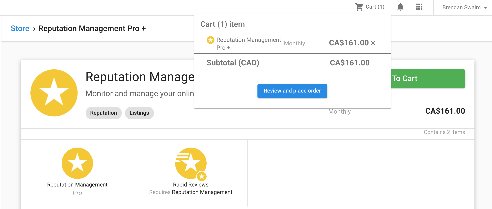
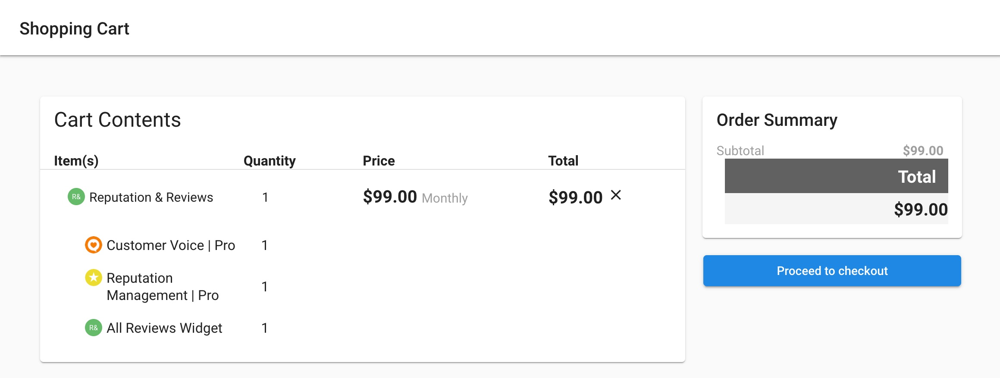
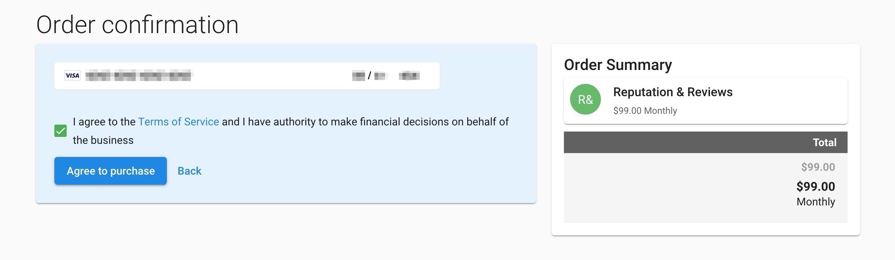

# Using the Shopping Cart

The Shopping Cart in the Vendasta Marketplace allows you to add multiple products to your cart and purchase them in a single transaction. This article explains how to use the Shopping Cart feature.

## Adding items to the Shopping Cart

You can add items to your Shopping Cart in these ways:

1. From a product detail page, click the **Add to Cart** button.
2. From the package detail page, click the **Add to Cart** button.

Once you add an item to your cart, you'll see a notification that confirms the item has been added to your cart, and the Shopping Cart icon in the top-right corner of the page will update to show the number of items in your cart.

## Viewing the Shopping Cart

To view your Shopping Cart:

1. Click the Shopping Cart icon in the top-right corner of any Marketplace page.
2. Review the items in your cart.

## Modifying items in the Shopping Cart

From the Shopping Cart, you can:

- **Remove an item**: Click the trash icon next to the item you want to remove.
- **Change quantity**: For products that allow multiple quantities, you can adjust the quantity using the dropdown menu.
- **Continue shopping**: Click the **Continue Shopping** button to return to the Marketplace while keeping your items in the cart.

## Checking out

When you're ready to complete your purchase:

1. Review the items in your cart.
2. Click the **Checkout** button.
3. On the checkout page, select your payment method.
4. Review the order summary.
5. Click **Place Order** to complete your purchase.

## Important notes

- Your Shopping Cart contents are saved if you leave the Marketplace and return later.
- Some products may require additional configuration during checkout.
- Pricing is displayed in your account's default currency.
- If you have any issues with the Shopping Cart, contact Vendasta Support.

## Related articles

- [Manage Store Overview](/marketplace/marketplace-manage-store/manage-store-overview)
- [Embed or Share Your Store](/marketplace/marketplace-manage-store/embed-or-share-your-store)