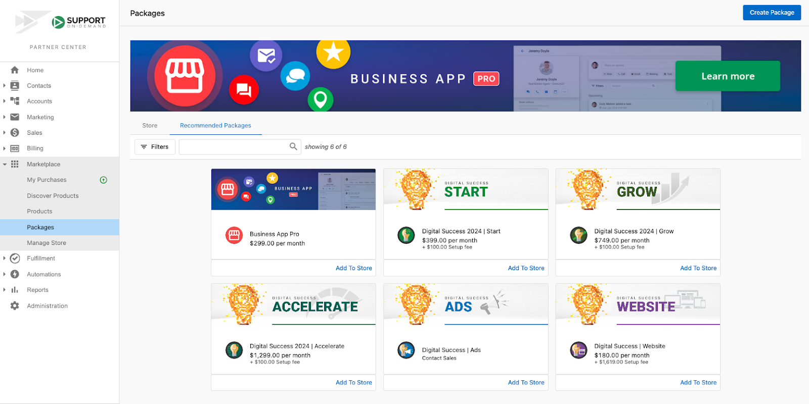
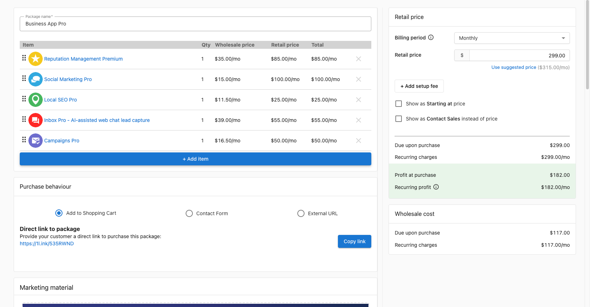

Whether you're a new Partner who's only beginning to set up your store or an experienced Partner who wants to offer local businesses a focused and effective suite of services, Recommended Packages provide a Vendasta-curated set of products designed to offer maximum value to your customers.

We currently offer a variety of Recommended Packages, each designed to provide a complete solution within a range of needs:

- Business App Pro 
- Digital Success 2024 | Start
- Digital Success 2024 | Grow
- Digital Success 2024 | Accelerate 
- Digital Success | Ads
- Digital Success | Website 

### How does it work?

To view Recommended Packages in Partner Center, go to **Marketplace > Recommended Packages**.

Recommended packages will automatically be added to your store, but you can also navigate to the **Recommended Packages** tab to browse through these! 

Click on any package to view the included products and to see a preview of how the package will appear in your store.  

From here, you can edit what is included in the package, set the retail pricing, select the purchase behavior, and preview the package in your store. Finally, save your package as a draft, or publish it to your store! 

