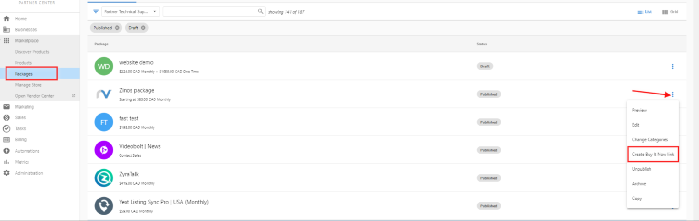
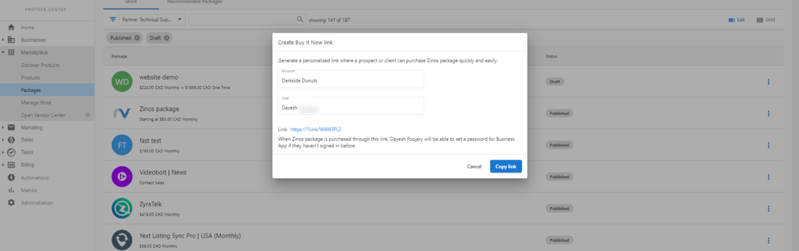
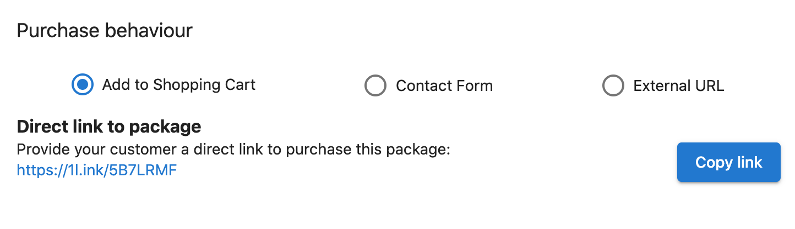
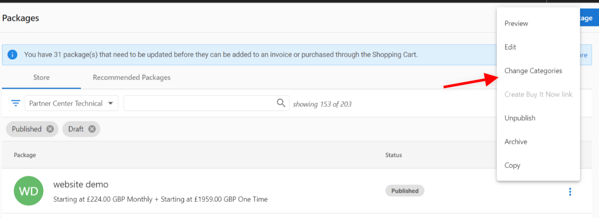
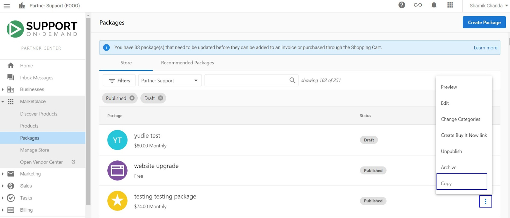

# Package Management & Store Integration

Effective package management covers the entire lifecycle: editing, optimizing, arranging in store, and sharing with customers. This guide focuses on managing packages post‑creation and ensuring they perform in your store.

## Package lifecycle management

### Edit published and draft packages

The package editing system provides complete flexibility to modify both published and draft packages at any time, allowing you to respond quickly to market changes, incorporate customer feedback, or adjust your business strategy as conditions evolve. Changes to published packages take effect immediately, ensuring your store always reflects your current offerings and market positioning.

**The editing process** begins by navigating to **Partner Center > Marketplace > Packages** where you can access your complete package portfolio. If you're using the Markets feature for multi-geographic operations, select the target market before proceeding to ensure you're editing the correct regional version of your package.

Click on the package requiring modification to access the comprehensive editing interface. Here you can modify every aspect of the package including the package name and description that customers see, the specific product contents and quantities included in the bundle, individual product pricing within the package, purchase behavior settings that control how customers can buy the package, and all marketing content and materials that support the package sale.

**Save options** provide control over when changes go live. Choose **Save & Publish** for immediate live updates to your customer-facing store when you want changes to be available instantly, or select **Save as Draft** to preserve changes without publishing when you need more time to review or coordinate with other business activities.

**Real-time impact** means all published package changes become immediately visible to customers in both your Public Store and Business App interfaces. This immediate deployment capability enables rapid response to market opportunities, competitive pressures, and evolving customer needs without delays or technical barriers.

### Package status management

#### Archive packages
Package archiving provides a powerful tool for managing your offerings without permanently losing work or data. When you archive a package, it's immediately removed from customer view while preserving all configuration details for potential future use. This approach works particularly well for seasonal offerings that you'll want to reactivate later, discontinued product combinations that may become relevant again, or packages currently under revision that aren't ready for customer access.

**The archiving process** starts by navigating to **Partner Center > Marketplace > Packages** to access your package management dashboard. If you're operating across multiple markets, select the appropriate market to ensure you're archiving the correct regional version of your package.

Locate the target package within your portfolio, then click the **three dots menu** in the bottom right corner to access package management options. Select **Archive** from the available actions and confirm your archiving decision to complete the process.

**Archiving benefits** include immediate removal from your customer-facing store while preserving all package configuration and settings for future reference, maintaining complete historical performance data that helps you understand past success and challenges, enabling quick restoration if market conditions change or you need to reactivate the package, and keeping archived packages visible in Partner Center using the "Archived" filter for easy management and review.

#### Restore archived packages
Restoration returns archived packages to active status, making them available for customer purchase.

**Restoration process**
1. Navigate to **Partner Center > Marketplace > Packages**
2. Access **Filters** menu
3. Select **Archived** filter to view archived packages
4. Locate package for restoration
5. Click **three dots menu** > **Restore**
6. Package immediately returns to active status

#### Permanently delete packages
Deletion permanently removes packages from the system. This action cannot be undone and should be used only for packages that will never be needed again.

**Requirements**
- Packages must be archived before deletion
- Deletion is permanent and irreversible
- Consider long-term business needs before deletion

**Deletion process**
1. Navigate to **Partner Center > Marketplace > Packages**
2. Apply **Archived** filter in Filters menu
3. Locate package for deletion
4. Click **three dots menu** > **Delete**
5. Confirm permanent deletion

### Package management walkthrough video

For visual guidance through package management processes:

<iframe 
  src="https://drive.google.com/file/d/1reJejr8GPxZHrIfRwBDPboxQUln36N-H/preview" 
  width="640" 
  height="480" 
  allowFullScreen
></iframe>

## Store organization and arrangement

### Strategic package positioning

Just like physical retail stores where product placement dramatically influences customer behavior and sales performance, your digital store's presentation and package positioning significantly impact how customers discover, evaluate, and purchase your offerings. Strategic arrangement of packages helps highlight your most valuable solutions and guides customers through a logical progression of your solution portfolio.

**Positioning principles** should guide your package arrangement decisions. **MVP positioning** focuses on highlighting your best-selling and most strategically significant packages in prominent locations where customers will see them first, ensuring your most successful offerings get maximum visibility and consideration.

**Customer journey optimization** involves arranging packages to support natural purchase progression, starting with entry-level solutions that appeal to first-time buyers and progressing to more comprehensive packages that serve customers ready for larger commitments. This approach helps customers find appropriate starting points while creating clear paths for future expansion.

**Visual hierarchy** uses positioning to create clear value distinctions between different package tiers, helping customers understand the relationship between your offerings and making upgrade decisions more intuitive. **Seasonal adaptation** keeps your package arrangement responsive to market conditions and timing, ensuring promotional packages and seasonal solutions receive appropriate visibility when they're most relevant to customer needs.

### Package ordering configuration

**Arrangement process**
1. Navigate to **Partner Center > Marketplace > Packages**
2. Switch to **Grid layout** view
3. Click **Edit Order** button
4. **Drag and Drop** packages to desired positions
5. Click **Save Order** to confirm arrangement

**Customer impact**
Package order determines how customers see your offerings in both Business App store and Public Store. Strategic ordering can significantly impact conversion rates and average order values.

### Category management and organization

**Assign categories for visibility**
Proper category assignment ensures packages appear in logical store sections and are discoverable through customer browsing.

**Configuration**
- **Package Categories** - Assign packages to relevant business function categories
- **Store Categories** - Control which categories appear in customer-facing store
- **Market Categories** - Customize category visibility by geographic market

## Package sharing and customer engagement

### Package link sharing methods

Partner Center provides three distinct methods for sharing package links with customers and prospects, each designed for specific use cases and customer interactions.

#### Method 1: Buy It Now links

**Purpose**: Create account‑specific, user‑specific links that allow immediate package purchase without Business App sign‑in.

**Use cases**
- Direct sales conversations with specific prospects
- Personalized email outreach to target customers
- Sales team follow-up with qualified leads
- Streamlined purchase for known customers

**Create link**
1. Navigate to **Partner Center > Marketplace > Packages**
2. Click **⋮ (Options) menu** on target package
3. Select **Create Buy it Now link**
4. Choose specific **Account** and **User**
5. Copy generated link for distribution

**Requirements**
- Package must be published
- Purchase behavior must be set to **Add to Shopping Cart**
- Target user must already exist in the system

**User setup**
Before creating Buy it Now links, ensure target users exist:
1. Navigate to **Partner Center > Accounts > Manage Accounts**
2. Select target account
3. Add existing users under **Users** section
4. Configure user permissions and access

**Customer experience**
- No Business App sign-in required for purchase
- Direct access to package information and checkout
- Password setup prompted after purchase completion (for new users)
- Seamless transition to full Business App access

#### Method 2: Direct package links

**Purpose**: General‑purpose links that work for any customer but require Business App authentication.

**Use cases**
- Website integration and call-to-action buttons
- General marketing campaigns and advertisements
- Social media sharing and promotion
- Email marketing to broad audiences

**Generate link**
Direct links are automatically available for all published packages with **Add to Shopping Cart** purchase behavior. Access these links when viewing or editing packages in **Partner Center > Marketplace > Packages**.

**Distribute link**
- Copy shortened URL using **Copy link** button
- Embed in websites, emails, or marketing materials
- Share through any communication channel

**Customer experience**
- Automatic package addition to shopping cart
- Redirect to **Cart Contents** page for review
- Sign-in required for non-authenticated users
- Quick account creation option for new customers

#### Method 3: Email marketing campaign integration

**Purpose**: Dynamic package links within email marketing campaigns for personalized outreach.

**Integrate**
1. Navigate to **Partner Center > Marketing**
2. Create new campaign or edit existing campaign
3. While editing email content, click **Insert Dynamic Component**
4. Select **Direct Store Link > Buy it Now Link**
5. Choose target Market (if applicable) and specific package
6. Continue email editing or use **Preview** to review appearance
7. **Publish** campaign to make available to sales team

**Benefits**
- Personalized package recommendations
- Seamless integration with existing email workflows
- Performance tracking and analytics
- Automated customer segmentation and targeting

### Package sharing best practices

**Communication strategy**
- **Context Setting** - Explain package value and relevance before sharing links
- **Follow-Up Planning** - Establish communication plan for post-share engagement
- **Multiple Touchpoints** - Use different sharing methods for comprehensive outreach
- **Performance Tracking** - Monitor link usage and conversion rates

**Security and access**
- Buy it Now links are user-specific and should not be shared broadly
- Direct links can be shared publicly but require customer authentication
- Regular link performance review and optimization
- Consider link expiration for time-sensitive offers

## Store integration and visibility management

### Troubleshoot package visibility

Package visibility issues can impact customer discovery and sales performance. Understanding common causes and solutions ensures optimal package presentation.

#### Common visibility problems

**Issue 1: Missing category assignment**
Symptoms: Published packages not appearing in Business App store
Cause: Package created without category selection
Solution:
1. Navigate to **Marketplace > Packages**
2. Search for affected package
3. Click **3 dots (options menu)** > **Change Categories**
4. Select appropriate store categories
5. Package automatically appears in selected categories

**Issue 2: Store category configuration**
**Symptoms:** Packages assigned to categories that aren't displayed in store
Cause: Category visibility settings not configured
Solution:
1. Navigate to **Marketplace > Manage Store > Categories**
2. Add required categories
3. Configure package assignments
4. Toggle **Show in store** for relevant categories

**Issue 3: Market assignment problems**
**Symptoms:** Packages missing from specific markets
Cause: Package not copied to correct market
Solution:
1. Navigate to **Marketplace > Packages**
2. Click **3 vertical dots** next to package > **Copy**
3. Select required market
4. Click **Save and Publish**

### Duplicate package resolution

Issue: Duplicate packages appearing in Public Store after categorization
Cause: Both Business App and Public Store options checked for the same product
Resolution:
1. Navigate to **Partner Center**
2. Search for duplicated product in **Product** section
3. Access **Product Overview** page
4. Uncheck both **Business App** and **Public Store** options
5. Refresh page and verify duplicate removal in Public Store

### Multi‑market package management

**Considerations**
- **Localized Pricing** - Adjust package pricing for regional markets
- **Product Availability** - Ensure all package components are available in target markets
- **Regulatory Compliance** - Consider local regulations and requirements
- **Cultural Adaptation** - Modify messaging and positioning for local audiences

**Cross‑market strategy**
- **Standardization** - Maintain consistent core offerings across markets
- **Localization** - Adapt pricing, messaging, and product mix for regional needs
- **Performance Monitoring** - Track package performance across different markets
- **Optimization** - Continuously improve packages based on market-specific data

## Advanced package management

### Performance analytics and optimization

**Key metrics**
- **Conversion Rates** - Track package-to-purchase conversion across different sharing methods
- **Average Order Value** - Monitor package impact on transaction size
- **Customer Acquisition** - Measure package effectiveness for new customer acquisition
- **Customer Lifetime Value** - Assess long-term value of package customers

**Optimization**
- **A/B Testing** - Test different package configurations, pricing, and messaging
- **Seasonal Adjustments** - Modify packages based on seasonal demand patterns
- **Customer Feedback Integration** - Incorporate user insights into package improvements
- **Competitive Analysis** - Regular review of market positioning and pricing

### Integration with sales processes

**Sales team enablement**
- **Package Training** - Ensure sales team understands package value propositions
- **Link Management** - Provide easy access to sharing tools and resources
- **Performance Tracking** - Monitor individual and team package sales performance
- **Customer Insights** - Share package usage data for improved customer conversations

**Customer success integration**
- **Onboarding Packages** - Create packages specifically for new customer success
- **Expansion Packages** - Develop upgrade paths for existing customers
- **Retention Packages** - Design packages to reduce churn and increase loyalty
- **Support Integration** - Align package offerings with customer support capabilities

Effective package management requires ongoing attention to customer needs, market conditions, and business objectives. The tools and strategies outlined in this guide provide the foundation for building a successful package-based business that drives revenue growth and customer satisfaction.