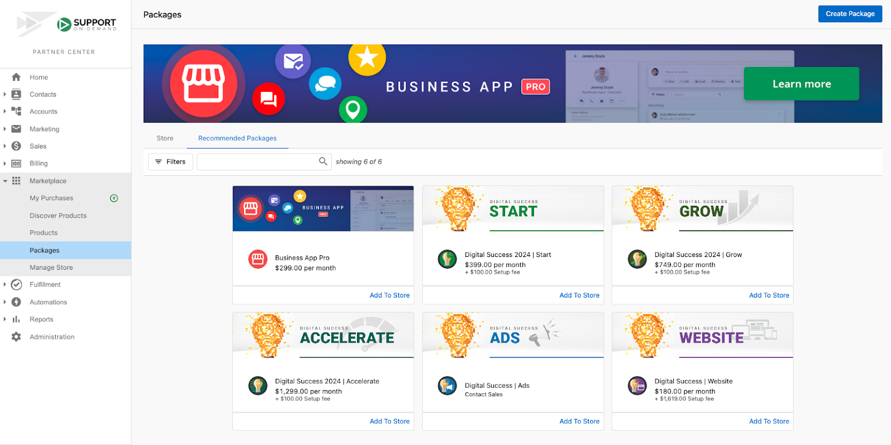
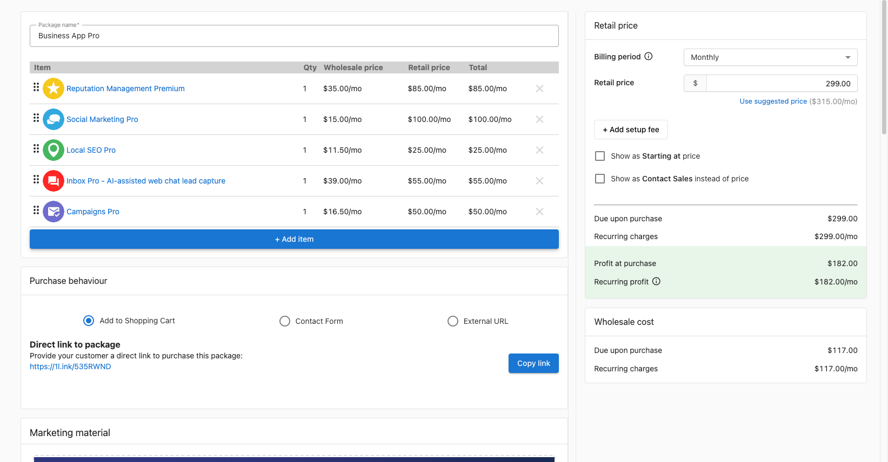
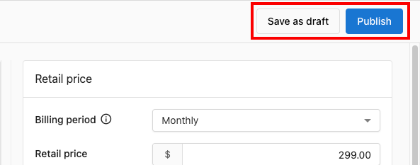
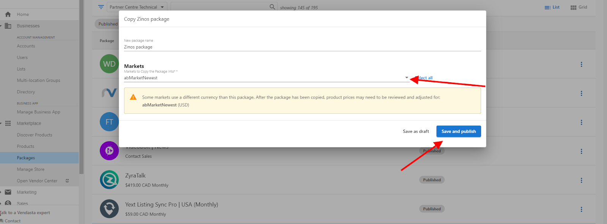

# Packages - Overview & Creation

Packaging is the strategic process of designing and creating different combinations of features, functions, and products you can offer customers. Packages in the Marketplace serve as your centralized location to bundle products into compelling combinations—each at different price points—to appeal to a range of different customers and maximize revenue opportunities.

## What Are Packages?

Packages are curated bundles of products and services that work together to solve comprehensive customer needs. Rather than selling individual products, packages allow you to create complete solutions that provide greater value to customers while increasing your average order value and profit margins.

**Key Package Benefits:**
- **Efficient Product Distribution** - Streamlined delivery of multiple solutions
- **Enhanced Branding** - Emphasize your best features and create cohesive offerings
- **Revenue Optimization** - Higher average order values and improved profit margins
- **Customer Acquisition** - Simplified decision-making for prospects
- **Product-Led Growth** - Clear upgrade and expansion paths for existing customers

## Understanding Package Types

### Store Packages
Store packages provide a high-level overview of packages configured in your Public Store, available both in Business App and embeddable on your website.

**Store Package Features:**
- Easy filtering by Status (Published, Draft, or Archived)
- Organization by Products or LMI Category
- Real-time availability in customer-facing stores
- Integration with shopping cart functionality

### Recommended Packages
Recommended packages are Vendasta-curated bundles designed to offer maximum value to your customers. These pre-configured packages represent proven combinations that drive results for local businesses.

**Current Recommended Packages:**
- **Business App Pro** - Comprehensive platform access and core features
- **Digital Success 2024 | Start** - Entry-level digital marketing suite
- **Digital Success 2024 | Grow** - Expanded marketing and growth tools
- **Digital Success 2024 | Accelerate** - Advanced growth and optimization features
- **Digital Success | Ads** - Focused advertising and campaign management
- **Digital Success | Website** - Website creation and optimization bundle

### Custom Packages
Custom packages allow Partners to create tailored combinations of products and services that align with their specific market needs and customer requirements.

## How to Use Recommended Packages

Recommended packages provide an excellent starting point for Partners who want to leverage proven product combinations without starting from scratch.

### Accessing Recommended Packages
Navigate to **Partner Center > Marketplace > Packages** and select the **Recommended Packages** tab to browse through available options.

### Evaluating Recommended Packages
1. **Browse Available Packages** - Review all recommended options in the dedicated tab
2. **Package Preview** - Click on any package to view included products and store preview
3. **Customization Options** - Edit package contents, pricing, and purchase behavior
4. **Store Integration** - Preview how packages will appear in your customer-facing store

### Adding Recommended Packages to Your Store

**Quick Addition Method:**
1. Navigate to **Partner Center > Marketplace > Packages**
2. Click the **Recommended Packages** tab
3. Browse or search for desired packages
4. Click **Add to Store** on the package card for immediate addition
5. Review and edit package information as needed
6. Select target Market (if using Markets feature)
7. Click **Save and publish** for immediate availability

**Detailed Customization Method:**
1. Click **Copy** on the Package Details page for full customization
2. Modify package components, pricing, and marketing materials
3. Configure purchase behavior and customer experience
4. Save as draft for further editing or publish immediately

## Creating Custom Packages

Custom package creation gives you complete control over product combinations, pricing strategies, and customer experience design.

### Package Creation Workflow

#### Step 1: Initial Package Setup
Navigate to **Partner Center > Marketplace > Packages** and select **Create Package**.

**Market Selection:** If using Markets, select the target market for package creation from the Packages table before beginning.

#### Step 2: Package Naming
**Package Name Configuration:**
- Choose a descriptive name that appears in your Store
- Consider customer language and search terms
- For single-product packages, the product name is used automatically
- Ensure brand consistency across your package portfolio

#### Step 3: Product Selection and Organization
**Adding Products:**
1. Click **+ Add item** to select products for your package
2. Only products you're currently selling appear in the selection list
3. **Organize Contents:** Drag items to reorder them logically
4. **Remove Items:** Click the X icon to remove unwanted products
5. **Product Availability:** Ensure all included products are enabled for sale

**Product Selection Strategy:**
- Group complementary products that solve related problems
- Consider customer workflow and implementation order
- Balance package value with price point accessibility
- Plan for natural upgrade paths to higher-tier packages

#### Step 4: Purchase Behavior Configuration
Package purchase behavior determines customer interaction with your packages and significantly impacts conversion rates.

**Purchase Behavior Options:**
- **Add to Shopping Cart** - Standard e-commerce experience with immediate purchase capability
- **Contact Sales** - Launches contact form for sales team interaction
- **External URL** - Redirects to custom landing page or external system

**Behavior Selection Guidelines:**
- Use **Shopping Cart** for standardized packages with fixed pricing
- Choose **Contact Sales** for complex solutions requiring consultation
- Select **External URL** for integration with existing sales systems

#### Step 5: Pricing and Cost Analysis
**Comprehensive Pricing Overview:**
The package creation interface provides real-time financial analysis displayed on the right side of the screen.

**Retail Price Management:**
- **Default Pricing:** Uses Manufacturer's Suggested Retail Price (MSRP)
- **Custom Pricing:** Override default with market-optimized pricing
- **Dynamic Updates:** Pricing adjusts automatically as you add/remove products
- **Price Display Options:**
  - **Show as Starting at price** - Indicates variable pricing based on customization
  - **Show Contact Sales instead of price** - Hides specific pricing for consultation-based sales

**Setup Fee Configuration:**
- Add one-time implementation or setup charges
- Separate recurring costs from initial investment
- Account for onboarding and configuration services

**Cost Analysis:**
- **Wholesale Cost:** Your total cost for all package components
- **Profit at Purchase:** Immediate margin calculation (retail price minus wholesale cost)
- **Margin Optimization:** Real-time profit analysis for pricing decisions

**Shopping Cart Compatibility:**
"Starting at" pricing and "Contact Sales" pricing options make packages incompatible with shopping cart functionality. Use these settings with **Contact Form** purchase behavior for optimal customer experience.

#### Step 6: Marketing Material Development
**Customer-Facing Marketing Content:**
Marketing materials appear when customers view packages in your Public Store or Business App Store tab.

**Editable Marketing Elements:**
- **Package Icon** - Visual identifier for quick recognition
- **Banner Image** - Hero image for package promotion
- **Tagline** - Compelling value proposition summary
- **Description** - Detailed explanation of package benefits and included services

**Product Display Options:**
- **Show Product Icons and Names** - Display individual product components
- **Show Product Details** - Include detailed product information
- **Invoice Impact:** When product display is disabled, invoices show only package name and total price rather than individual line items

**Marketing Best Practices:**
- Focus on customer outcomes rather than product features
- Use specific, measurable benefits when possible
- Maintain consistent brand voice and messaging
- Include social proof and credibility indicators

#### Step 7: Publication and Availability
**Publishing Options:**
- **Publish** - Makes package immediately available in Public Store and Business App
- **Save Draft** - Saves progress for future editing without customer visibility
- **Draft Management** - Access drafts anytime from Marketplace > Packages using Draft filter

### Adding Products and Packages to Your Store

#### Individual Product Addition
**Quick Product Enablement:**
When you start selling a product, you receive prompts to:
- Skip adding to store for backend-only sales
- Add to store at suggested retail price for immediate customer availability

**Product Availability Management:**
- **Stop Selling:** Navigate to Marketplace > Discover Products, search for product, and click Stop Selling at bottom of product page
- **Market-Specific Availability:** Control product visibility per market in Marketplace > Products on the "Available in-store" section
- **Store Integration:** Enabled products appear in Public Store (preview in Marketplace > Manage Store) and Business App > Store

#### Custom Product Integration
Partners can also sell their own products and services through the marketplace by creating custom products in Vendor Center, expanding beyond the 250+ curated marketplace solutions.

### Advanced Package Management

#### Package Preview and Testing
**Preview Functionality:**
1. Navigate to **Partner Center > Marketplace > Packages**
2. Click the **Menu** (3 vertical dots) on the package card
3. Select **Preview** to test customer-facing display
4. Review package appearance in both Public Store and Business App contexts

#### Multi-Market Package Management
**Package Distribution Across Markets:**
- Configure different packages for different geographic markets
- Customize pricing and product availability by region
- Maintain market-specific branding and messaging
- Monitor performance across different markets

## Package Pricing Strategies

### Value-Based Packaging
- **Solution-Oriented Pricing** - Price based on customer value delivered
- **Competitive Analysis** - Research similar solutions in your market
- **Margin Optimization** - Balance profitability with market accessibility
- **Tiered Offerings** - Create good, better, best package hierarchies

### Dynamic Pricing Options
- **Promotional Pricing** - Limited-time offers and seasonal discounts
- **Market-Specific Pricing** - Regional optimization based on local markets
- **Volume Discounts** - Incentives for larger commitments
- **Custom Pricing** - Consultation-based pricing for complex solutions

## Best Practices for Package Success

### Package Design Principles
- **Customer-Centric Design** - Start with customer needs and pain points
- **Logical Grouping** - Bundle products that naturally work together
- **Clear Value Proposition** - Articulate why the package is better than individual products
- **Scalability Planning** - Design packages that support customer growth

### Marketing and Positioning
- **Compelling Naming** - Use customer language and benefit-focused titles
- **Visual Consistency** - Maintain brand standards across all package materials
- **Benefit-Focused Messaging** - Emphasize outcomes rather than features
- **Social Proof Integration** - Include testimonials and success stories

### Performance Optimization
- **Regular Review** - Monitor package performance and customer feedback
- **A/B Testing** - Test different pricing, messaging, and product combinations
- **Customer Feedback** - Incorporate user insights into package improvements
- **Market Adaptation** - Adjust packages based on market conditions and competition

## Frequently Asked Questions

### Multi-Market Package Management
**Q: How can I add a package to multiple Markets?**
A: If you have an existing package in one market and want the same package in other markets without rebuilding it, you can copy it:

1. Navigate to **Partner Center > Marketplace > Packages**
2. Select the package and click the **3 dots** beside it
3. Choose **Copy**
4. Select the target market and click **Save and Publish**
5. Switch to the other market to confirm package availability

### Package Link Accessibility
**Q: Will the direct link to package work if the user has no access to the store?**
A: Yes! Users can purchase packages through direct links because the link leads to the shopping cart in Business App. The purchase workflow doesn't require navigation to the Store tab, making packages accessible even to users without store access.

### Package Deletion
**Q: Can I delete multiple packages at once?**
A: Packages can only be deleted one by one, not collectively. To permanently remove packages:

1. **Archive First:** Navigate to Marketplace > Packages, click the 3 dots next to the package, and select **Archive**
2. **Then Delete:** Access archived packages using filters, then select **Delete**
3. **Restoration Option:** Archived packages can be restored if needed by selecting **Restore** from the 3-dot menu

Creating effective packages requires understanding your customers' needs, strategic thinking about product combinations, and ongoing optimization based on performance data. The Vendasta platform provides all the tools necessary to create compelling packages that drive revenue growth and customer satisfaction.