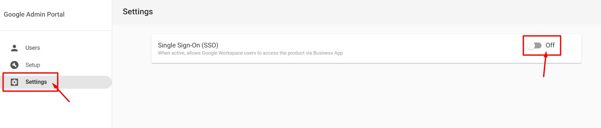

# Google Workspace - Complete Integration Guide

This comprehensive guide covers everything you need to know about integrating Google Workspace with the Vendasta platform, including initial setup, transferring existing subscriptions, and managing SSO configurations.

## Overview of Google Workspace Integration

Google Workspace integration with the Vendasta platform provides seamless productivity solutions for your clients while maintaining centralized management through Partner Center. This integration supports both new Google Workspace setups and transfers of existing subscriptions.

**Key Integration Benefits:**
- Centralized billing and management through Partner Center
- Seamless user authentication with Business App
- Automated provisioning and deprovisioning
- Comprehensive administrative control
- Support for both SSO and direct Google login

## Pre-Setup Requirements

Before beginning any Google Workspace configuration, ensure you have the following prerequisites:

### Essential Requirements
- **Domain Administrative Access** - Full DNS management capabilities for the target domain
- **Secondary Email Address** - Alternative email on different domain for administrative purposes
- **Business App User Setup** - Configured users matching the Google Workspace domain structure

### Domain Configuration
- Verify domain ownership and administrative rights
- Ensure DNS settings can be modified (TXT and MX records)
- Plan domain structure for all Google Workspace users
- Example format: `username@clientdomain.com`

### User Planning
- Identify all users who will need Google Workspace access
- Plan user roles and permissions structure
- Determine administrative responsibilities
- Consider future scaling requirements

## New Google Workspace Setup

### Business App User Configuration

**Creating New Users:**
1. Navigate to **Partner Center > Businesses > Users**
2. Click **Create User**
   - Alternative path: **Partner Center > Businesses > Accounts > [Account Name] > Users**
3. Complete user form ensuring email domain matches Google Workspace domain
4. Add user to target account:
   - Select edit icon > **Edit Permissions > Add Account**
   - Locate target account and select checkbox
   - Click **Add Accounts**
5. Repeat for all Google Workspace users

**Using Existing Users:**
If users already exist with matching domain:
1. Navigate to **Partner Center > Businesses > Users**
2. Select edit icon next to target user > **Edit Permissions**
3. Click **Add Account**
4. Locate target account and select checkbox
5. Click **Add Accounts**
6. Repeat for all applicable users

Skip to activation if users are already assigned to the target account.

### Google Workspace Activation

**Initial Activation Process:**
1. Navigate to **Partner Center > Businesses > Accounts**
2. Select target account
3. Click **Activate Products > Google Workspace**
4. Click **Continue**
5. Check both "I understand..." acknowledgment boxes

### Setup Scenarios

Choose the scenario that best matches your deployment strategy:

#### Scenario A: Client-Managed Setup
**Use Case:** Client handles all Google Workspace configuration independently

**Configuration:**
- **Domain Name:** Client's domain for Google Workspace
- **Username:** Client's primary email address (must match domain)
- **Business App User:** Select corresponding Business App user
- **Admin Email Address:** Client's alternative email (different domain required)

**Process Flow:**
- Client receives Welcome to Google Workspace email
- Client completes domain verification and DNS configuration
- Client configures Google Workspace settings independently
- Partner maintains billing and administrative oversight

#### Scenario B: Partner Setup, Client Administration
**Use Case:** Partner performs initial setup, client takes over administration

**Configuration:**
- **Domain Name:** Client's domain for Google Workspace
- **Username:** Client's primary email address (must match domain)
- **Business App User:** Select corresponding Business App user
- **Admin Email Address:** Client's alternative email (different domain required)

**Process Flow:**
- Partner completes initial activation and domain verification
- Client receives administrative credentials
- Client assumes ongoing administrative responsibilities
- Partner maintains billing relationship

#### Scenario C: Partner Setup and Administration
**Use Case:** Partner maintains ongoing administrative control

**Configuration:**
- **Domain Name:** Client's domain for Google Workspace
- **Username:** Partner's email address on client domain
- **Business App User:** Select corresponding Business App user
- **Admin Email Address:** Alternative email for password recovery

**Process Flow:**
- Partner maintains full administrative control
- Partner handles all configuration and management tasks
- Client users access through Business App integration
- Partner provides ongoing support and management

### Activation Completion

1. Complete configuration form based on chosen scenario
2. Check **I understand...** acknowledgment checkbox
3. Click **Purchase** to begin activation
4. **Allow up to 10 minutes** for product activation

### Administrative Configuration (For Partner-Managed Setups)

**Terms of Service Acceptance:**
1. Monitor admin email inbox for "Google Workspace Admin User for..." message
2. Click **Reset Password** in the email
3. Enter secure password in **New Password** and **Confirm Password** fields
4. Click **Reset** to complete password setup
5. Navigate to [https://admin.google.com](https://admin.google.com)
6. Sign in with configured email and password
7. Accept Google Workspace Terms of Service

### Domain Verification and DNS Configuration

**Final Setup Steps:**
1. Navigate to **Partner Center > Businesses > Accounts > [Account Name]**
2. Click **Google Workspace**
3. Select **Setup** from sidebar
4. Follow verification instructions:
   - **Recommended Method:** Automated verification process
   - **Alternate Methods:** Manual DNS configuration

**DNS Record Configuration:**
- **TXT Records:** Domain ownership verification
- **MX Records:** Email routing configuration
- **Host-Specific Instructions:** Use "View full instructions" for platform-specific guidance
- **Support:** Contact domain host for configuration assistance if needed

### Additional User Provisioning

**Adding Extra Seats:**
1. Navigate to **Partner Center > Businesses > Accounts > [Account Name]**
2. Click **Google Workspace** under Products section
3. Locate "Seat Available For Use" rows
4. Click **Create User** for each available seat

**User Configuration:**
- **Business App User:** Select matching Business App user
- **First Name and Last Name:** User's full name
- **Google Workspace Username:** Username matching Business App user
- **Alternate Email:** Recovery email on different domain

Repeat for all additional purchased seats.

## Transferring Existing Google Workspace Subscriptions

### Transfer Overview

**Important Policy Update:** As of March 7th, 2025, Google no longer allows transfers to resellers that previously hosted the same Google Workspace within the last 18 months. Verify client's previous hosting history before initiating transfer.

**Transfer vs. New Subscription Differences:**
- Transferred accounts do NOT require Business App login
- Users continue existing Google Workspace login patterns
- No disruption to existing workflows and data
- Billing transfers to Vendasta while maintaining user experience

### Client Transfer Steps

**Required Client Actions:**
1. Provide client with Vendasta's **Reseller ID: C02e5br85**
2. Direct client to navigate to [admin.google.com/TransferToken](https://admin.google.com/TransferToken)
   - If 404 error occurs, use private/incognito browsing mode
3. Have client click **Generate Transfer Token**
4. Client sends transfer token to partner

### Partner Transfer Processing

**Partner Center Configuration:**
1. Navigate to **Partner Center > Businesses > Accounts > [Account Name]**
2. Click **Activate Products > Google Workspace Transfer**
   - Contact [support@vendasta.com](mailto:support@vendasta.com) if option not available
3. Enter client-provided **Transfer Token**
4. Enter existing domain name being transferred
5. Check **I understand...** acknowledgment
6. Click **Purchase**

**Transfer Completion:**
1. Review seat calculation (transfer is free, no billing for activation)
2. Click **Google Workspace Transfer** under Products section
3. Confirm transfer details:
   - Review seat count being transferred
   - Check **I understand...** acknowledgment
   - Click **Confirm Transfer**
4. Allow several minutes for processing and seat activation
5. Verify client agreement to Google Workspace terms and conditions

## SSO Management and Configuration

### Understanding SSO Integration

Single Sign-On (SSO) integration allows users to access Google Workspace through Business App credentials, providing centralized authentication and seamless user experience across all platform products.

### Disabling SSO for Direct Google Access

**Use Case:** Users prefer direct Google login instead of Business App authentication

**SSO Disable Process:**
1. Navigate to **Partner Center**
2. Open account with active Google Workspace
3. Access Google Workspace from Partner Center

4. Open Workspace Dashboard
5. Select **Settings** from left panel
6. Locate SSO (Single Sign-On) toggle
7. Toggle SSO on or off as needed

**Impact of Disabling SSO:**
- Users can access Google products directly through Google login
- Business App and Google Workspace become separate login experiences
- Reduced integration between platforms
- Users maintain separate authentication for each system

### SSO Best Practices

**When to Keep SSO Enabled:**
- Centralized user management desired
- Single authentication point preferred
- Integration with other Business App products
- Simplified user training and support

**When to Disable SSO:**
- Users prefer native Google experience
- Existing Google workflow dependencies
- Reduced complexity for end users
- Independent Google and Business App usage

## Advanced Management and Troubleshooting

### User Management Best Practices

**User Provisioning Strategy:**
- Plan user hierarchy and permissions before setup
- Maintain consistent naming conventions
- Document user roles and responsibilities
- Regular review and cleanup of unused accounts

**Access Control Management:**
- Configure appropriate user permissions
- Implement security policies and requirements
- Monitor user access patterns and usage
- Regular security audits and updates

### Integration Monitoring

**Performance Monitoring:**
- Regular connectivity testing between systems
- Monitor authentication success rates
- Track user adoption and usage patterns
- Identify and resolve integration issues quickly

**Billing and Account Management:**
- Regular review of seat utilization
- Monitor for billing discrepancies
- Plan for user growth and scaling
- Maintain accurate user count for billing

### Common Issues and Solutions

**Domain Verification Problems:**
- Verify DNS record propagation (can take 24-48 hours)
- Confirm correct TXT and MX record values
- Check for conflicting DNS records
- Contact domain host for configuration assistance

**User Authentication Issues:**
- Verify Business App user configuration matches Google Workspace
- Confirm user permissions and account assignments
- Check SSO configuration settings
- Test authentication flow with sample users

**Transfer Problems:**
- Verify transfer token generation and validity
- Confirm client's previous hosting history (18-month restriction)
- Check domain ownership and administrative access
- Ensure all prerequisite steps completed

### Support and Resources

**Escalation Paths:**
- Technical issues: [support@vendasta.com](mailto:support@vendasta.com)
- Billing questions: Account management team
- Google-specific issues: Google Workspace support
- DNS/domain issues: Domain registrar support

**Documentation and Training:**
- Google Workspace administration guides
- Vendasta platform integration documentation
- User training materials and resources
- Video tutorials and walkthrough guides

## Setup Walkthrough Video

For visual guidance through the setup process, reference this comprehensive walkthrough:

<iframe src="https://drive.google.com/file/d/1g5VKa8MIaMd-7KjERa4RuNv9vmcADz9m/preview" width="640" height="480" allow="autoplay"></iframe>

## Conclusion

Google Workspace integration with the Vendasta platform provides powerful productivity solutions while maintaining centralized management and billing. Whether setting up new instances, transferring existing subscriptions, or managing SSO configurations, following these detailed procedures ensures smooth implementation and ongoing success.

Regular monitoring, proactive user management, and understanding of both new setup and transfer processes will help you deliver exceptional Google Workspace experiences for your clients while maintaining operational efficiency.