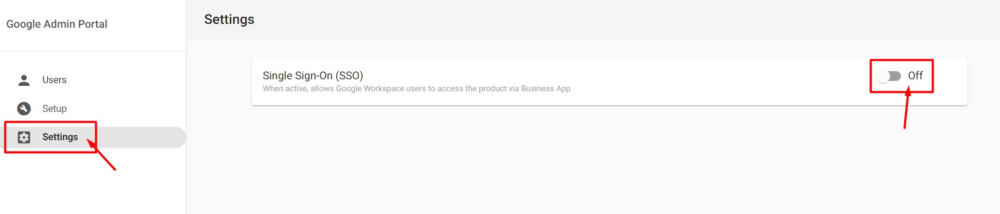

# Turning off Google Workspace SSO from Partner Center

Sometimes users would like to access their Google accounts directly instead of going through the Business App login process. Turning Single Sign On (SSO) off enables this and the SSO for all users can be turned off from the platform by Partners/Users. Once this is turned off, users can access Business App and Google products separately.

**To do this:**

- Go to Partner Center.
- Open an account with Google Workspace active and open Google Workspace from Partner Center.

- Once the Workspace Dashboard opens, click on Settings from the left panel.
- This then brings up the SSO (Single Sign-On) toggle.
- This can be turned on and off.

