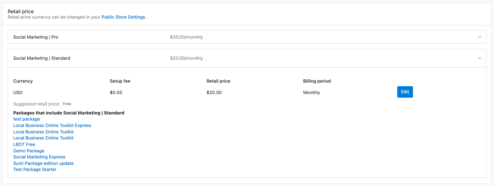
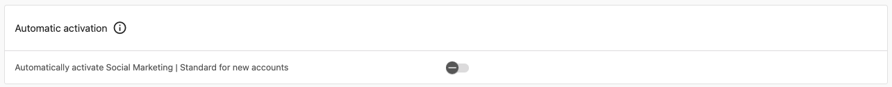
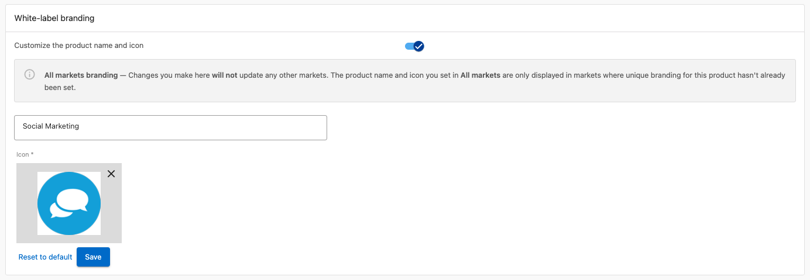
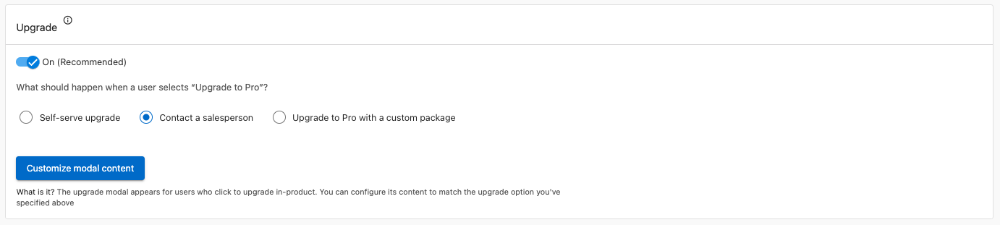
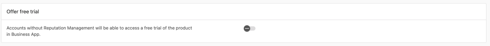
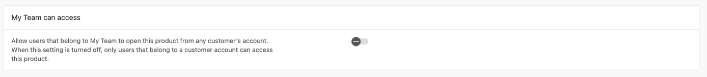

# Products overview

Products is your central place to manage enabled products, configure pricing and branding, and track growth and revenue.

## Why use Products?

- See what drives growth and track store sales and adoption
- Configure retail pricing, white‑label branding, and upgrade paths
- Monitor performance with real-time metrics (activations, deactivations, net growth)
- Improve customer experience with trials, team access, and add‑ons

## What's in this section

- **[Create & Manage Custom Products](./create-manage-custom-products.mdx)** – Build and manage your own custom products and services
- **[Google Workspace Complete Guide](./google-workspace-complete-guide.mdx)** – Comprehensive guide to Google Workspace product setup and management

## What's included

Per product you can view **store availability**, **active accounts**, and **growth metrics** (activations, deactivations, net growth). You can configure retail pricing, white‑label branding, auto‑activation, upgrade paths, free trials, team access, and add‑ons. Retired products are identified with a **Legacy** status badge. Filter by **All Products** or **My Products** in **Partner Center** → **Marketplace** → **Products**.

## Product configuration

Click any product to open management options:

### Overview tab
- Account analytics (usage, geography, trends), market‑specific performance, and store visibility by market, segment, or region.

### Product Info tab
- **Retail pricing**: Start from MSRP; set prices by channel (teams, markets, segments), setup fees, billing periods, and optional automatic updates.

- **Auto‑activation**: Enable "Auto‑activate when ordered" for instant deployment (new accounts only; not CSV or store‑created).

- **White‑label branding**: Use your product names and icons (select paid tiers).

- **Upgrade paths**: Self‑serve, contact sales, or custom package; customize modals (title, content, CTA).

- **Free trials**: Set duration, terms, and messaging to reduce friction and improve conversion.

- **Team access**: Control which roles can access products for support, demos, and training.

### Add‑ons tab
- View add‑ons; monitor sales and active accounts; configure pricing and availability.

## Best practices

- **Pricing**: Do regular competitive research and align prices with value delivered. Monitor wholesale vs. retail so each product stays profitable; adjust for market conditions and demand.
- **Performance**: Review growth metrics weekly. Use activation and deactivation patterns to spot product‑market fit and onboarding issues. Focus marketing and sales on products that drive growth and retention.
- **Configuration**: Keep white‑label branding consistent with your brand. Test upgrade paths and trials to improve conversion and lifetime value. Use team access and auto‑activation to balance support and efficiency.

## Frequently asked questions

Where can I manage daily digest notifications for product activations?

Notification icon (top bar) → **Settings** → **Accounts** → **Daily Activity** → deselect "Emails" (platform or user level).

Can I change the 1-year commitment on a product?

Yes for retail: adjust billing frequency (e.g. yearly → monthly) in **Product Info**. Wholesale frequency is fixed—you're still charged annually if you bill customers monthly.

How do I disable auto product activation?

**Marketplace** → **Products** → select product → **Product Info** → toggle off **Automatic Activation**.

How can I rename products in the Marketplace?

**Marketplace** → **Products** → product → **Product Info** → **White-label Branding** → toggle on, enter name, save. Only for white-labelable products.

How can I initiate a product trial?

Some products (e.g. Reputation AI, ActiveCampaign) offer trials. Activate from **Business App** → **My Products**.

## Advanced product management

- **Markets**: With Markets, set pricing and availability by region, use market-specific branding, and monitor performance per market.
- **Integrations**: Monitor health, set webhooks for product events, and manage API access.
- **Revenue**: Use dynamic and promotional pricing, tune upgrade paths, and track customer lifetime value.
