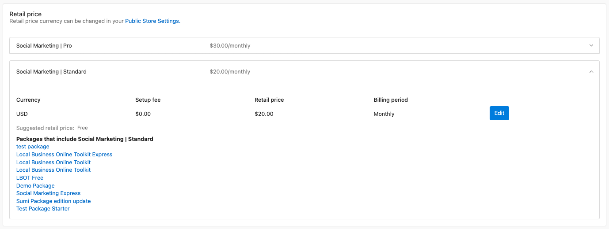
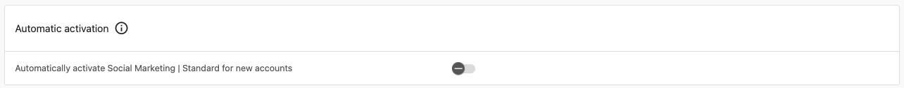
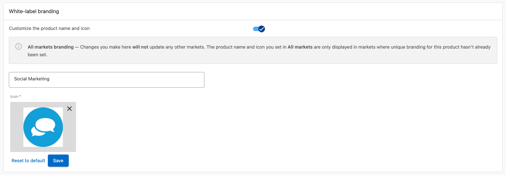
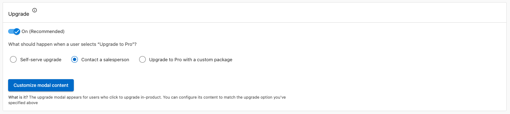
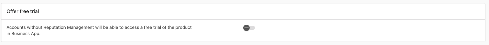
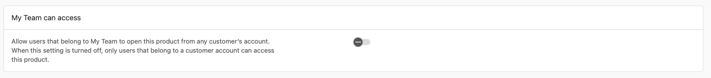

# Products - Overview & Management

Products in the Marketplace is your centralized command center for understanding, managing, and optimizing all enabled products in your portfolio. From marketing and product information to metrics and configuration, this is where you control growth trends, product settings, and revenue optimization.

## What is Products Overview?

The Products section serves as a comprehensive dashboard for all products you've enabled to sell. It provides real-time insights into performance, enables detailed customization, and offers powerful management tools to optimize your product portfolio and customer experience.

**Key Capabilities:**
- **Centralized Product Management** - Control all enabled products from a single location
- **Performance Analytics** - Monitor growth trends, activations, and revenue metrics
- **Advanced Configuration** - Customize pricing, branding, and customer experience
- **Team Management** - Control access and permissions across your organization

## Why Products Management is Critical

**Higher-Level Business Intelligence:**
- Identify which products drive the best growth trends and highest revenue
- Understand which products are actively selling in your store
- Track customer adoption patterns and lifecycle metrics
- Make data-driven decisions about product portfolio expansion

**Product Configuration and Customization:**
- Set optimal retail pricing strategies for maximum profitability
- Implement white-label branding to maintain brand consistency
- Configure upgrade paths to maximize customer lifetime value
- Customize the customer experience to align with your business processes

## How to Use Products Overview

Navigate to **Partner Center > Marketplace > Products** to access your product management dashboard.

### Product Categories

**All Products:**
- Complete view of everything currently enabled for your store
- Includes both marketplace products and your custom products
- Real-time status and performance metrics for each product

**My Products:**
- Focuses exclusively on your custom products and services
- Products you've created and added to the marketplace
- Full control over pricing, features, and configuration

### Key Product Information Display

For each enabled product, you'll see critical business metrics:

**Selling in Store Status:**
- Check mark indicates the product is actively available in your store
- Shows whether product is sold individually or as part of packages
- Quick visual confirmation of store inventory

**Active Accounts:**
- Total number of customers currently using the product
- Real-time count of active subscriptions
- Key metric for understanding adoption and revenue

**Growth Metrics (Configurable Time Frames):**
- **Activations:** New customer sign-ups for the product
- **Pending Deactivations:** Customers scheduled to cancel
- **Deactivations:** Completed cancellations in the time period
- **Net Growth:** Overall growth calculation (activations minus deactivations)
- Filter by Last 7 Days, 30 Days, or custom date ranges

## Product Details and Configuration

Click on any product to access comprehensive management options:

### Overview Tab
**Active Account Analytics:**
- Detailed breakdown of customer usage patterns
- Geographic distribution of active accounts
- Trend analysis over time periods
- Market-specific performance (if using Markets feature)

**Store Visibility Control:**
- Enable or disable product appearance in specific markets
- Control which customer segments can see the product
- Manage product availability by region or customer type

### Product Info Tab - Core Configuration

#### Retail Pricing Management

**Default Pricing Structure:**
- Products start with Manufacturer's Suggested Retail Price (MSRP)
- Customize pricing to optimize profit margins and market positioning
- Set different prices for different sales channels (teams, markets, customer segments)

**Price Configuration Options:**
1. **Setup Fees** - One-time charges for product implementation
2. **Subscription Pricing** - Recurring monthly or annual charges
3. **Billing Period Adjustment** - Change from annual to monthly billing or vice versa

**Automatic Price Updates:**
- Enable automatic price synchronization with integration providers
- Nightly updates ensure pricing stays current with vendor changes
- Applies updates at the customer level automatically

#### Auto-Activation Settings

**Streamlined Activation Process:**
- Enable "Auto-activate when ordered" for immediate product deployment
- Reduces manual administrative work
- Improves customer experience with instant access
- Particularly valuable for digital products and services

**Automatic Activation for Standard Products:**
Configure automatic activation when new accounts are created:
1. Navigate to specific Standard products (Local SEO, Reputation Management, Campaigns Pro, Social Marketing, Website, Advertising Intelligence)
2. Toggle "Automatic Activation" in Product Info
3. Products auto-activate for new accounts unless manually unchecked during account creation
4. Does not apply to bulk CSV uploads or store-created accounts

#### White-Label Branding

**Brand Consistency and Customization:**
Many marketplace products support white-labeling, allowing you to present them as your own solutions.

**White-Label Configuration:**
1. Navigate to Product Info tab
2. Enable "Customize the product name and icon"
3. Enter your preferred product name
4. Upload custom product icon
5. Save changes to apply across all customer touchpoints

**Availability:** White-label branding is available on select paid subscription tiers. Contact your account manager to verify qualification.

#### Upgrade and Downgrade Paths

**Revenue Optimization Through Upselling:**
Configure intelligent upgrade paths to maximize customer lifetime value and provide growth opportunities.

**Upgrade Path Options:**
1. **Self-Serve Upgrade** - Automatic upgrade when customer selects option
2. **Contact Salesperson** - Connects customer with sales team for personalized upgrade
3. **Custom Package Upgrade** - Uses pre-configured packages for upgrade path

**Modal Customization:**
- Edit in-product upgrade modal with custom title, content, and call-to-action
- Add custom images and branding
- Real-time preview of modal appearance
- Optimize conversion rates through A/B testing different modal content

#### Free Trial Configuration

**Risk-Free Customer Acquisition:**
Free trials reduce sales friction and help convert prospects to paying customers.

**Free Trial Setup:**
1. Navigate to Product Info tab
2. Toggle "Offer Free Trial"
3. Configure trial duration and terms
4. Set automatic conversion settings
5. Customize trial experience messaging

**Benefits:**
- Reduces burden on sales teams
- Increases conversion rates from prospects to customers
- Allows customers to experience value before commitment
- Builds confidence in product capabilities

#### Team Access Management

**Internal Product Access Control:**
Configure which team members can access products across all customer accounts.

**Team Access Benefits:**
- Enables admins, digital agents, and salespeople to access products
- Creates seamless experience across the platform
- Improves customer support capabilities
- Facilitates product demonstration and training

**Configuration Process:**
1. Navigate to Product Info tab
2. Toggle "My Team can access"
3. Select specific team roles and permissions
4. Apply access across all customer accounts

### Add-Ons Tab

**Product Enhancement and Revenue Expansion:**
- View all applicable add-ons for each product
- Monitor add-on sales performance and active accounts
- Configure add-on pricing and availability
- Track revenue contribution from product enhancements

## Product Management Best Practices

### Pricing Strategy Optimization
- **Market Research:** Regularly compare your pricing with competitors
- **Value-Based Pricing:** Align pricing with customer value delivery
- **Margin Analysis:** Monitor wholesale costs vs. retail pricing for profitability
- **Dynamic Pricing:** Adjust pricing based on market conditions and demand

### Performance Monitoring
- **Regular Review:** Weekly assessment of growth metrics and trends
- **Customer Feedback:** Monitor activation and deactivation patterns
- **Revenue Analysis:** Track which products contribute most to business growth
- **Market Response:** Adjust strategies based on customer adoption rates

### Configuration Management
- **Brand Consistency:** Ensure white-label branding aligns with overall brand strategy
- **Customer Experience:** Optimize upgrade paths and free trials for maximum conversion
- **Team Training:** Ensure team access settings support customer service excellence
- **Automation:** Leverage auto-activation where appropriate to reduce administrative overhead

## Frequently Asked Questions

### Notification Management
**Q: Where can I manage daily digest notifications for product activations?**
A: Navigate to the notification icon in the top navigation bar > Settings > Accounts > Daily Activity. Deselect "Emails" as a platform-wide or user-level setting.

### Billing Frequency Changes
**Q: Can I change the 1-year commitment on a product?**
A: You can adjust retail pricing and billing frequency (one-time, monthly, yearly) for customers. Example: Change a yearly product to monthly billing in Product Info settings. Note: Wholesale frequency cannot be changed - you'll still be charged annually even with monthly customer billing.

### Auto-Activation Management
**Q: How do I disable auto product activation?**
A: Navigate to Marketplace > Products, select the desired product, go to "Product Info" tab, and toggle off "Automatic Activation."

### Product Rebranding
**Q: How can I rename products in the Marketplace?**
A: Access Marketplace > Products, select the product, click "Product Info," then "White-label Branding." Toggle on, add your preferred name, and save. This feature is only available for white-labelable products.

## Advanced Product Management

### Market-Specific Configuration
For Partners using Markets feature:
- Configure different pricing for different geographic markets
- Customize product availability by region
- Implement market-specific branding and messaging
- Monitor performance across different markets

### Integration Management
- Monitor integration health and performance
- Configure webhook notifications for product events
- Manage API access and permissions
- Troubleshoot integration issues

### Revenue Optimization
- Implement dynamic pricing strategies
- Configure promotional pricing and discounts
- Optimize upgrade paths for maximum revenue
- Monitor and improve customer lifetime value

The Products Overview & Management system provides you with comprehensive control over your product portfolio, enabling data-driven decisions that drive revenue growth and improve customer satisfaction. Regular monitoring and optimization of these settings will help you build a successful, scalable product business.