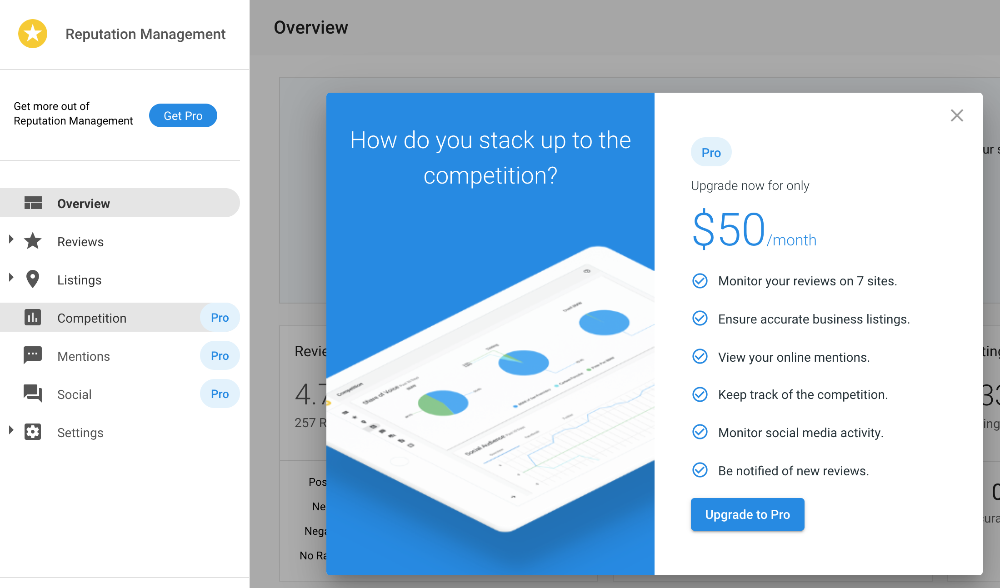

# Set the retail price for product upgrades

When a customer clicks on a Pro feature in Business App, they are prompted to upgrade from the Standard edition to the Pro edition. Business App displays the Pro edition MSRP by default. This article explains how to set a custom retail price and how to reset it back to the default.

## Set retail prices

The steps are the same for all products. The only difference is which product to search for in step 2.

1. Go to **Marketplace** > [**Products**](https://partners.vendasta.com/marketplace/manage-products).
2. Search for and click the product you want to price:
   - **Reputation AI, Customer Voice, Website, Social AI** — search by product name
   - **Advertising Intelligence** — search for *Advanced Reporting*
   - **Local SEO (Citation Builder)** — search for *Citation Builder*
   - **Local SEO (Listing Sync)** — search for *Listing Sync*
3. Click the **Product Info** tab.
4. If applicable, select a **Market**.
5. Click the **Lock** icon under **Retail Price**.
6. Select a currency, enter a price, and select a billing frequency.
7. Click the **Unlock** icon to save.

The new price will appear in Business App when customers click an upgrade button.

## Reset retail prices

To revert a custom price back to the default MSRP:

1. Go to **Marketplace** > [**Products**](https://partners.vendasta.com/marketplace/manage-products).
2. Search for and click the product.
3. Click the **Product Info** tab.
4. If applicable, select a **Market**.
5. Click the **Lock** icon under **Retail Price**.
6. Click **Reset to default MSRP**.
7. Click the **Unlock** icon to save.
