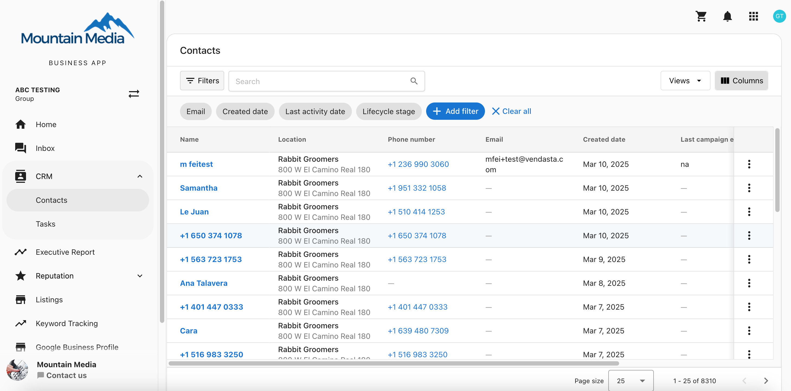

## Multi-Location contact & task view in Business App

If you support multiple franchise locations, you need a streamlined way to manage contacts and sales tasks across all locations in one place. The Multi-Location Business App provides a centralized task and contact view, making it easier to track and complete key sales and customer support activities.

## Why this matters

If you manage multiple locations without a centralized view, you have to manually switch between locations to follow up on leads or respond to customer concerns, which can be inefficient and time-consuming. This becomes especially challenging as your location count grows relative to your team size.

A centralized task view lets you track and complete tasks like:

- Responding to web chat leads that have been waiting over 24 hours.
- Following up with unhappy customers (NPS score 6 or below) to improve customer experience.

Using a centralized task view helps you efficiently handle these responsibilities, so franchise locations can focus on their daily operations while you help ensure excellent customer service.

## How it works

You can manage sales tasks and customer interactions across multiple locations without needing to switch between accounts. The Multi-Location Business App provides a single view for:

- Viewing all tasks assigned across multiple locations.
- Tracking outstanding tasks in one place.
- Improving response times to leads and unhappy customers, enhancing the overall customer experience.

## How to use this feature

1. Open the Multi-Location Business App.
2. Navigate to `CRM` → `Tasks` to see all tasks assigned to you across locations.
3. Ensure automations are set up to create tasks automatically, such as when a new NPS detractor is detected.
4. Select tasks and click `Start Task` to begin working through your assigned tasks.

The Multi-Location Business App helps you efficiently manage contacts and tasks, improving customer satisfaction and operational efficiency.
