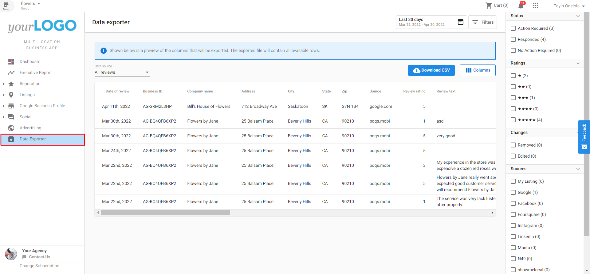

Users of the Multi-Location Business App can export review, NPS, listing, or Google Business Profile data to a CSV for workflows, auditing, and internal reporting across many locations.

In Multi-Location Business App, go to **Data Exporter** in the left navigation menu. In **Data source**, choose one of the available export types:

- **All reviews**
- **Review summary by source**
- **Net Promoter Score (NPS)**
- **Google Business Profile summary**
- **Listing data**

After you select a data source, set any filters you need and then select **Export data to CSV**.

## Export NPS data

Select **Net Promoter Score (NPS)** in **Data source** to export NPS data to CSV.

NPS exports:

- Include NPS-specific columns in the table and CSV output.
- Support the same filtering approach as review exports.
- Include a page filter for exporting data by page context.
- Are visible only when NPS export is enabled for the account.

### Configuration

The Data Exporter can be enabled or disabled on a group-by-group basis for all users. In Partner Center, go to **Accounts**, open [Multi-location Groups](https://partners.vendasta.com/brands/manage?marketId=default), choose a group, open **Features**, and toggle the feature on or off.

(Note: The configuration screen image was not available.)