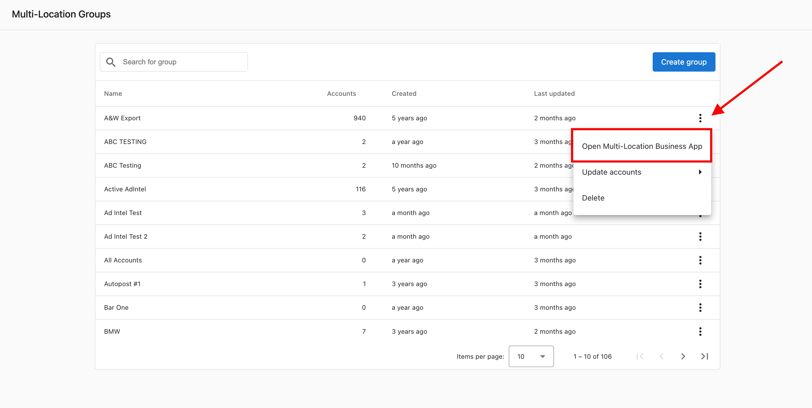
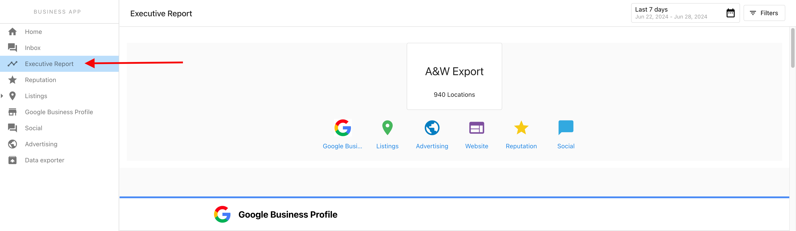

# Executive Report overview

The Multi-Location Executive Report is a powerful roll-up of metrics across any number of business locations. With a custom date selector and filtering, you can slice the data to see trends in marketing performance across a Multi-Location Group. Available in Multi-Location Business App and fully white-labeled, the report supports needs analysis and proof-of-performance reporting.

## Why use the Executive Report?

**Prospect and identify opportunities:** The report shows marketing data collected for all business accounts in the group. Run Snapshot Reports for a group of locations, then view that data in Multi-Location Business App so users can see opportunities for improvement.

**Proof-of-performance reporting:** Trend lines and delta-change numbers show short- or long-term change across many accounts and demonstrate the impact of your work.

## Key features

- **Fast data** – Slice and dice large data sets quickly.
- **Short-term changes and long-term trends** – Compare metrics period-over-period with a custom date selection.
- **White-labeled** – The report is your own, complete with your logo and branding.
- **Filtering** – Filter by geography, business category, region, groups of locations, or listing/review sources.

## What data is included?

The report can include:

- Google Business Profile
- Advertising Intelligence
- Google Analytics
- Reputation (Top Review Sources, Recent Reviews, Review Rating, Review Volume, Average Time to Response)
- Listings data
- Social media (powered by Social Marketing)

Additional Marketplace products and third-party metric sources will be added over time.

## How to view the report

Multi-Location Business App users can view the Executive Report for their multi-location group inside the app. The platform does not email the report to users. As a partner, open the report by going to **Partner Center** → **Accounts** → **Multi-Location Groups**, using the kebab menu on the group name to open **Multi-Location Business App**, then selecting **Executive Report** in the left panel.

Report content is driven by the features enabled for the group in **Partner Center** → **Accounts** → **Multi-Location Groups** → *Group name* → **Features**.

## FAQ

How do I configure the Executive Report?

The Multi-Location Executive Report compiles data from all individual locations and rolls them up into an easily digestible report. The report obeys the selections made in **Partner Center** → **Accounts** → **Multi-Location Groups** → *Group name* → **Features**.

Why are users not receiving the Executive Report?

Multi-Location users view the Executive Report inside the Multi-Location Business App. The platform does not email Executive Reports to users.

As a partner, you can view the report as follows:

1. Go to **Partner Center** → **Accounts** → **Multi-Location Groups**.
2. Click the kebab menu on the group name and open **Multi-Location Business App**.
3. Select **Executive Report** in the left panel to view the report.

Why does my Listing Score look different in the Multi-Location Executive Report vs. a single-location report?

This is expected — the two reports calculate Listing Score differently.

The **single-location Business App** Listing Score includes citations as part of the calculation. The **Multi-Location Executive Report** Listing Score does not include citations — it uses a subset of listing signals that can be consistently aggregated across all locations in the group.

Because citations are excluded from the multi-location calculation, the score you see in the Multi-Location Executive Report will generally be lower than the score shown in any individual location's Business App. Both scores are accurate for what they measure — they're just measuring different things.

Why do my review response rate and average response time look different between the Overview and Reviews tabs?

Both tabs are accurate — they use different date ranges by design.

- **Overview tab** — Shows data scoped to your selected date filter. If you've set a custom date range, response rate and response time reflect only that period.
- **Reviews tab** — Always shows all-time data for the group, regardless of the date filter set on the Overview.

This means the two tabs will often show different numbers, which is expected, not a bug.

**To compare them directly:** Set the Overview date filter to the earliest possible date (January 1, 2001) through today. This aligns the Overview to all-time data so both tabs reflect the same period.

**Why all-time response time can look unusually high:** The all-time calculation includes reviews that came in before Reputation AI was activated for the location — reviews that were never responded to. This drags the average response time up significantly. Filtering the Overview to a more recent period gives a more representative view of current performance.

How does citation tracking work?

Citation tracking in the Executive Report provides proof of performance under the Listings category. Citations are mentions of a business found online—a business name plus another detail (phone number, website, or address). They help search engines understand a business and improve findability.

Citation data is powered by **Reputation AI Pro**. The citations card appears for accounts that have Reputation AI Pro active. **Citation Builder** and **Listing Sync Pro** can also affect and help increase citations found. If Reputation AI Pro is not active for a client, the citations card does not appear in their Executive Report.

