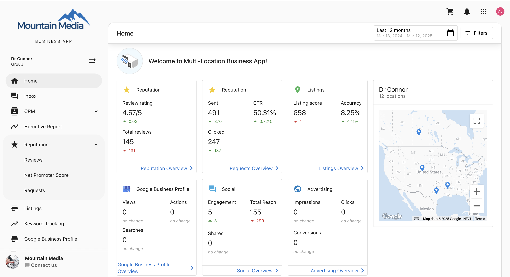

# Multi-Location Business App Overview

The Multi-Location Business App is a powerful portal that enables partners to help their business clients manage and monitor multiple store or service locations from a single unified interface. This comprehensive platform streamlines multi-location management with consolidated dashboards, group organization, and cross-location insights.

## Get Started with Multi-Location Business App

Ready to set up Multi-Location Business App for your clients? Start with our [comprehensive setup guide](./setup/getting-started) to configure business groups, import locations, and set up user permissions.

## What is Multi-Location Business App?

The Multi-Location Business App provides a centralized command center for businesses with multiple locations. This white-labeled platform transforms complex multi-location management into a streamlined process where customers can:

- **View aggregated performance data** across all locations with unified dashboards
- **Create and manage business groups** for logical organization and hierarchy
- **Monitor key metrics** like leads, reviews, listings, and social media performance
- **Generate executive reports** with consolidated insights and custom reporting
- **Manage communications** across all locations from one unified interface
- **Track advertising performance** and ROI across multiple sites and campaigns

## Why is Multi-Location Business App Important?

Multi-Location Business App eliminates the complexity of managing multiple business locations separately by providing a unified command center. The platform enables businesses to scale operations efficiently while maintaining visibility and control across all locations, improving decision-making and operational efficiency.

**Key Benefits:**

- **Centralized Management** - Single dashboard for all locations with unified reporting and analytics
- **Scalable Organization** - Business groups and sub-groups that grow with your business
- **Comprehensive Insights** - Aggregated metrics with individual location performance tracking
- **Streamlined Communications** - Unified inbox for managing customer interactions across all locations
- **Efficient Operations** - Bulk actions and cross-location performance comparisons

## What Your Customers Can Do

In Multi-Location Business App, your customers can:

- **Monitor performance across all locations** from a single, unified dashboard
- **Create business groups** to organize locations by geography, type, or custom criteria
- **View consolidated reports** with aggregated insights and location-specific data
- **Manage customer communications** across all locations from one centralized inbox
- **Track advertising campaigns** and ROI across multiple sites and locations
- **Export data** for custom reporting and external integrations
- **Set user permissions** and location-specific access controls
- **Compare performance** between different locations and business groups
- **Analyze trends** with historical data and customizable reporting periods

## What's Included

### **Core Features**
- **[Getting Started Guide](./setup/getting-started)** - Complete setup and configuration guide
- **[Multi-Location Notifications](./setup/multi-location-notifications.mdx)** - Custom notification solutions using automations
- **Home Dashboard** - Central overview with key metrics across all locations

### **Communication & Customer Management** 
- **Conversations** - Unified inbox for managing communications across all locations
- **CRM** - Consolidated contact management and lead tracking across multiple locations
- **Customer Interactions** - Centralized communication workflows with filtering and routing

### **Analytics & Reporting**
- **Executive Report** - Comprehensive reporting with location-specific and aggregated insights
- **Performance Tracking** - Individual location and cross-location performance comparisons
- **Data Exporter** - Advanced data export capabilities for custom reporting and external integrations

### **Marketing & Advertising**
- **Social Media Management** - Social media posting, engagement tracking, and performance analytics
- **Advertising Management** - Campaign management and performance tracking for location-based advertising
- **Multi-Location Campaigns** - Coordinated marketing efforts across all locations

### **Reputation & Online Presence**
- **Reputation AI** - Review monitoring, response management, and reputation tracking
- **Listings Management** - Google Business Profile, Bing Places, and directory listing management
- **Online Presence** - Centralized management of digital footprint across all locations

### **Administration & Configuration**
- **Business Groups** - Organize locations by geography, business type, or custom criteria  
- **User Management** - Set permissions and location-specific access controls
- **Bulk Operations** - Perform actions across multiple locations simultaneously

## Getting Help

For additional resources and detailed configuration guides:

- **[Getting Started Guide](./setup/getting-started)** - Step-by-step setup and configuration instructions
- **[Multi-Location Notifications](./setup/multi-location-notifications.mdx)** - Custom notification solutions and automation setup
- **[Partner Center Overview](/partner-center/overview)** - Access admin controls and client management tools
- **[Business App Documentation](https://docs.businessapp.io/)** - Complete in-application guides and user tutorials

### **Best Practices & Support**

For optimal Multi-Location Business App implementation:

- **Group Organization** - Use consistent naming conventions and organize by logical business criteria
- **User Management** - Assign appropriate permission levels and create location-specific access when needed  
- **Reporting Strategy** - Establish regular reporting schedules and customize reports for different stakeholder needs
- **Ongoing Optimization** - Regular audit of user permissions, group structures, and reporting effectiveness

Each Multi-Location Business App module is designed to scale with your client's business growth. Click on any section above to learn more about specific features, setup requirements, and configuration options.

## Frequently Asked Questions

### General Setup & Configuration

<strong>If a user is added to a multi-location group, will they receive daily digest emails for each account in the group?</strong>

No, multi-location groups are designed for viewing aggregated statistics, not for notifications. Daily digest emails still come from individual accounts and their associated users. Users must be added to the individual accounts separately to receive daily notifications from those accounts.

<strong>Will custom product names show up in the multi-location dashboard?</strong>

No, the multi-location dashboard does not support custom product names.  Instead, users will see generic menu items such as, "Reputation", "Listings", "Social" and "Advertising".

### CRM

<strong>What areas of the CRM can multi-location groups access?</strong>

Multi-location users can access the Contacts and Tasks from the locations that make up the group.

### Conversations

<strong>How long does it take for conversations to load after enabling "Multi-location Conversations"?</strong>

The loading time varies depending on the number of accounts and conversations being aggregated. It can take anywhere from a few seconds to several minutes. There is no completion notification, so we recommend checking back after a few minutes to see if all conversations have loaded.

### Keyword Management

<strong>Can I add more than 15 keywords at once using bulk add?</strong>

No, the limit is 15 keywords per bulk addition. However, you can repeat the process multiple times to add more keywords as needed.

<strong>What happens if a location has reached its keyword limit?</strong>

Keywords will be skipped for locations that have reached their limit, but they will still be applied to other locations that have available quota. You'll receive a summary showing which keywords were not applied and why.

<strong>When will I see bulk-added keywords appear in the system?</strong>

Changes are reflected in the Multi-Location Business App within 24 hours after bulk addition.

<strong>Will keywords be automatically favorited when bulk added?</strong>

Yes, but only if the admin settings for favoriting and syncing are enabled in your account configuration.

<strong>Does the order of keywords matter during bulk addition?</strong>

Yes, keywords are applied in the exact order you enter them until each location's keyword limit is reached. Plan your keyword priority accordingly.

<strong>Can I remove keywords in bulk like I can add them?</strong>

No, the bulk feature is only available for adding keywords. Keywords must be removed individually from each location.

<strong>Will I get a report of which keywords were successfully applied?</strong>

Yes, the system tracks and reports which keywords were successfully added to each location, including any failures with explanations.

---
The Multi-Location Business App transforms complex multi-location management into a streamlined, efficient process, enabling businesses to scale operations while maintaining visibility and control across all locations.