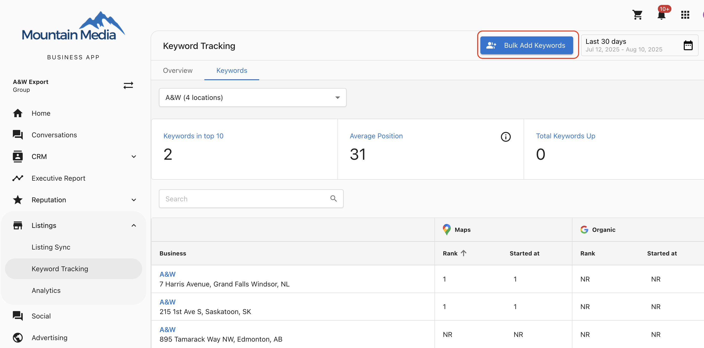
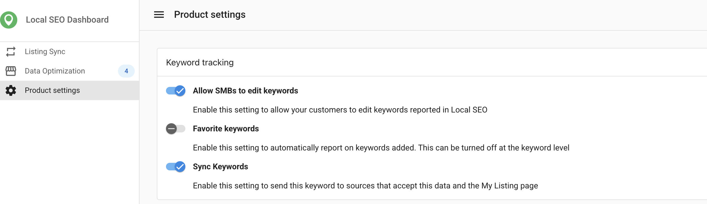

## What is bulk adding keywords?
Bulk adding keywords lets you apply a list of keywords to multiple locations in a single step. Keywords are applied in the order you enter them until each location’s keyword limit is reached. This feature also tracks which keywords were successfully added to each location, giving you clear insight for reporting and future updates. Added keywords are automatically favorited and synced when admin settings allow.

## Why is bulk keyword addition important?
When you manage multiple locations, adding keywords one at a time is time-consuming and error-prone. Bulk adding keywords helps you:
- Save hours by applying keywords to all selected locations at once
- Maintain consistent keyword coverage across locations
- Reduce manual work and human error
- Quickly see which keywords were successfully added

## What's included with bulk adding keywords?
- Apply up to 15 keywords at once
- Select multiple locations in a group
- Automatic keyword favoriting and syncing (if enabled in admin settings)
- Tracking of successful keyword additions per location

## How to bulk add keywords
1. Open the multi-location group from the `Accounts` dropdown.
2. In the Multi-Location Business App, go to the `All Listings` dropdown.
3. Select `Keyword Tracking` and open the `Keywords` tab.
4. Click `Bulk Add Keywords`.
5. Enter your keywords in the desired order (up to 15).
6. Select the locations where you want to apply them.
7. Save your changes.

:::note
Keywords are added to each location in list order until that location’s keyword limit is reached.
:::

## Points to remember
- You can add up to 15 keywords in a single bulk action.
- Each location has its own keyword limit.
- Keywords will not be added to locations that have already reached their limit.
- Changes appear in the Multi-Location Business App within 24 hours.
- Automatic favoriting and syncing happen only if admin settings are enabled.

## Frequently asked questions (FAQs)

Can I add more than 15 keywords at once?

No. The limit is 15 keywords per bulk addition. You can repeat the process to add more.

What happens if a location has reached its keyword limit?

Keywords will be skipped for that location, but still applied to others that have quota available.

When will I see the keywords appear?

Changes are reflected in the Multi-Location Business App after 24 hours.

Will keywords be automatically favorited?

Yes, but only if the admin settings for favoriting and syncing are enabled.

Does the order of keywords matter?

Yes. Keywords are applied in the order you enter them until the location's limit is reached.

Can I remove keywords in bulk?

No. This feature is for adding keywords only.

Will I see a report of which keywords were successfully applied?

Yes. The system tracks which keywords were added to each location for reporting purposes.

Will I get a summary of the keywords that were not applied?

Yes, a summary of keywords and reasons for failure will be provided.

