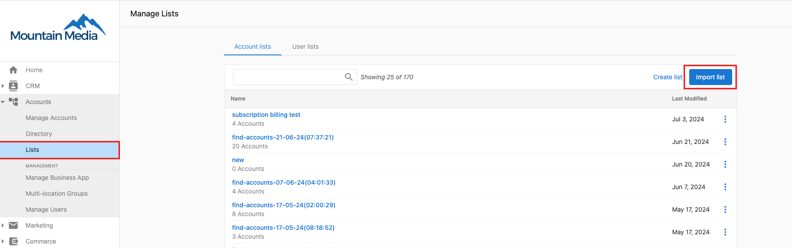
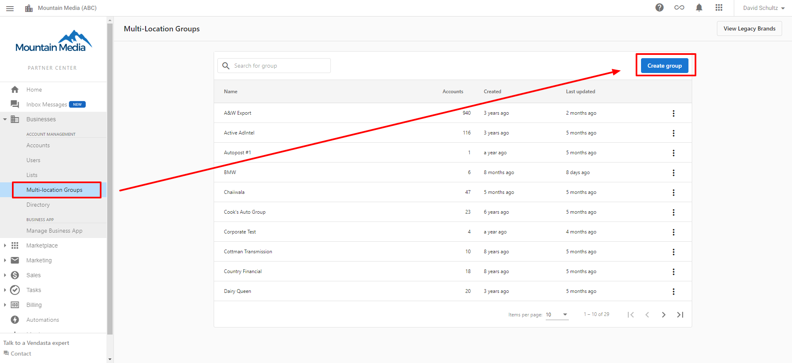

This guide walks you through setting up the Multi-Location Business App to efficiently manage multiple business locations from a single platform.

## Prerequisites

Before you begin, ensure you have:

- Active Business App accounts for each location
- Partner or admin access to the multi-location portal
- Proper user permissions configured

## Setup process overview

The Multi-Location Business App setup involves organizing your business locations into logical groups for streamlined management. You can create and manage these business groups through several methods designed for efficiency and flexibility.

### Creating business groups

You can create business groups using two primary methods:

#### Method 1: from the Multi-Location app homepage

1. Navigate to the Multi-Location app homepage
2. Click `Create Group`
3. Enter the group details and save

#### Method 2: from the Business List

1. In Business App, navigate to the `Business List` section
2. Select multiple businesses using the checkboxes
3. Click `Add to Group` from the actions menu
4. Choose an existing group or create a new one

#### Creating from the list view

You can also create a group directly from the list view:

1. Select multiple businesses in the list
2. Click `Create Group`
3. Complete the required details

### Importing business locations

For efficient bulk setup, you can quickly add multiple business locations:

1. Prepare a CSV file with all location details
2. Navigate to `Import` in the Multi-Location app
3. Upload your CSV file
4. Map the columns to the required fields
5. Submit the import

## Configuration steps

Follow these steps to complete your Multi-Location Business App setup:

1. **Create Business Groups**: Organize locations using the methods above
2. **Add Locations**: Assign existing Business App accounts or import new ones
3. **Configure Permissions**: Set user access levels for each group
4. **Customize Dashboard**: Configure metrics and reporting preferences
5. **Train Users**: Ensure team members understand the multi-location interface

## Managing business groups

Once created, you can easily manage your business groups:

- Edit group details and members
- View aggregated analytics
- Apply bulk actions across all locations in a group
- Create targeted marketing campaigns for specific groups

## Benefits for partners

The Multi-Location Business App provides significant advantages when you manage multiple client locations:

- **Enhanced Efficiency**: Manage multiple locations without switching between accounts
- **Better Insights**: View aggregated data to identify trends across locations  
- **Streamlined Operations**: Apply changes, updates, and campaigns to multiple locations simultaneously
- **Organized Structure**: Create logical groupings that match your business organization

## Next steps

Once you've completed the initial setup:

- [Add accounts to a group](./add-accounts-to-a-multi-location-group.mdx) to populate your business groups
- [Set up sub-groups](./multi-location-sub-groups.mdx) to further organize locations
- Set up specific modules like [social posting](../social/multi-location-social-posting.mdx)
- Configure [executive reporting](../executive-report/executive-report.mdx) for stakeholders

With your Multi-Location Business App properly configured, you can now efficiently manage and monitor multiple business locations from a single, unified platform.
