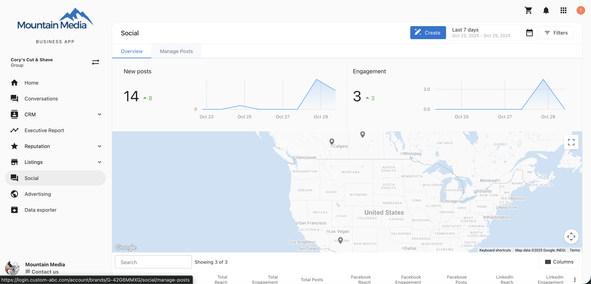
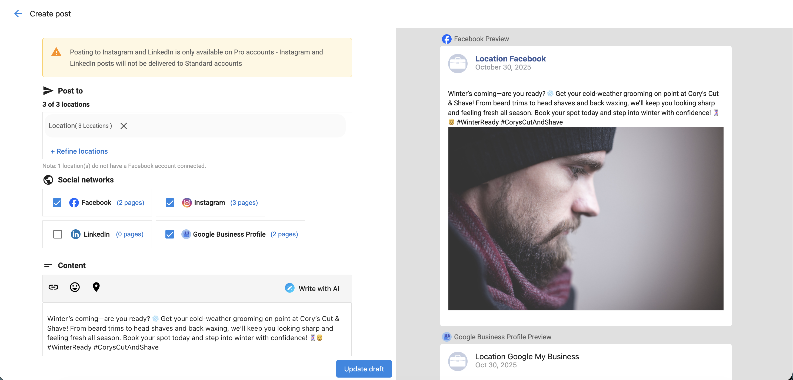

## Managing multi-location posts

The **Manage Posts** feature lets you view and manage all social posts including drafts, scheduled, published, and failed across every location in your multi-location group.  
You can easily track, edit, or remove posts from one centralized dashboard, without switching between individual locations.

## Why is managing multi-location posts important? 

This feature simplifies social media management for multi-location businesses by allowing you to:

- Monitor post status across all locations in one view  
- Identify and troubleshoot failed posts with detailed error messages  
- Edit content, media, or publishing details before a post goes live  
- Remove posts consistently across all locations from one place  

## What’s included in the 'manage posts' feature?

- A **unified post list** showing all posts by status (Drafts, Scheduled, Published, Failed)  
- **Location visibility** for each post across the group  
- **Clickable social networks** to navigate to an individual location’s view  
- **Error messages** for posts that fail to publish, with location-level details  
- **Edit and delete functionality** for drafts, scheduled, and published posts  

## How to use managed posts

1. Go to `Multi-Location` → `Social` → `Manage Posts`.

2. Choose a tab to view posts by status: `Drafts`, `Scheduled`, `Published`, or `Failed`.   

3. Click on a post to view details and available actions. 

### Filtering drafts by context

When viewing drafts, use the filter type that matches your workflow:

- **Calendar / Report**: drafts are listed by **scheduled date**
- **Post Menu**: drafts are listed by **updated date**

### Viewing posts across all locations

- You can see where a post exists (draft, scheduled, published) across all linked locations.  
- Clicking on a **social network icon** will take you directly to that network view for the selected location.  
- For failed posts, you’ll see the exact location where the post failed and the related error message.  

### Editing posts

You can edit **drafts** and **scheduled** posts to update the following:

- Post content  
- Media  
- Date and time  
- Selected locations  
- Social networks  

To edit a post:

1. Click the post you want to update.  
2. Select `Edit`.  
3. Make your changes and save the post.  

### Scheduling draft posts from post cards

In the `Drafts` tab, each draft post card includes a `Schedule` action so you can schedule the post directly from the card.

- `Schedule` is available only for posts in the `Drafts` state.
- The action is available in desktop and mobile toggle views.
- After you schedule a draft post, a confirmation snackbar appears.

Before the `Schedule` action is enabled, date and time checks are applied:

- If the selected date and time are in the past, scheduling is disabled and shows: `Please select a future date and time to schedule this post`.
- If the selected date and time are in the past and no valid social account is connected, scheduling is disabled and shows: `Please ensure the scheduled time is in the future and at least one social account is connected`.

:::info
Edits made at the multi-location level are reflected across all connected single-location posts.
:::

### Deleting posts

You can delete drafts, scheduled, and published posts directly from the multi-location view.

To delete a post:

1. Click the post you want to remove.  
2. Select `Delete`.  
3. Confirm the deletion.

When a post is deleted at the multi-location level, it is also removed from all connected single-location accounts.

:::warning
Published **Instagram** posts will not be deleted from single-location accounts even if removed at the multi-location level.
:::

## Frequently asked questions

Can I edit published posts?

No. Only drafts and scheduled posts can be edited.

Can I see which locations a post has been published to?

Yes. The `All Locations` view shows where each post is drafted, scheduled, or published.

Can I click through to view a location’s social network?

Yes. Click on the social network icon to navigate directly to that location’s page.

Can I fix failed posts?

Yes. You can view the specific error message for each failed post and edit or reattempt publishing.

Can I delete published posts?

Yes, but deleted Instagram posts will remain at the single-location level.

Can I change the date and time of a scheduled post?

Yes. You can update the schedule details in the `Edit` view for scheduled posts.

Do changes at the single-location level affect the multi-location post?

No. Updates made at a single location do not reflect in the multi-location view.

Can I view media associated with posts?

Yes. You can preview attached images or videos in the post details view.

What happens when I delete a draft?

The draft is removed from the multi-location group and all associated single-location accounts.

Are failed posts automatically retried?

No. You’ll need to manually edit and reschedule the failed post.

