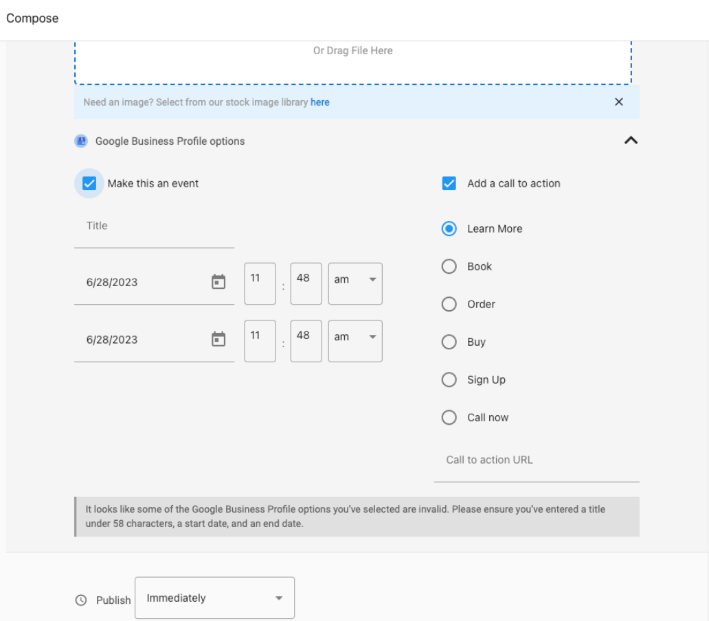
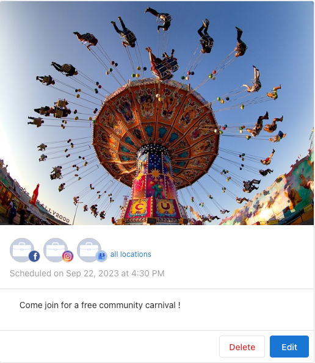
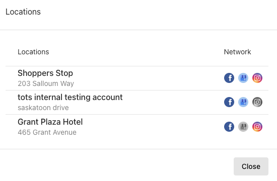
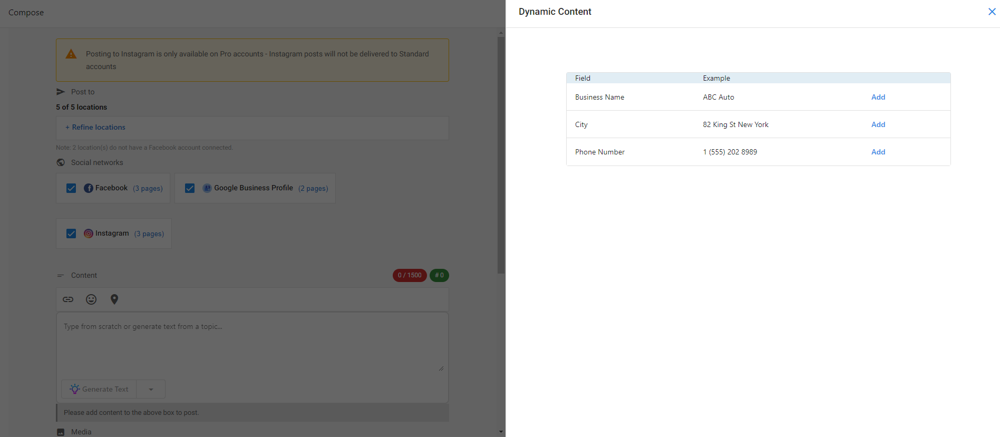
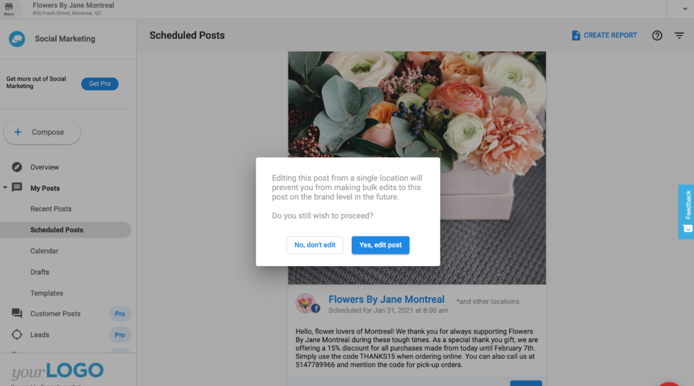
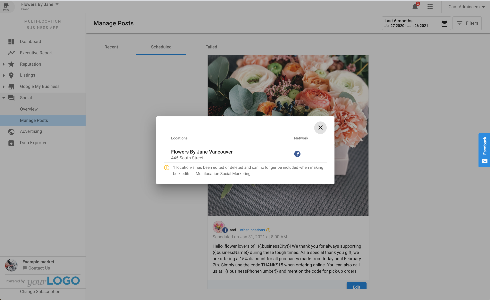

With Multi-location Business App's social posting, you can:

- Post to multiple Facebook, Instagram or Google Business Profile pages in one go
- Customize posts for each individual location through dynamic content and allow the individual locations to customize multi-location posts in their own Social AI app.
- Review and monitor brand performance and drill down on individual locations in one view

## How it works

You create and schedule posts from the Multi-location Business App; those posts are published to each location’s connected social accounts. You can target all locations or refine by group, geography, or individual location. Locations can also customize or edit scheduled posts in their own Social AI app.

:::info
**Requirements:** Multi-location Business App must be set up for your group, and each location must have Social AI Standard or Pro. For best results, use one account per location with Facebook, Instagram, and Google Business Profile connected to that account’s Social AI app.
:::

## Creating a post

Go to **Multi-Location Business App → Social → Overview**. Here you will see the overview of your Brand's social performance with details for each location. Click on the **Compose Post** button to open the Composer.

:::note
Posting to Instagram and using the AI feature is a Pro functionality.*
:::

### Step 2 - Google Business Events and Call To Actions are also included while composing a post.

### Step 3 - Refine Locations

By default, all locations are selected. Click Refine Locations to select locations by Group, Geography, or Location.

1. **Group** - select a group that you've previously created. You can create groups according to however you want to classify your locations. (Example: franchises, corporate-owned branches, etc.)
2. **Geography** - select locations by country or by state/province 
3. **Location** - select specific locations that you want to include in your post

:::warning
If two or more of your selected locations share the same Facebook, Instagram, LinkedIn, or X connection, you can't save the post. You'll see:

**"Posts cannot be saved because the same Facebook/Instagram/LinkedIn/X connection is linked to multiple locations to stop duplicate posts. To continue, either remove this social connection from the other location(s) or remove the affected location."**

Where possible, the message names the specific location. Remove the shared connection from the other location, or remove the affected location, then save the post again.
:::

### Viewing recent and scheduled posts

In **Recent** and **Scheduled**, each post appears once for Facebook and Google Business Profile. Click **all locations** to see which accounts the post was published to. Click an **individual account name** to open that location’s view.

## Dynamic content

Once you've refined the locations, you can proceed with creating your post. Using dynamic content, you can customize your post for each location. Simply click on the dynamic content icon  to add any of the following information:

1. Business name
2. City
3. Phone number

Dynamic content automatically pulls each location's details. You can see what your post looks like in the preview pane of the composer.

Once you're done with your post, you can choose to either publish it immediately or schedule it for a specific date and time.

## Easy customization

Each location can customize a scheduled multi-location post through Social AI in its own Business App. They can edit the post as they would with any regular post: change the date and time of posting, edit copy, change images, add hashtags, etc.

Simply go to Business App → Social AI → `My Posts` → `Scheduled Posts` or click **View More** on the Scheduled Posts section on the Overview page. You will see the scheduled multi-location post and will be able to edit it.

:::note
**NOTE:** Editing a multi-location post for a single location will prevent you from making bulk edits to this location's post through the Multi-location Business App.

If you try to make changes to your multi-location Scheduled Posts, you will also see a notice through Multi-location Business App → Social → `Managed Posts` → `Scheduled Posts`.

:::

## Manage Posts

Clicking on Multi-location Business App → Social → **Managed Posts** will allow you to view Recent Posts. You can also view and edit Scheduled Posts, as well as retry any posts that may have failed. You can also see which locations are included in each post by clicking the locations link.

## Overview

Finally, through the Overview page, you can see how your overall brand is doing and compare performance among your different locations.

The "new posts" and "engagement" stats at the top of the page include data from posts published through the platform and directly on the connected social media sites.

Clicking a location will open a side panel with more details specific to the location. Through this panel, you can launch this location's Business App, Social AI app, or Executive Report in a separate tab.

## Frequently asked questions

What social networks are supported with multi-location social posting?

Multi-location posting supports **Facebook**, **Instagram**, and **Google Business Profile** only. Other platforms your locations may have connected — such as LinkedIn or X — are not available for multi-location posts and must be posted to individually from each location's own Social AI app.

**Instagram requirements:** Instagram posting requires Social AI **Pro**. Locations on Social AI Standard will not receive Instagram posts from a multi-location campaign, even if Instagram is connected to their account. The post will still publish to their Facebook and Google Business Profile pages.

Why can't I save a post to some of my selected locations?

This happens when two or more of your selected locations share the same Facebook, Instagram, LinkedIn, or X connection. Multi-location social posting blocks saving in this case to prevent duplicate posts. Remove the shared connection from the other location(s), or remove the affected location, then save the post again.

