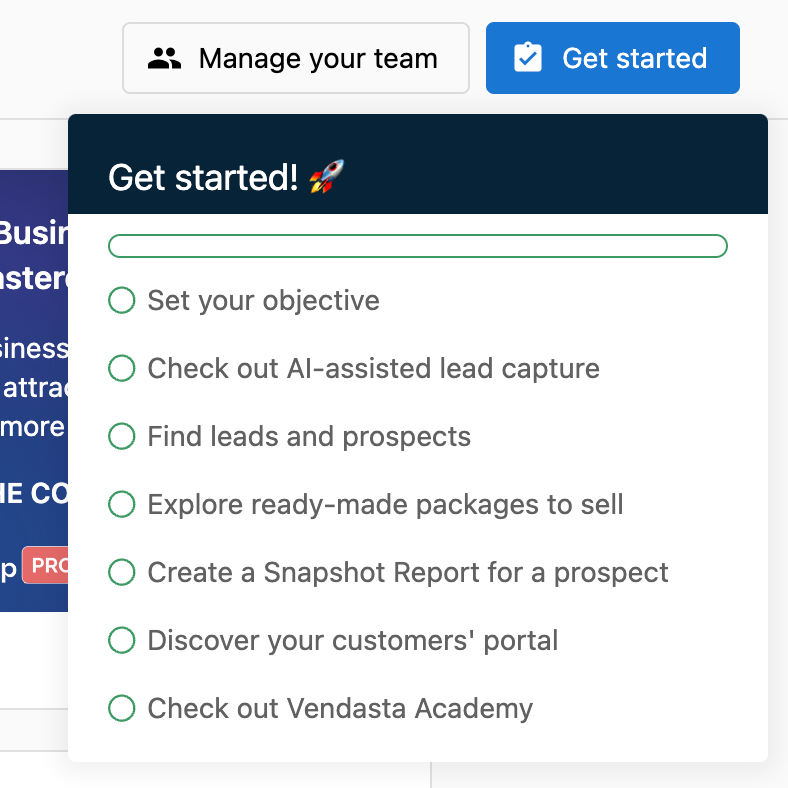
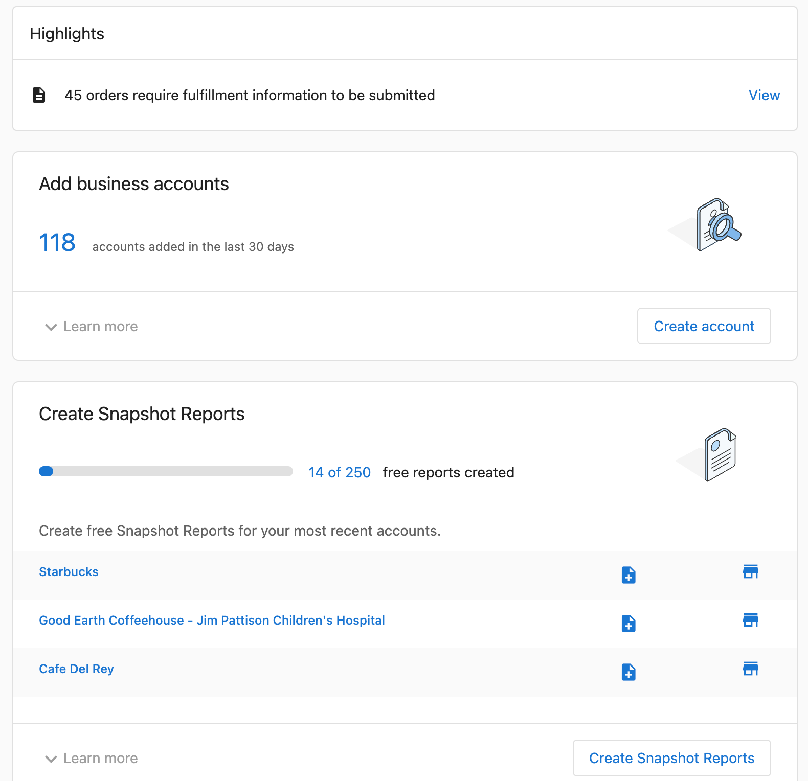
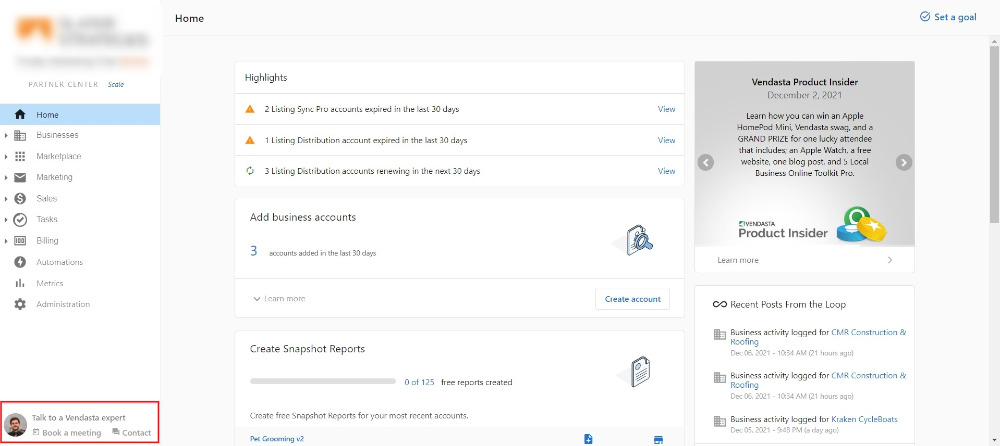
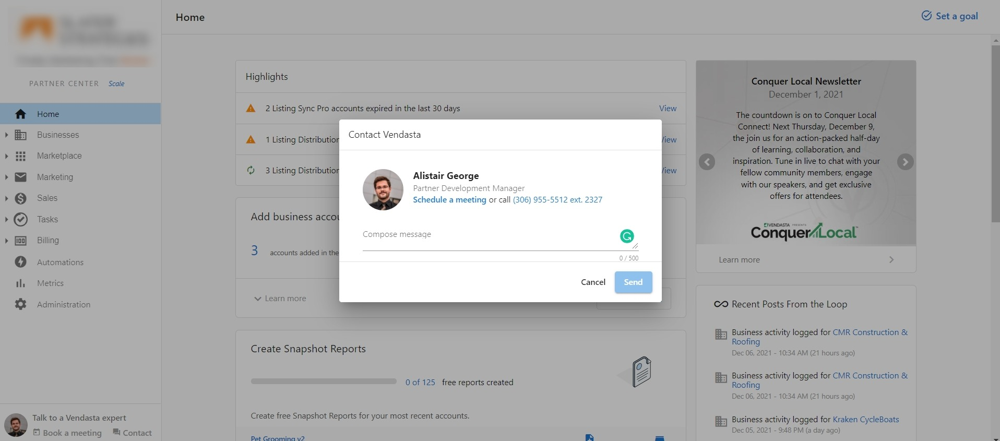
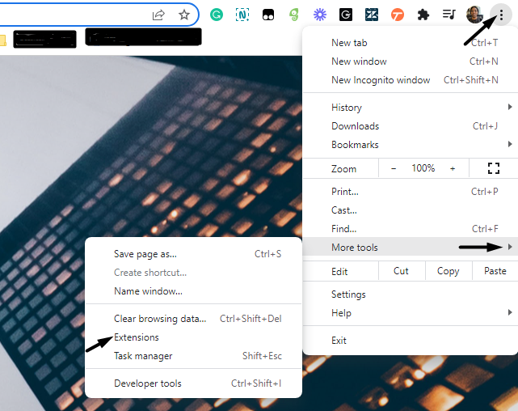
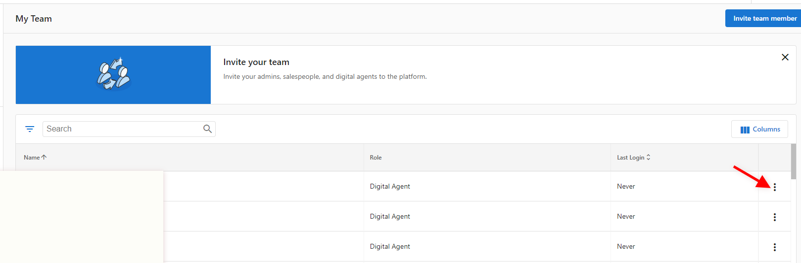
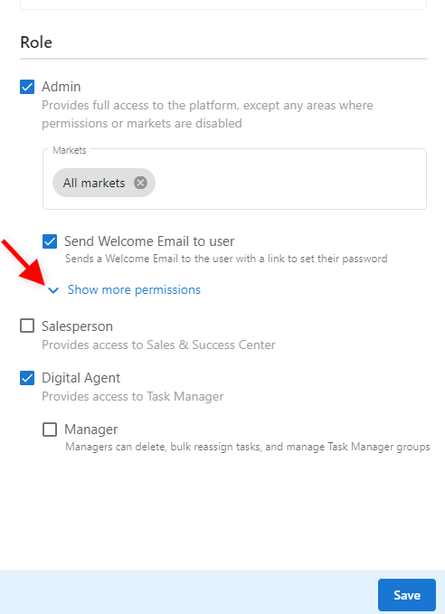
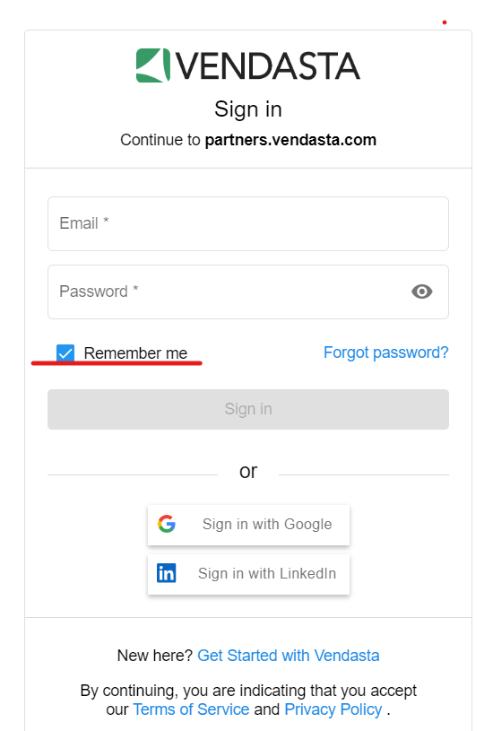

## What is Partner Center?

Partner Center is your gateway to Vendasta's powerful platform.

In Partner Center, you can:

- Manage your client accounts
- Manage users
- Start selling and activating products
- Set up your store
- Manage other admins
- Configure multi-location groups*
- Publish and track marketing campaigns*
- Create Acquisition Widgets*
- Manage orders*
- Manage salespeople and sales teams*
- Manage fulfillment services for multiple clients with Task Manager*
- Customize your branding*

*\* Certain features may only be available on select [subscription levels](https://www.vendasta.com/pricing).*

All admins can access Partner Center via [partners.vendasta.com](https://partners.vendasta.com/dashboard#utm_campaign=partner-onboarding&utm_medium=referral&utm_source=resource-center&utm_content=welcome-inline-link). 

If you're new to the platform, we highly recommend following our [Getting Started Guides](https://docs.vendasta.com/getting-started/) and taking courses in the [Vendasta Academy](https://academy.vendasta.com/).

## How do I use it?

### From the home page in Partner Center:

1. Select the "Get Started" button to find a checklist for some of the first, important actions that should be taken upon starting with the platform.  
   
2. Scroll through the carousel to watch the "What's New" video, and see other important notices from Vendasta.
3. See important updates like new accounts added, and Snapshot Reports created right from the home page.

## Customize your domains

:::note
Custom domains are available for most paid subscriptions. Please refer to [vendasta.com/pricing](https://www.vendasta.com/pricing/) for more details on eligibility as per the subscription tiers.
:::

When we set up your white label, we ask about your preferences for which URLs your customers, prospects, and salespeople see. There are two options: Default URLs and Custom URLs. You will typically choose to customize your domains if you already have a website and access to its DNS settings. If you want to maintain white-label for Sales teams in the Partner Center CRM, you will also need to customize your domains.

**To customize your domains:**

- Fill in [this form](https://custom-domains-form.websitepro.hosting/) to send us your domain preferences.

Once you submit the form, we'll email you TXT and CNAME records, along with instructions on how to enter them into your DNS settings.

## Rebrand the Vendasta Platform using a custom domain

:::note
These options are only available on select [subscription levels](https://www.vendasta.com/pricing).
:::

We understand acquisitions, company rebrands, and more happen. We'll take the leg work off your plate, and make changing your company name and access URLs an easy switch.

### Request a Platform Rebrand

To rebrand your Vendasta Platform, please email support@vendasta.com with the following details:

- Preferred company name.
- Preferred sub-domain for default URLs.
- Updated accounting details (billing name and address), if applicable.

If you have previously set up a **custom domain** with our Support team, we ask that you work directly with them to update your URLs. Please submit [this form](https://custom-domains-form.websitepro.hosting/).

Your work is done! Our Support On-Demand team will reach out when this change goes live.

## Enrichment process for importing Accounts to Partner Center

Google's inference is used during the bulk account import process and requires the **Company Name, Zipcode, and Google Place ID** to work.

### **What Information Do We Infer?**

- companyName
- website
- workNumber
- latitude
- longitude
- address
- city
- state
- zip
- country
- taxonomyId
- hoursOfOperation
- socialUrls

Our system will attempt to pull additional data provided **the box at the bottom of the upload wizard called 'Attempt to fill in empty cells' is checked.**

If there is any doubt about identifying the correct business (via Google search), we will not import any data to avoid pulling in the wrong data. 

Note: The enrichment only takes place when the account is created, not when the account is updated and requires:

- **Company Name, Zipcode, and Google Place ID**
- The **'Attempt to fill in empty cells'** box must be checked

## Frequently Asked Questions (FAQs)

How do I contact my assigned representative in Partner Center?

You can easily view and contact your assigned Vendasta representative right from Partner Center.

To contact your assigned representative, click on the representative's name in the bottom left corner of Partner Center. A modal will appear with your representative's name, title, and contact information.

You can enter a message in the text box, then click **Send**. Your representative will receive a notification about your message.

Can I use the same email address to access multiple Partner Center dashboards?

Admin email addresses can be tied to **only one** Partner Center dashboard at a time.

If you manage multiple Partner Center dashboards, a unique email address will be required for each one.

Why are the products' URLs not secure?

Our team uses Google-managed SSL certificates and these are applied to the login portals - Business App, and Partner Center.

Outside of that, we do not currently auto-uplift those certificates in the individual apps such as Reputation Management and Local SEO as they would be behind those login portals.

On a case-by-case basis, the Technical Team can assist with securing the URL to uplift to HTTPS using Postman. Please reach out to Support on Demand ([support@vendasta.com](mailto:support@vendasta.com)).

Why can't I log in to Partner Center?

So you can't access Partner Center? Have you tried clearing your cache and cookies and refreshing the page? Have you updated Chrome and restarted your computer? Are you certain you have the correct admin email address?

If you answered yes to all of the above, one possibility is you may have an **Ad Blocker extension** on your Google Chrome that is preventing your access to our Platform.

**How to check and how to turn it off:**

1. Click the menu icon (three dots) at the top-right corner of the browser  
2. Choose **More Tools > Extensions.**  
     
3. Turn off the toggle next to 'Enabled' corresponding to your ad-blocking extension.  
4. Refresh the web page

You also may have the wrong **admin permissions**. Please contact the main admin on the account who has access to Administration > My Teams and click the three dots next to the user:

Select "Edit Member". Then, select **Admin.** You MUST be an Admin to access Partner Center. If you can only see certain parts of Partner Center, click "Show more permissions"

- You may also have a VPN enabled on your computer. Try switching to a mobile network and logging in. If that works, try disabling the VPN on your computer.
- If you see an "Invalid Credentials" error message after entering your email ID and Password, and the issue persists even after resetting your password, this would probably be the *Remember me* box. Due to the caching, sometimes the system pulls in the older password to the password field causing the issue. To fix this issue, all you would need to do is uncheck the Remember me box:  
  

If you still encounter issues logging in to Partner Center or viewing all of Partner Center, please reach out to Support-on-Demand with your HAR file.

Can products get automatically updated?

**Yes.** Checking the following areas on the platform will provide a better understanding of what may have occurred.

1. Check if there is any active automation that may auto-activate products in **Partner Center > Automations > My automations.**

2. Check the product settings under **Marketplace > Products** to see if automatic activation is turned on or off.

3. Check the **Acquisition Widget** under the Marketing tab to see if product activation is enabled.

4. For Orders created, the Order details will show if it was a 'manual automation' or not under Tags.
   - When it shows 'product manual automation' it means the products were manually activated.
   - The Activation History on the account will display the email address of who activated the product.

Verifying all these 4 steps will provide you with a complete picture and help you understand what occurred.

## Watch Video Walkthrough

<iframe src="https://drive.google.com/file/d/1C7qK1ad0vbu2WFzdhahwXk3iwDt153kw/preview" width="640" height="480"></iframe>