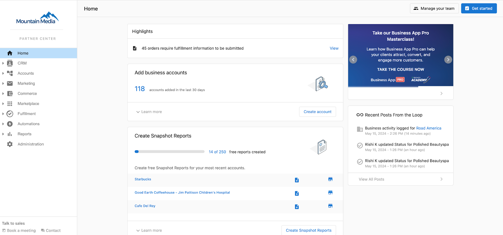

# Partner Center overview

## What is Partner Center?

Partner Center is your gateway to Vendasta's powerful platform.

In Partner Center, you can:

- Manage your client accounts
- Manage users
- Start selling and activating products
- Set up your store
- Manage other admins
- Configure multi-location groups*
- Publish and track marketing campaigns*
- Create Acquisition Widgets*
- Manage orders*
- Manage salespeople and sales teams*
- Manage fulfillment services for multiple clients*
- Customize your branding*

:::note
Certain features may only be available on select subscription levels.
:::

All admins can access Partner Center via [partners.vendasta.com](https://partners.vendasta.com).

## Customize your domains

:::note
Custom domains are available for most paid subscriptions. Please refer to [vendasta.com/pricing](https://vendasta.com/pricing) for more details on eligibility as per the subscription tiers.
:::

When we set up your white label, we ask about your preferences for which URLs your customers, prospects, and salespeople see. There are two options: Default URLs and Custom URLs. You will typically choose to customize your domains if you already have a website and access to its DNS settings. If you want to maintain white-label for Sales teams in the Partner Center CRM, you will also need to customize your domains.

To customize your domains:

1. Fill in [this form](https://custom-domains-form.marketingservices.dev/) to send us your domain preferences.
2. Once you submit the form, we'll email you TXT and CNAME records, along with instructions on how to enter them into your DNS settings.
3. After you've added the records to your DNS, we'll verify them and complete the setup.

## Set up Partner Center (step-by-step)

This section walks you through **everything you need to set up Partner Center for the first time**, in the recommended order. Follow each step from top to bottom to ensure your account is fully ready for clients.

### Table of Contents
- [Access Partner Center](#step-1-access-partner-center)
- [Set Up the AI Chat Receptionist](#step-2-set-up-the-ai-chat-receptionist)
- [Install the Chat on Your Website](#step-3-install-the-chat-on-your-website)
- [Add Knowledge to Your AI](#step-4-teach-your-ai-about-your-business)
- [Customize the Chat Experience](#step-5-customize-the-chat-experience)
- [Set Up Vendasta Payments](#step-6-set-up-vendasta-payments)
- [Configure Default Billing Settings](#step-7-configure-default-billing-settings)
- [Set Up Email Sending](#step-8-set-up-email-sending-and-domains)
- [Create Your Booking Link](#step-9-create-your-booking-link-and-connect-your-calendar)
- [Add Team Members](#step-10-add-team-members-and-roles)
- [Complete Your Salesperson Profile](#step-11-complete-your-salesperson-profile)
- [What to Do Next](#what-to-do-next)
- [FAQs](#frequently-asked-questions-faqs)

### Step 1: Access Partner Center {#step-1-access-partner-center}

1. Go to `https://partners.vendasta.com`
2. Log in using your Vendasta credentials
3. You will land on your **Partner Center dashboard**

Your main navigation menu is on the **left-hand side**. You will use this menu throughout the setup process.

### Step 2: Set Up the AI Chat Receptionist {#step-2-set-up-the-ai-chat-receptionist}

The AI Chat Receptionist lives on your website and:
- Answers visitor questions
- Captures names, emails, and phone numbers
- Automatically saves leads to your CRM

#### How to Access the AI Chat

1. In the left-hand menu, click `AI`
2. Select `AI Workforce`
3. Click **AI Chat Receptionist**
4. Click `Configure`

#### Configure the Chat

On the configuration screen:
- **Name** your chat (recommended: leave the default)
- Upload an image (optional)
- Leave the **Purpose** and **Behavior** settings as-is

Vendasta provides a default setup that works out of the box.

Click `Save`.

### Step 3: Install the Chat on Your Website {#step-3-install-the-chat-on-your-website}

1. Scroll to the **Channels** section
2. Click `Set up or respond to Web Chat`
3. Customize:
   - Welcome message (optional)
   - Initial AI message (optional)
   - Brand colors (recommended)

Click `Next`.

#### Install the Chat Widget

1. Select your website platform (e.g. **WordPress**)
2. Download the plugin or installation code
3. Install it on your website

Once installed, the chat will appear on your site automatically.

### Step 4: Teach Your AI About Your Business {#step-4-teach-your-ai-about-your-business}

Your AI needs to understand your business to answer questions accurately.

#### Add Website Knowledge

1. In the Chat configuration screen, scroll to **Knowledge**
2. Click `Add Knowledge`
3. Select `Website`
4. Enter your website URL
5. Change **Mode** to `Follow Links`
6. Enable **Automatic Refresh**
7. Click `Next`
8. Click `Save`

Your AI will scan your site in the background and update itself when your website changes.

### Step 5: Customize the Chat Experience {#step-5-customize-the-chat-experience}

1. Scroll back to the **Channels** section
2. Review the chat preview
3. Confirm branding and greeting
4. Click `Save`

Your AI Chat is now live and capturing leads.

### Step 6: Set Up Vendasta Payments {#step-6-set-up-vendasta-payments}

Vendasta Payments allows you to:
- Accept credit and debit cards
- Automate billing
- Manage subscriptions

#### Create Your Payment Account

1. Click `Administration` in the left-hand menu
2. Select `Commerce`
3. Click `Vendasta Payments`
4. Click `Create New Account`

A secure Stripe setup page will open in a new tab.

Complete all required fields. This includes:
- Business details
- Identity verification
- Bank account information

Do **not** share this screen.

Once completed, return to Partner Center.

### Step 7: Configure Default Billing Settings {#step-7-configure-default-billing-settings}

This ensures all new client accounts bill automatically.

1. Go to `Accounts`
2. Click `Manage Accounts`
3. Open any account
4. Select `Billing Settings`
5. Click `View Default Billing Settings`

Set the following:
- **Payment Collection** → Automatic
- **Automatically Charge Payment Method on File** → Enabled

Click `Save`.

These settings will apply to all new client accounts going forward.

### Step 8: Set Up Email Sending and Domains {#step-8-set-up-email-sending-and-domains}

This step ensures emails you send do not land in spam.

#### Configure Sender Details

1. Go to `Marketing`
2. Click `Email Settings`
3. Set:
   - **Sender Name** → Your business name
   - **Reply-To Address** → Your business email

Click `Save`.

#### Authorize Your Domain

1. In `Email Settings`, scroll to **Domains**
2. Enter your domain (example: `yourbusiness.com`)
3. Click `Authorize Domain`

This will generate:
- 1 DMARC record
- 1 SPF record
- 3 CNAME records

These records must be added to your domain for email verification.

### Step 9: Create Your Booking Link and Connect Your Calendar {#step-9-create-your-booking-link-and-connect-your-calendar}

Vendasta includes built-in scheduling.

1. Go to `CRM`
2. Click `My Meetings`
3. Click `Set Up`

#### Connect Your Calendar

1. Choose `Sign in with Google`
2. Select your primary calendar
3. Grant permissions
4. Click `Continue`

#### Configure Availability

- Confirm your time zone
- Set business hours
- Click `Complete Setup`

You will receive a booking link that can be shared or embedded.

### Step 10: Add Team Members and Roles {#step-10-add-team-members-and-roles}

Professional plans allow up to **five users**.

1. Go to `Administration`
2. Click `My Team`
3. Click `Add User`
4. Enter:
   - Name
   - Email
   - Role

#### Role Types

| Role | Access Level |
|---|---|
| Admin | Full access |
| Salesperson | CRM, billing, conversations |
| Digital Agent | Task management |

Click `Send Invite`.

### Step 11: Complete Your Salesperson Profile {#step-11-complete-your-salesperson-profile}

Your profile appears to clients inside their dashboard.

1. Go to `Administration`
2. Click `My Team`
3. Click the three dots next to your name
4. Select `Edit Salesperson`

Add:
- Profile photo
- Phone number
- Email
- Booking link

Click `Save`.

### What to Do Next {#what-to-do-next}

You are now ready to:
- Capture leads from your website
- Accept payments
- Book meetings automatically
- Onboard your first clients

Your next step is to:
- Create client accounts
- Activate products
- Begin selling and delivering services

### Frequently Asked Questions (FAQs) {#frequently-asked-questions-faqs}

Can I start accepting payments immediately?

Yes. Your first transaction may take longer to deposit. After the first payout clears, deposits typically take 1-2 business days.

Can I change any of these settings later?

Yes. All settings in Partner Center can be updated at any time.

Do I need technical knowledge to complete this setup?

No. This guide is designed for non-technical partners and walks you through each step.

