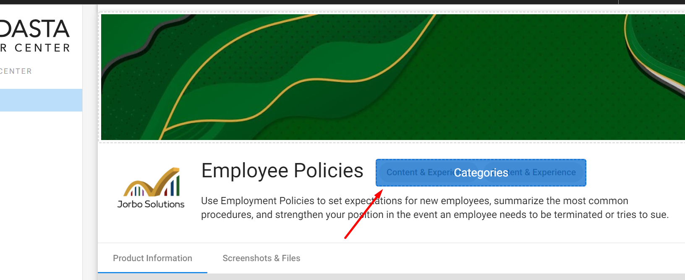
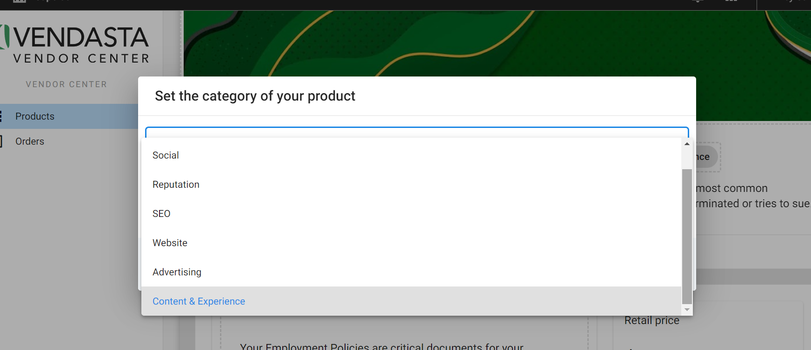
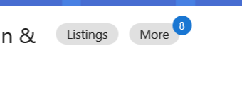

Partners cannot add a custom/new category in Vendor Center for their own custom product(s). Partners can only choose from the default LMI (Local Marketing Index) categories available in **Vendor Center > Marketing**. The selected category (primary and secondary) will determine where your custom product will appear in the Marketplace.

These categories work like product tags in Marketplace (beside product description).

