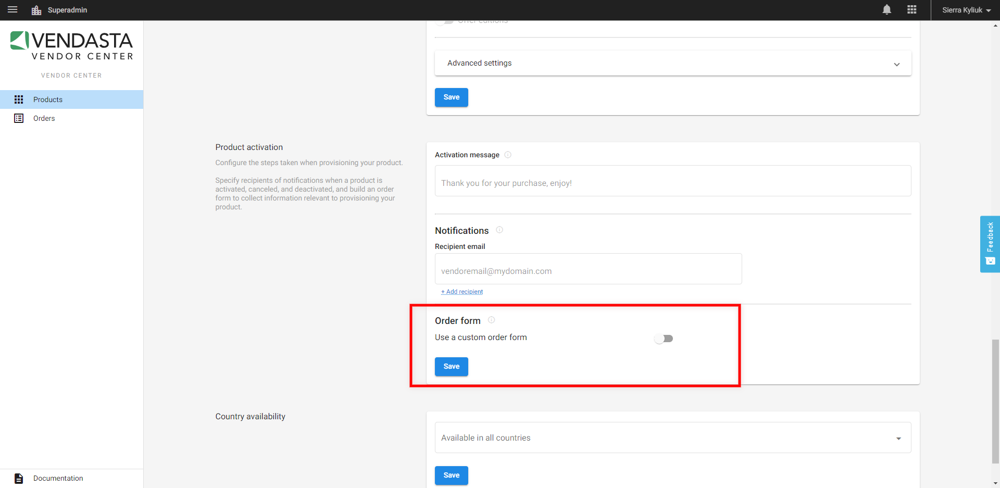

# Why is "Automatic Activation" not available for my vendor/custom product?

If the order form in Vendor Center is toggled on, the toggle for automatic activation upon account creation will not be available in **Marketplace > Products > Product info.**

