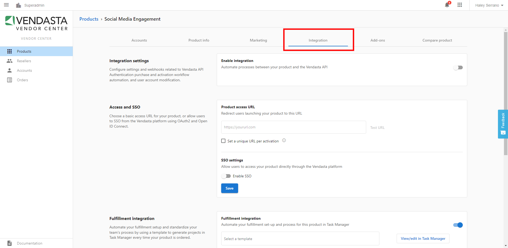

To create complex products—such as those where you log users into your product automatically when accessing it through Business App—you can use **Integrations**. This is accessible from the **Integration** tab of your product in the Vendor Center. 

To begin integrating, toggle the **Enable Integration** setting on. On each field, you can click **Details** to find specific information on how to integrate your product.

It should be noted that depending on your product's existing infrastructure, integrating your product may require technical or development work from your team. Only those familiar with these concepts should attempt to use these advanced integration options.

If you would like to explore our integration options, please see our [developer documentation](https://developers.vendasta.com/).