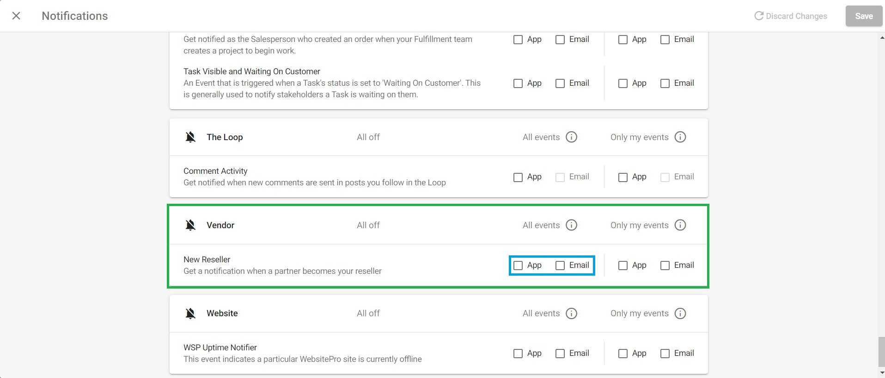
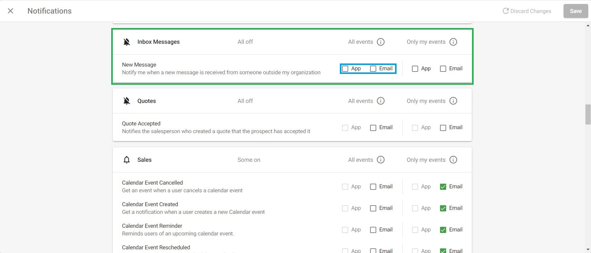

### **Start Selling Notification**

Among the best practices to be effective in winning more business is to respond to interest in a timely fashion. Vendor Center is making this easier by notifying you not only when an agency has a question, but right at the moment when they start offering your product or service in their store. As soon as an agency clicks on "Start Selling" in the Marketplace, you will be notified by email and in-platform through the notification bell.

If you're not currently getting these notifications, the notification settings may need to be adjusted to your preferences as outlined in the next step.

  

- **Reseller Notification:** Notifications are listed alphabetically, and reseller notifications are handled by the Vendor notifications at the bottom of the menu. Scroll down and select the method that works best for you.

  

- **Inbox:** While we're in the notification settings, let's take the opportunity to make sure you're also getting notified when prospective resellers have a question or existing partners need support. Scroll up to the Inbox section and select the options you need.

  

### **Improved Reseller Tab**

Now that you know an agency has become a reseller, the next step is to segment and qualify those resellers. The improved Reseller tab features an easy to use workflow with customizable tables with relevant information such as name, email, and service tier will help you prioritize discovery calls and identify which resellers you would like to reach out to.

If you missed our previous discussion on the improved reseller tab, you can [find it here](/partner-center/top-navigation/vendor-center/vendor-center-general/enriched-reseller-information).

### **Inbox Messages**

With the introduction of Inbox messages, communication is only one click away using Inbox without worrying that the messages are lost or undelivered. After clicking on the message icon on the right side of the Reseller information, the Inbox messaging window will open where you can send and receive direct messages to and from your resellers.
