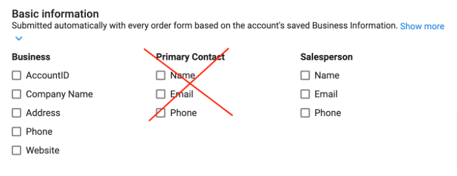
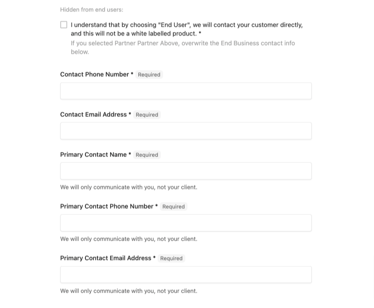
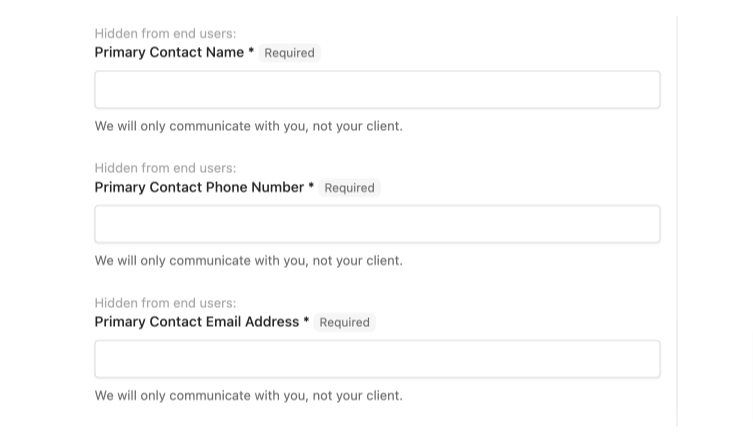

*This article guides Marketplace Vendors through creating custom order forms to gather essential information from partners during product activation. While helpful for creating custom products for your clients, it is specifically designed to support official Marketplace Vendor integrations.*

## Order Form Overview

**What is the purpose of an Order Form?**

Order forms allow you to request specific business information from partners when activating the app. There are also Fulfillment Forms, that allow for information to continue to be collected after the purchase is made. Both the standard Order Form, and Fulfillment Form utilize the same form builder.

**When to use a standard Order Form**

You should use an order form if you need any additional information upon activation of the product. Some common examples are:

- To obtain Reseller or client contact information for fulfillment communication. Note: Automated communications should be handled through the platform. Use the Inbox for general Reseller communication.
- Requesting shipping information for physical products
- Content gathering for digital advertising products etc.
- Baseline configuration settings you **require** to set up a digital product.

**It's best practice to avoid having an order form if at all possible, as it adds purchase friction. If you absolutely require certain data up front, then try to limit the length of the order form.**

## Creating an Order Form

1. Navigate to **Vendor Center > Product Name > Product Info > Product Activation > Order Form**, toggle the **Use a custom order form**.
2. Choose any necessary **Basic Information. AccountID** and **Company Name** are recommended.
   - These are **optional** by default to avoid completed order forms from containing irrelevant information. If you require any of this information check them off.

**Selecting the Primary Contact** will not result in obtaining required contact information. The Primary Contact will automatically populate any existing user on the account.

**Selecting Salesperson** will only provide you with the Reseller's assigned Salesperson on the account which will not result in obtaining required contact information.

3. **Additional Information fields** (optional) will enforce the Reseller to backfill required information on their or their client's account.
4. To add a custom field, click **Add Form Field** and expand the New Form Field item that will have appeared.
5. The **Order Form Footer** should be used to include information regarding the order itself such as service level agreements and is displayed to both the Reseller and their client.

### Types of Form Fields

There are various types of form fields available. Underneath each is an example of that field as it would appear in Partner Center when activating a product:

- **Files** – Used to request specific files.
- **Drop Down** – A multi-option field where you can add options by selecting Add Option.
- **Check Box** –Allows you to present the user with a single option in the form of a checkbox.
- **Text Area** – An open-ended input that allows users to type long answers. This is especially useful when requesting a description.
- **Text Box** – An input box that allows users to enter text for simple answers. You can add a prefix and suffix to this, as well as add regex validation (answers must be in a specific format).
  - One example might be that you want users to enter their website. You may start with a prefix of 'www.' and a suffix of '.com'.
- **End User** – Requires a user on the account to be selected as a designated user of the product. This field is commonly used in tandem with a seat-based billing model.
  - This can be handy if there is an initial user that needs to be set up with different permissions than all other users on the Account.
  - If you mark this field as required, and there are no users on the Account it will force the admin to go back and add a user to the Account before they can activate your product.

**Requirements**

Form Fields can either be left as optional or Required. Requirements are often used for contact information, domains, digital advertising collateral, or shipping information for example.

**Which Persona Will See the Order Form?**

Each Form Field requires you to choose whether or not the form field is Hidden from end users or Office editable only.

**Hidden from end users** will hide your question from the reseller's client, therefore the Reseller must provide a response to the form field. If you require specific Reseller contact information, this option should be selected.

**Office Editable Only** means end users can see your order form field, but cannot provide a response. Making this selection means you may want the end user to be informed of certain configurations, but not be able to change them.

### Asking for Contact Information

You may need to get in touch with either the Reseller or their client if you provide an initial onboarding or the sku is service. 

**NOTE: Selecting the Primary Contact possibly will not result in obtaining the required contact information. The Primary Contact will automatically populate a random User from the account. You must identify and obtain contact information through a custom order form field. This will also allow you**

*Creating custom fields will enable you to confirm the Reseller's communication preference. They may prefer to handle all communications, so you allow them to choose by providing the correct contact information.*

**If you will communicate with the Reseller OR their client:**

Start with a question for the Reseller to identify who you are able to communicate with. This question should be **Required** and **Hidden from end users** and works best in the form of a Drop Down form field.

**It's best practice to include a Check Box that is Required and Hidden from end users, for the Reseller to acknowledge that by choosing "End user", you will contact their customer directly, and this will not be a white labelled product.**

Lastly, ensure you ask for the contact's name and contact information as **Required** and **Hidden from end users** Form Fields. Here's an example of the full order form requesting contact information if you don't have a preference for which persona you interact with on the project:

**If you will be communicating with the Reseller only:**

Your questions should be **Required** and **Hidden from end users** and include hint text that lets the Reseller know that you will only be in communication with them directly. Here's an example of the full order form when you will only be communicating with the Reseller:

### Asking for Passwords

The Sales and Fulfillment Order Forms are displayed in plain text all over the platform. These fields are not a suitable avenue for collecting sensitive data such as Passwords, or certain Account information etc.  The best way to obtain this type of information is through an encrypted email inbox or onboarding call.