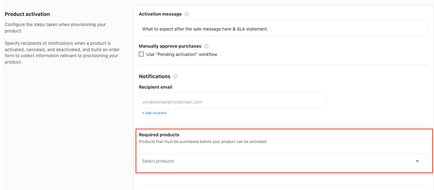
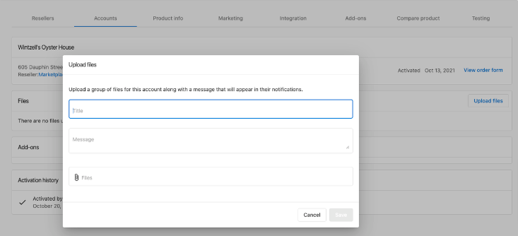
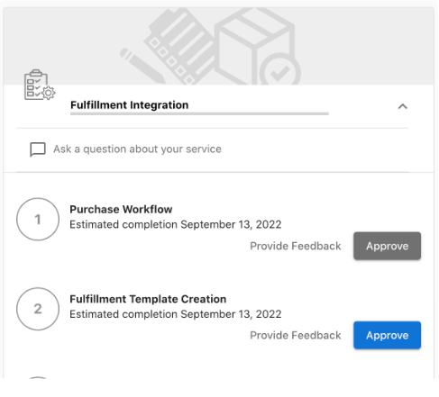

**Note:** This article was created to support the integration phase for Marketplace Vendors. If you're ready to get started as a vendor, we'd love to hear from you. [Apply to join the Marketplace.](https://www.vendasta.com/marketplace/vendors/)

### **Reliance on another marketplace product**

1. If your service leverages a Marketplace Product, and requires that product be active for you to be able to start your work.

Ensure that the required product has been selected.

[Vendor Center](https://vendors.vendasta.com/) *> Select Product > Product Info > Product activation > Required products*:

2. ***If your service is reliant on a Vendasta product*** AND involves responding to reviews, claiming, and filing listings, or reviewing mentions you can also choose to have system-generated tasks created upon product activation. These are event-triggered tasks: Reviews, Mentions, Listings, and Google Q&A.

**If your service is not this type of service, ignore this checkbox.**

### **Reporting**

If you currently provide a service completion report or any ongoing reporting to your clients, then this will now need to be provided via the Vendasta Platform.

### **Requirements**

How do you natively deliver your reporting? Refer to the available reporting types below for requirements.

- *Hosted Dashboard users log into*
  - Requirements:
    - SSO into Dashboard & Executive Report Highlights
- *Hosted Semi Interactive Report - shared as a signed URL (magic link)*
  - Requirements:
    - SSO into Dashboard
    - Executive Report Highlights OR PDF File Upload
- *Emailed PDF Reports*
  - Requirements:
    - PDF File Upload
    - Optionally - Executive Report highlights

### **Reporting Types**

Single Sign-On:

If you have a hosted reporting dashboard that is accessed via a login, or shared via a signed URL, then that must be accessed via [SSO](https://developers.vendasta.com/vendor/d191b96068b71-sso-o-auth2-3-legged-flow).

The Executive Report (API Integration):

Pull highlights from, or recreate your reporting in Vendasta's dynamic report that lives within the end user dashboard Business App. See supported card types [here](https://developers.vendasta.com/vendor/ZG9jOjE2NTY5Mzk0-executive-report).

*Suggested Maximum of 9 cards*

### **File Uploads**

File groups can be generated in two ways:

1. The Account Details page in Vendor Center. In this case, Vendasta hosts the file.

2. Automated upload via the Account [File Group API](https://developers.vendasta.com/vendor/e8e7370a6bbc0-create-a-file-group). In this case, the Vendor Hosts the file and provides a link.

**For either method file uploads will automatically send a message to the Activity Stream providing an alert that a new file is now available.**

**Final Walkthrough (Vendasta Testing Your Integration)**

Once you have finished each task, then submit this task for review and approval in your project tracker by clicking Approve

A Vendasta Vendor Operations team member will review your implementation and provide any feedback prior to marking the task as Complete

### **Fulfillment Forms**

Are you a vendor looking for a better way to track your orders across the Vendasta platform? We've got a new solution for you with Work Orders! Start by enabling fulfillment forms on your product in Vendor Center.

In Vendor Center, start by enabling fulfillment forms on your product. This form will be presented to users after they purchase your product and can be used to gather additional information needed to fulfill your product or service by moving your existing purchase order form questions to the new post-purchase fulfillment form.

This will make it easier for people to order your products with a potential 250% increase in your order success rate.

Once you've configured your fulfillment form and published your product changes, you'll be able to see the state of all your orders and any outstanding fulfillment on the work orders table.

Anything with the status 'details needed' means there is required information needed to fulfill and complete your order which can be seen under the tab "In Review."

The status indicates that the fulfillment form is completed. You can view additional information about a specific order such as contact details order forms and fulfillment forms.

<iframe 
  src="https://drive.google.com/file/d/1k8YNG1r2_ORiaxGf8LqKQMFh91RrJVD1/preview" 
  width="640" 
  height="480" 
  allow="autoplay">
</iframe>