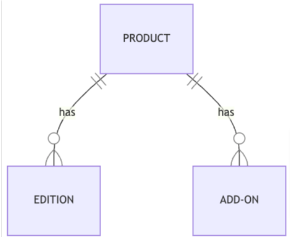
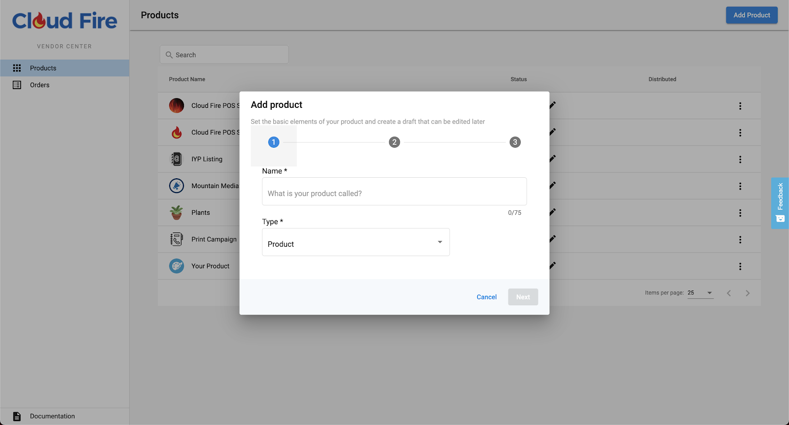
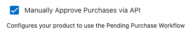
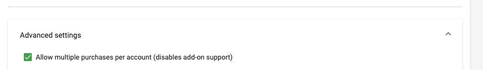
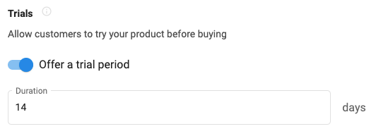
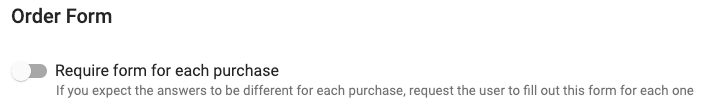
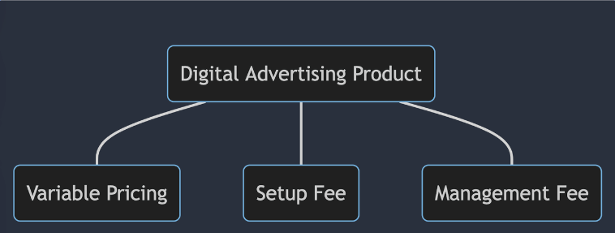

# Operational Requirements for Marketplace Vendors

As a vendor on Vendasta's Marketplace, you have a responsibility to meet or exceed the operational requirements below before your product or service is in a position of general availability.

## Product and Service Structure

**Category**: Operational requirements  
**Importance**: Required

Each product in Vendasta's Marketplace must have at least one paid tier. That being said, products are allowed to have multiple paid pricing tiers. Each pricing tier is known as an "Edition" in the Marketplace. Depending on pricing strategy, some vendors offer 3 different paid editions at different price points with feature differences bundled between them.

Products can also have free tiers such as trials, freemium, or premium and may include Add-Ons, which allow for flexible upsell and feature add-on opportunities.

**To create a product you must add the following information:**

1. Basic info: name, category, vertical, description, etc.
2. Integration settings: SSO, Fulfillment, etc.

3. Editions: feature list, price, minimum, term, etc.
4. Content: logos, screenshots, documents, videos, etc.
5. Visibility: approval status

**Multi-purchase Settings:**

Multi-Purchase can be turned on or off per Edition of your product or service. Multipurchase basically means that a customer can purchase your product or service multiple times for different locations that they are managing for end customers. For example, they might be managing 10 locations for a customer and want to purchase your product 10 times - once for each location.

**Pricing and Trials**:

Each vendor determines the pricing of their products and services, as well as the trial period (if applicable). There are a range of different options for setting this up and Vendasta will guide you through the best practices for your category and product type. Below are some examples of how pricing can be configured, including wholesale and margin options.

**Setting up your Product Editions:**

There are a lot of options for how you want your product or service to be presented to partners and sold to customers. The image above represents one approach for how you can configure your product with different Editions (pricing tiers).

**Add-on Multi-purchase Setting:**

Similar to your main product, each Add-On can be configured with Multi-Purchase settings.

## Use Case Examples

### Digital Advertising

The Digital Advertising use case example is one approach to illustrate how a product can be structured in the Marketplace. In this example, the vendor offers three pricing tiers: Bronze, Silver, and Gold, each with increasing feature sets and price points. Additionally, they provide add-ons for enhanced services that can be purchased separately.

## Help and Support

If you have questions about how to structure your product for Vendasta's Marketplace, please contact your Vendor Success Manager. They can provide guidance on best practices, pricing strategies, and help you optimize your product's presentation in the Marketplace.