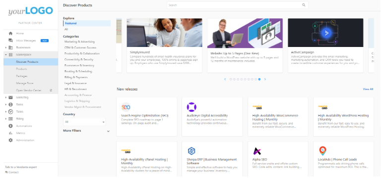
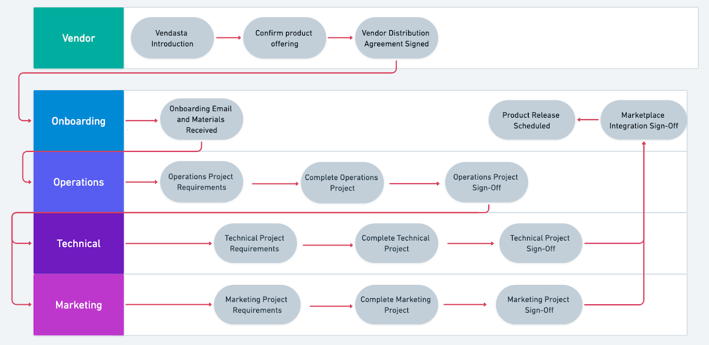
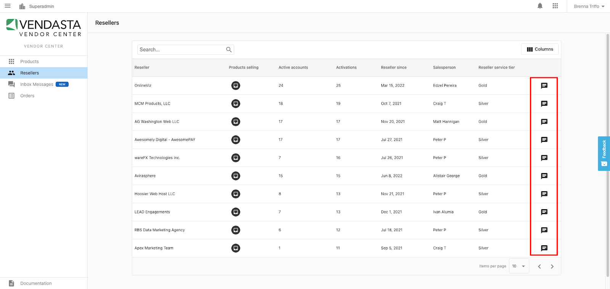
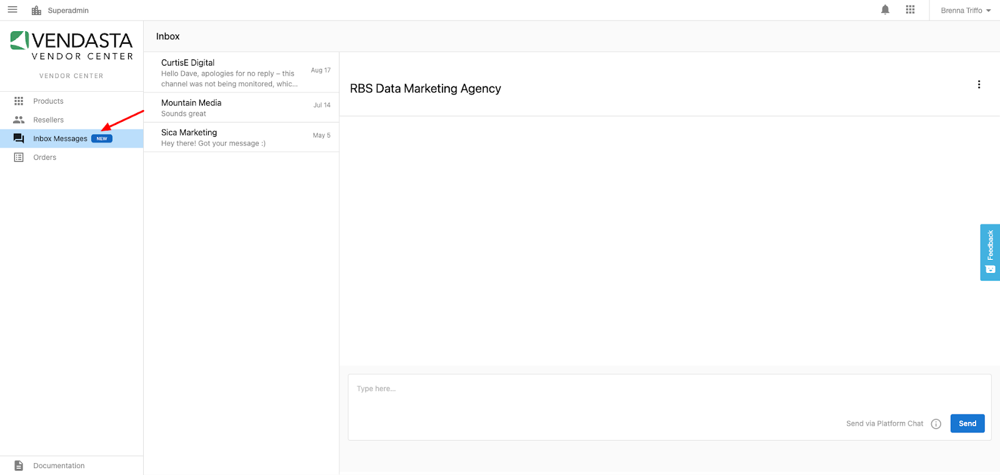
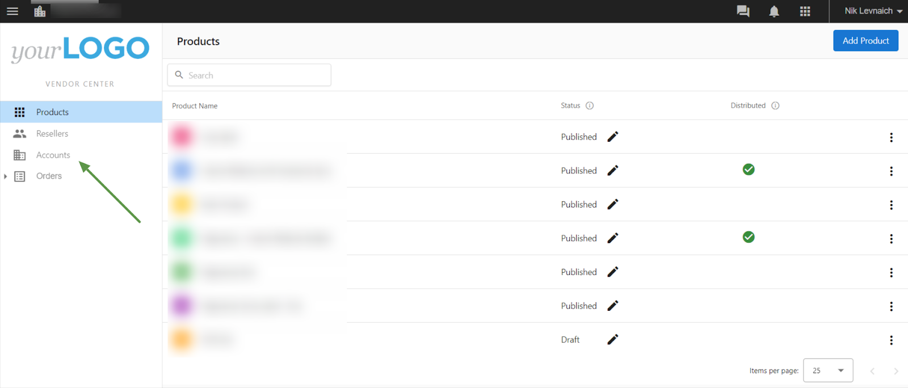
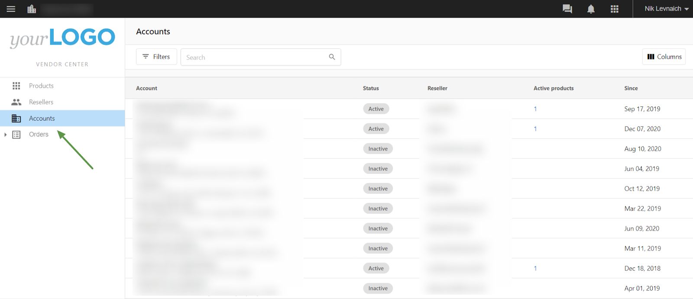
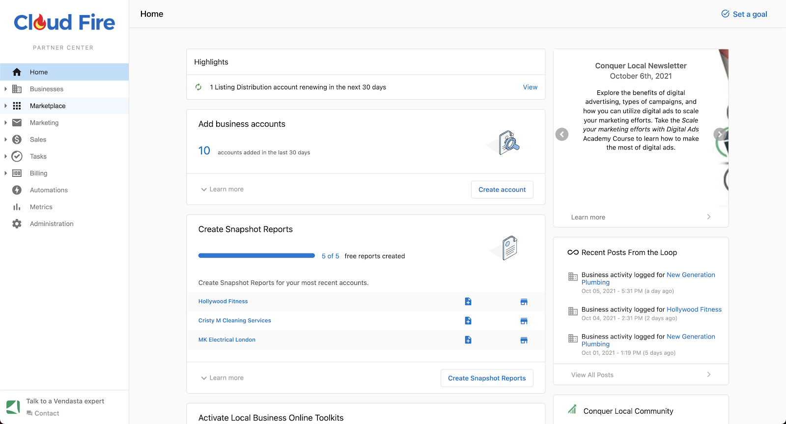
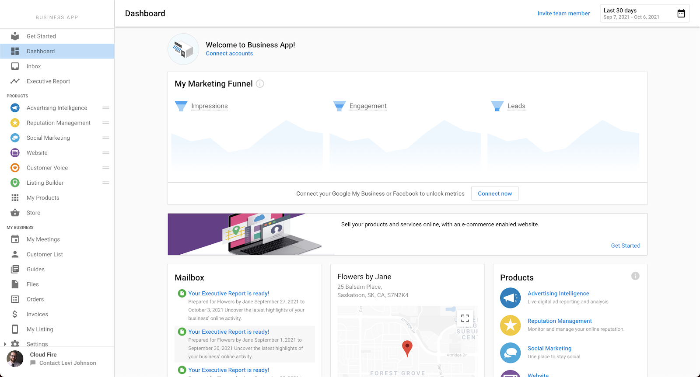
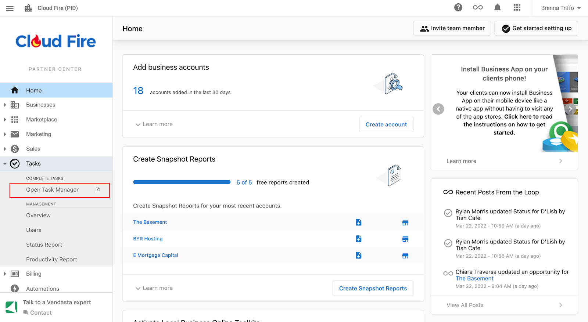

# Vendor Onboarding - Getting Started Guide

## About this Guide

This guide pairs with the [Vendor Operations Guide](/partner-center/top-navigation/vendor-center/vendor-onboarding-guide/operational-requirements-for-marketplace-vendors). Together these guides support a Project dashboard that will be shared with you detailing every step necessary for releasing a Product or Service to the Vendasta Marketplace. This Project is a **shared checklist** that facilitates collaboration with the Vendasta Solution Architecture team through Vendasta's Task Manager system. Each task in the Project corresponds to specific sections in these guides, but we would encourage you to review the guide contents in their entirety from the outset of your Marketplace journey. After signing your Vendor distribution agreement, you will be emailed the link to your project, but can navigate back to it any time via [Partner Center>Tasks>Projects](https://partners.vendasta.com/task-manager/reporting).

There may be some pertinent information in these guides for any Partner looking to set up a product to sell to their own clients, but they are purpose built for parties approved to release products and services in Vendasta's curated Marketplace.

## Overview

Congratulations on beginning your integration into the Vendasta Marketplace! The Vendasta Marketplace is a powerful platform for getting your products and services in front of Resellers worldwide.

## What is Vendasta?

Vendasta operates a comprehensive platform that enables vendors to distribute and market their products and services to a broad network of resellers. It acts as a bridge, connecting vendors to a diverse range of small and medium-sized businesses (SMBs) through Vendasta's Reseller network.

Resellers in Vendasta's network are able to market, sell, bill, and fulfill in one place and at scale. They sign up under a subscription model allowing them to purchase from the Vendasta Marketplace at wholesale rates, and resell these products and services to their clients.

## A Vendor's Place in the Vendasta Ecosystem

Vendasta's white-label platform includes a Marketplace featuring hundreds of digital solutions. Vendors are integral to the Vendasta ecosystem. The Marketplace is populated by a range of products and services provided by Vendors like you!

## Who will be buying my product?

Your products and service will be purchased by the Reseller through the Vendasta Marketplace and then sold to the Reseller's client. Reseller's also often purchase products or services for their own use.

Sometimes Resellers want to be the sole point of contact with their clients, and sometimes they prefer for Vendors to interact with their clients directly.

## What Does a Marketplace Integration Entail?

There are a number of features that may be implemented when preparing a Product or Service for distribution in the Vendasta Marketplace. Some of the features are required, and some are optional depending on the offering.

Once your Marketplace Agreement is signed you will receive a welcome email, with a link to your onboarding project. You can navigate back to this project any time via [Partner Center>Tasks>Projects](https://partners.vendasta.com/task-manager/reporting). The project is a **Shared Checklist** between you and the Vendasta Vendor team, and will include any **required operations tasks, and integration points**, links to the related documentation, as well as provide an avenue for you to ask questions of the Vendasta Vendor team if you require assistance.

## Getting Started

If you are not already a Vendasta partner, someone from your organization should have received platform credentials. If not please reach out to your Vendor Account Manager to receive an invite.

## Adding your Team Members

Team members are invited from the My Team page in Partner Center: 

[Partner Center>Administration>My Team](https://partners.vendasta.com/my-team)

**NOTE:** If you are a Vendor offering a service, you will want to provide all team members with the Digital Agent Role, which will allow them to log in to Task Manager if needed.

## Accessing Vendor Center

Vendor Center URL: [vendors.vendasta.com](http://vendors.vendasta.com/)

There are two ways to access Vendor Center

1. Log in directly at [https://vendors.vendasta.com](http://vendors.vendasta.com/) 
2. Through the Partner Center app navigation toggle on the right-hand side of the top navigation bar. 

***To access Vendor Center, you need first to be added as a Partner Center Admin.***

## Adding Your Product

**Vendor Center**

Click the 'Add Product' button in the top right of the dashboard.

**Partner Center**

Click the 'Create Product' button in the top right of [Partner Center>Marketplace>Products](https://partners.vendasta.com/marketplace/manage-products). Click 'Continue editing in Vendor Center' if you're not ready for the sku to appear in Partner Center for activation. You can publish it later from Vendor Center.

**Competitor Analysis**

Partner Center is your portal for accessing Vendasta's ***Marketplace*** where your product will soon live. As a Vendor, you have full access to the [Marketplace](https://partners.vendasta.com/marketplace/products). We suggest spending some time browsing through the Marketplace products to see what other Vendors have done. Look for complementary products and competitor products. Gain an understanding of how your product fits within the larger Vendasta Marketplace and think about how it is adding value or filling a void.

## Building Your Product

**Step 1)** Review the Product Structure Guidelines & Product Pricing Guidelines in the [Vendor Operations Guide](/partner-center/top-navigation/vendor-center/vendor-onboarding-guide/operational-requirements-for-marketplace-vendors)

**Step 2)**

Now that you have your skus in place, watch the video below for instructions on how to begin building out your product in Vendor Center. 

<iframe src="//www.youtube-nocookie.com/embed/uKs4uX5ghQ4" width="560" height="315" frameBorder="0" allowFullScreen></iframe>

## Product Fulfillment

Vendasta provides a project management platform that allows for collaboration between Vendors, Resellers, and end clients. Receive an interactive order form when your service is purchased, communicate with Resellers on project expectations and timelines using the Inbox, and have a shared view of Project Tasks.

## Post Product Release

There are several features that won't unlock until your first product has been released. There are also specific processes and requirements around making updates to already distributed skus.

**When searching your own product, you will not find it under Discover Products.** Instead, you will want to navigate to Marketplace > Products > My Products.

**Your product will always show as $0 / Free in your own Partner Center. We don't charge you to activate your own products.**

## Making Changes to a released SKU

After your product is released into the Marketplace, you may want to make changes to your offering. You are able to do this in Vendor Center. It is important to note, however, that when you make a change to your product after it has been released, any change will need to be approved by Vendasta before the new version is published in the Marketplace.

To request approval on a change, navigate to the "Compare Products" tab and click the Request Approval button. *Webhooks are currently excluded from the versioning system, and changes to them will go live immediately - thus ensure you've tested them on a sandbox product prior to shifting to production*.

## Building your Reseller network

The Resellers page in Vendor Center provides you with a list of Resellers who are selling your product. A Reseller will show up in your Resellers tab once they have enabled it. They will do this by finding it in the Discover Products page in their Partner Center, and then clicking 'Start Selling'. This will make the sku available to add to their Store and activate on Accounts. 

## Building relationships with Resellers

Our most successful Vendors are those who develop relationships with Resellers that have started selling their products, and thus have expressed interest in working with the Vendor. 

## Platform Inbox

Vendasta provides a platform wide communication system that allows for collaboration between Partners, Vendors, and their shared clients. At this time 3 way white-labeled conversations are not possible, but this is something that will be added in the future.

The majority of Resellers opt into Vendor communications via the Vendasta Inbox. **It is expected that your team will monitor and respond to communications from the Resellers that are selling your products.**

If you click the speech icon, you will be taken to Inbox where you can send the Reseller a message:

## Notifications

The users you've added as Partner Center Admins will receive notifications for Inbox messages, so you may want to add multiple Team Members OR **add a group email address monitored by any member of your team who is responsible for responding to these inbound messages.** Please refer to the [Adding your Team Members](#adding-your-team-members) section of this guide.

Notification preferences are set per Team Member within Partner Center. For additional information about Reseller Notifications, please refer to the Reseller Notification Guide.

## Vendor Accounts List

In Vendor Center, find the Resellers currently leveraging your product or service, and all of the Accounts they have sold your products to. You can also track the Status of the account as either "Active" or "Inactive" and how many active products are activated at that account.

## Platform Overview

You will primarily be interacting with Vendor Center, but there are several other Vendasta dashboards that you will interact with to configure, test, and manage your Marketplace Offerings in an ongoing fashion.

**Partner Center**

Partner Center is primarily designed as an area for Resellers to manage their accounts and prospects, create email marketing campaigns and automations, visit Marketplace and build out their store, manage and send invoices, and activate and deactivate products on accounts. 

*To learn more about Partner Center check out this* [article](/getting-started/intro-to-vendasta/partner-center-overview)

Actions Vendors will take in Partner Center:

- [Manage Admin platform access for your team](https://partners.vendasta.com/my-team)
- [Create test Accounts](https://partners.vendasta.com/manage-accounts)
- [Test activation of your skus](/commerce/orders/activate-products)
- [Access the Business App](/getting-started/intro-to-vendasta/partner-center-overview)

**Whitelabelled Business App**

Business App was built specifically for small-to-medium-sized businesses (SMBs) to provide them with a single portal where they can access products and services purchased through the Reseller's Store, maintain their business profile, view proof of performance reporting, and maintain their list of customers.

*To learn more about Business App check out this* [Article](/business-app/get-started/overview/business-app-overview)

- Test Single Sign On into your Product
- Test Trial activation
- Test the Executive Report
- Test the Activity Stream

## Vendor Proof of Performance

The Executive Report is a proof of performance reporting tool that is available for clients in their Business App. The Executive Report gives clients a roundup of recent activity and any changes in their digital marketing presence. It generates automatically on either a monthly or weekly basis. The Executive Report is a great way to build trust in a product and growth through time. A more in depth look at the Executive report can be found in the [Executive Report Overview](/business-app/executive-report).

It is a requirement for all product vendors to integrate into the Executive Report. 

## Task Manager

Task Manager is important to understand for Vendors integrating a *service*.

Task Manager is Vendasta's in-platform project management tool. Tracking the fulfillment of your service through Task Manager is a requirement for all service vendors.

The following Task Manager features are essential for a Service Vendor to understand:

- Adding your team to Task Manager
- Accessing Task Manager
- Creating templates (See Fulfillment Project documentation)
- Communicating with clients (Seel Fulfillment Project documentation)

**Providing Team Members with Access to Task Manager**

To provide your team member with Task Manager, you will need to add them as a "Digital Agent" under Administration > My Team > Invite team member.

**Accessing Task Manager**

There are two ways that you can access Task Manager

1. Through Partner Center
2. Directly through [https://task-manager.biz/](https://task-manager.biz/)

To access Task Manager through Partner Center, locate the "Tasks" tab on your left-hand side menu bar and click "Open Task Manager."

## Glossary

**Vendor**  
A Vendor is someone who has a product listed in the Vendasta Marketplace. There are two types of Vendors: Product Vendor and Service Vendor. Product Vendors are typically independent software vendors offering a product with deep technical integrations whereas Service Vendors provide a fulfilled service such as web design or blog posts.

**Vendasta Marketplace**  
An online Marketplace of products and services that are available for Resellers to purchase and resell to their clients.

**Reseller**  
A Reseller is someone who has signed up under Vendasta's subscription model and will resell Marketplace products to their clients. In the Vendasta ecosystem, reseller, Channel partner, and Agency are used interchangeably.

**Client**  
The client is the customer of the Reseller. In the Vendasta ecosystem, client, end user, and SMB are used interchangeably.

**SMB**  
An SMB is a small-to-medium-sized business. Most of Vendasta's Resellers sell to SMBs.

**Product**  
A product is an app that this listed in the Vendasta Marketplace. Products are usually defined by the fact that they have a deep technical integration into the Vendasta Platform.

**Service**  
A listing in the Marketplace that refers to fulfillment work that is completed for or on behalf of a client.

**Partner Center**  
Partner Center is the central hub for Resellers. In Partner Center, Resellers are able to manage their accounts, create email marketing campaigns and automation, visit Marketplace and build out their store, manage and send invoice, and activate products on accounts.

**Vendor Center**  
Vendor Center is the area of the platform where Vendors can go to build out their marketplace offering and connect with Resellers.

**Task Manager**  
Task Manager is Vendasta's project management tool.

**Business App**  
Business App is the end user dashboard and is the portal where end users will go to access the products and services that they have purchased. Business App is also home to end user reporting in the form of the Executive Report where they can see how the products and services that they have purchased have improved their online presence.

**Store**  
The Reseller's online store where they can add the products and services from the Marketplace. that they are wanting to resell. Depending on each Reseller's configurations, the store can be accessed through Business App, embedded on their website, or shared via a link.

**Activate**  
To activate a product means to make it available to use on an account.

**Deactivate**  
To deactivate a product is to make a product no longer active on an account. When a product is deactivated, it can no longer be accessed by the user.

**Account**  
An account refers to a single business location. The clients (business locations) that a Reseller works with are added into Partner Center as accounts.

**Pending Activation**  
An activation is in a pending state if your purchase workflow required Vendor Approval before the product can be active on an account. Activations in a pending state can be approved in Vendor Center.

**Executive Report**  
The Executive Report is an auto-generated weekly or monthly proof of performance reporting tool that gives Resellers and their clients a rundown of how the products and services they are utilizing are working to improve their online presence. The Executive Report is available as a tab in their Business App and is also sent to clients via email on either a weekly or monthly basis.