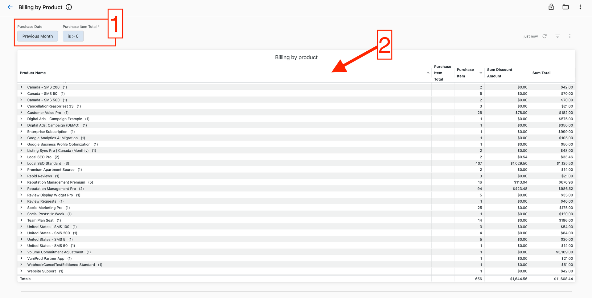
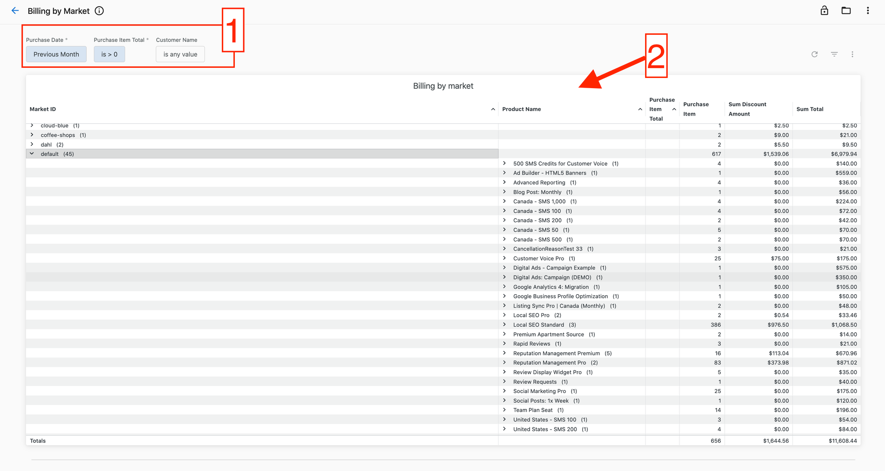
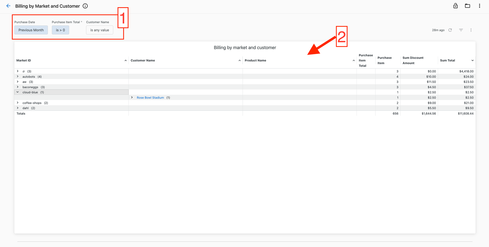
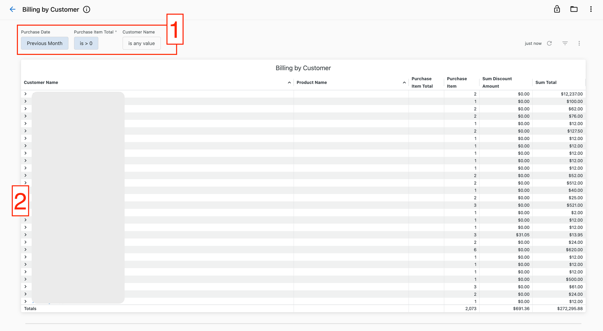
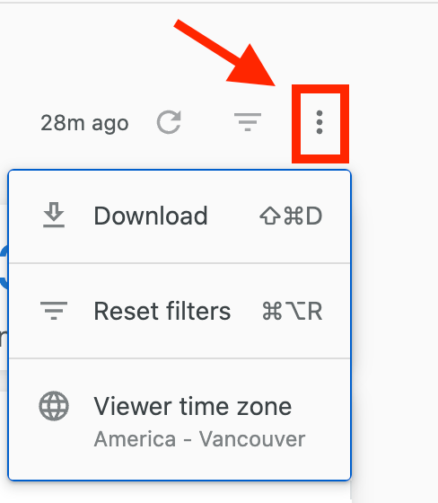
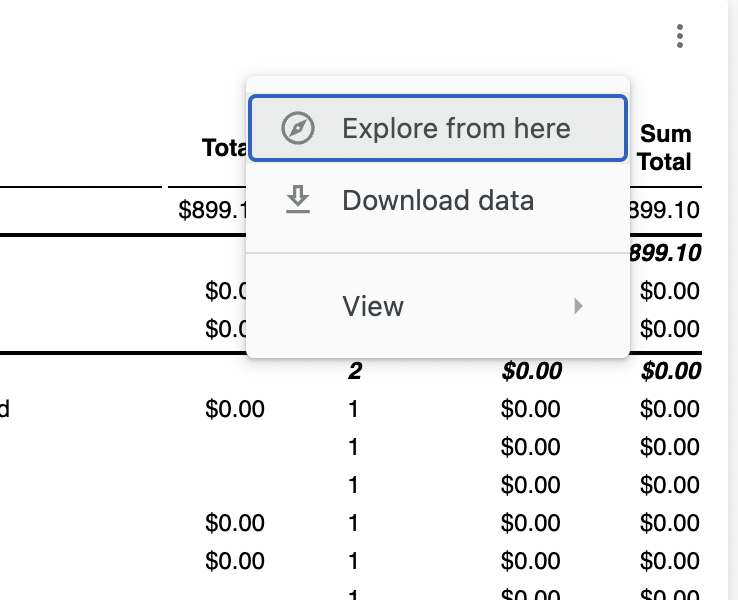
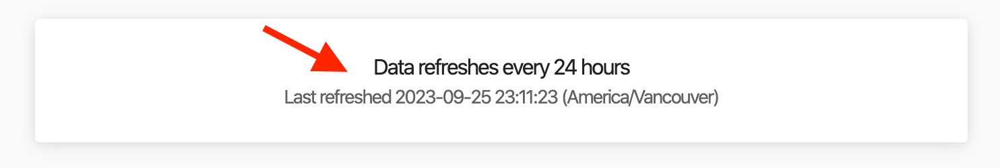

# Premium Reports: Billing

### **Billing by Product Report**

See all your product purchases in a selected timeframe with the Billing by Product Report! This helps you understand how the total spend was distributed across the products purchased in the selected timeframe and how many units of each product were purchased.

1. Select a timeframe of interest using the filter up at the top.
2. See the number of units of each product, discounts and totals in the table.

### **Billing by Market Report**

See your product purchases by market in a selected timeframe. This helps you understand the spending across markets and the distribution of spend across products in each market in the selected timeframe.

1. Select a timeframe of interest or hone in on specific customers using the filters up at the top.
2. See the number of units of each product, discounts and totals in the table.

### **Billing by Customer and Market Report**

See your product purchases by market and customers in the selected timeframe. This allows you to see your spending in a market as a whole and drill down into the spend by customer.

1. Select a timeframe of your interest or hone in on specific customers using the filters up at the top.
2. See number of units of each product purchased, discounts and totals in the table.

### **Billing by Customer Report**

See all your product purchases by customer in a selected timeframe. You can use this data to reconcile your accounts or to see the total spend for customers in the timeframe selected.

1. Select a timeframe that you want to see purchases in, or hone in on a specific customer using the filters at the top.
2. See the number of products purchased, discounts and totals in the table below.

*To download the data in the report click on the three-dot icon over to the top right-hand side of the dashboard, followed by 'Download' to see the download options.*

*If you would like to download the data from a specific chart, click the three dots next to the chart, and select 'download data.'*

A dashboard is often constructed from a set of different data sources. There are data freshness labels at the bottom of each dashboard that indicate the following two things:

1. The refresh interval (text in bold and on top). This reflects how often the data source with the lowest refresh frequency gets updated.
2. The last refresh timestamp (text at the bottom). This reflects the earliest time when a data source was last updated in the dashboard.

