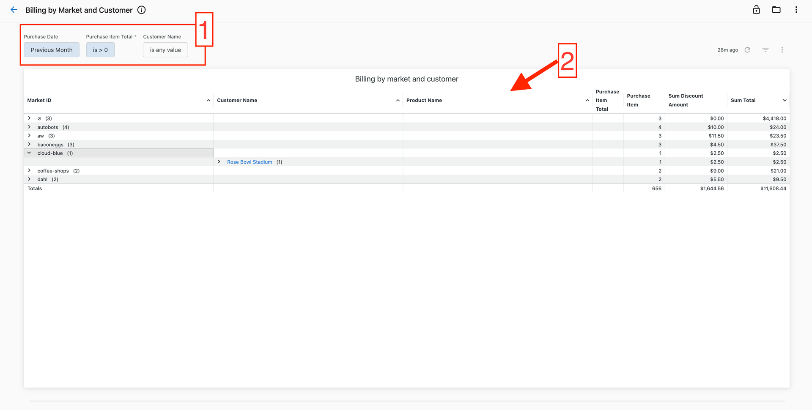
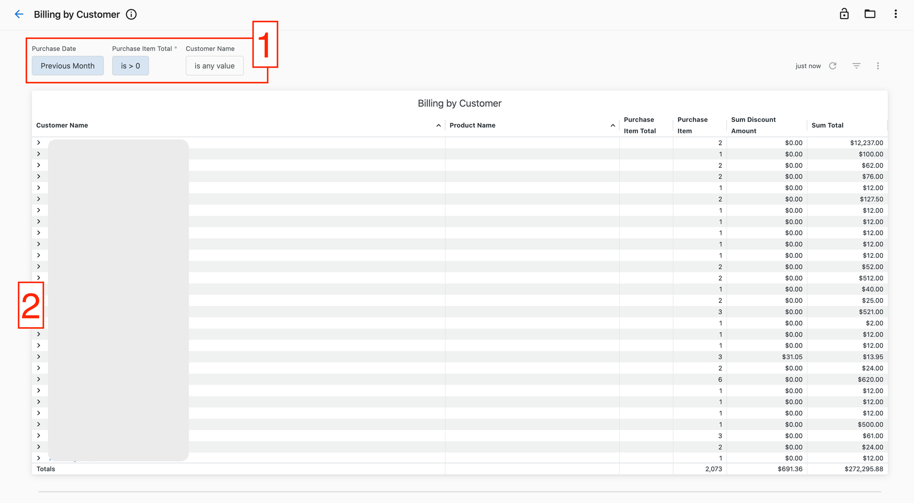
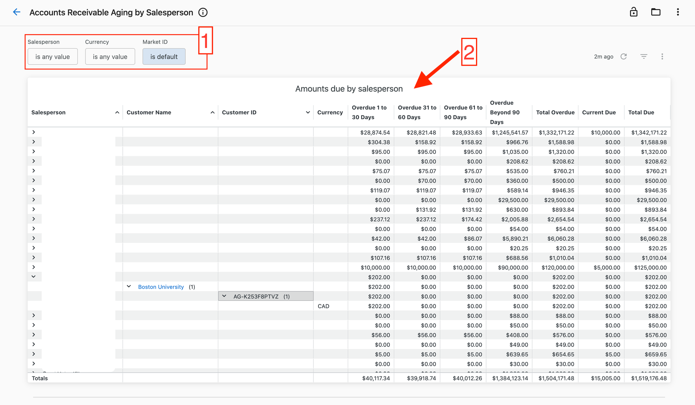
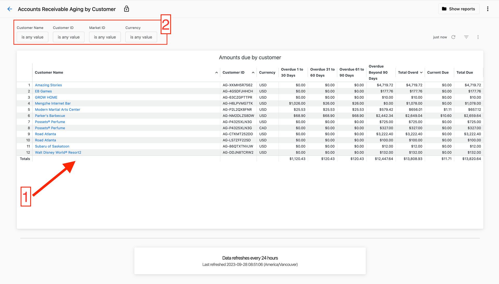
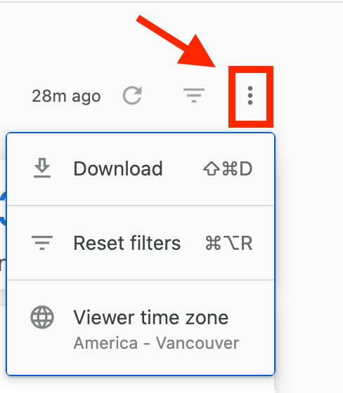

Track your organization's financial performance with detailed billing analytics and accounts receivable management. These reports provide insights into revenue distribution, payment patterns, and outstanding balances across products, markets, and customers.

## Billing reports

### Billing by product report

View all product purchases in a selected timeframe to understand spending distribution across products and unit quantities purchased.

1. Select a timeframe using the filter at the top
2. Review the number of units, discounts, and totals for each product in the table

### Billing by market report

Analyze product purchases by market to understand spending patterns across different regions and product distribution within each market.

1. Select a timeframe or filter by specific customers using the top filters
2. View units purchased, discounts, and totals by market in the table

### Billing by customer and market report

Examine product purchases by market and customer, allowing you to see market-wide spending and drill down into individual customer spend.

1. Select your timeframe or filter by specific customers using the top filters
2. Review units purchased, discounts, and totals by customer within each market

### Billing by customer report

View all product purchases by individual customer in a selected timeframe for account reconciliation and customer spend analysis.

1. Select a timeframe or filter by specific customer using the top filters
2. Review products purchased, discounts, and totals for each customer

## Accounts receivable reports

### Accounts receivable aging by salesperson

Track outstanding balances and overdue amounts segmented by the salesperson associated with each account.

1. Review amounts due and overdue by salesperson, customer, and currency in the table
2. View overdue amounts bucketed into 30-day windows to determine follow-up priority
3. Click on amounts to see detailed invoice breakdowns
4. Use filters to select specific markets, currencies, or salespersons

:::caution
When multiple currencies are involved, filter by `Currency` or `Market-ID` (markets with single currency) to ensure totals and subtotals calculate correctly.
:::

### Accounts receivable aging by customer

Monitor outstanding balances by customer to track payment terms compliance and identify accounts requiring follow-up.

1. View currently due and overdue amounts by customer in the table
2. Review overdue amounts in 30-day buckets to prioritize collection efforts
3. Click amounts to see contributing invoice details
4. Filter by specific accounts, markets, or currencies at the top

:::caution
When multiple currencies are involved, filter by `Currency` or `Market-ID` (markets with single currency) to ensure totals calculate correctly.
:::

## Download options

Download financial report data in multiple formats:

**For complete reports:**
1. Click the three-dot icon in the top-right corner
2. Select `Download` to view format options

**For specific charts:**
1. Click the three dots next to any chart
2. Select `Download data`

## Data freshness

Financial reports are updated daily at 12:00 AM UTC. Data freshness labels at the bottom of each dashboard indicate:

1. **Refresh interval** (bold text): How often the data source with lowest refresh frequency updates
2. **Last refresh timestamp** (bottom text): Earliest time when any data source was last updated

:::tip
Use financial reports to identify revenue trends, track payment patterns, and prioritize collection efforts. The aging reports help maintain healthy cash flow by highlighting overdue accounts requiring immediate attention.
:::

## Related articles

- [Premium Reports overview](./index.mdx) - Getting started with Premium Reports
- [Sales performance reports](./sales-performance-reports.mdx) - Sales activity and pipeline analysis
- [Operations reports](./operations-reports.mdx) - Account connections and automation monitoring
