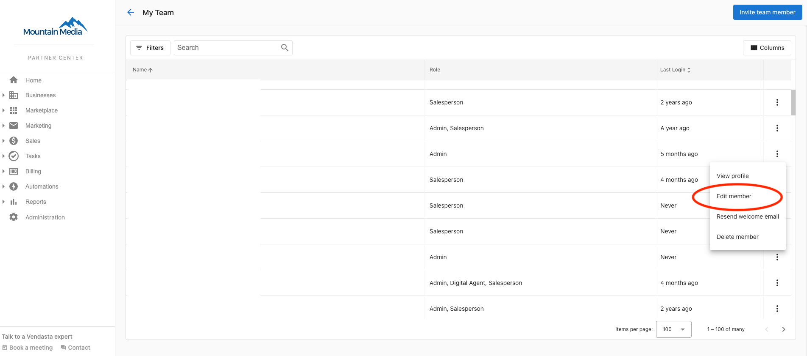
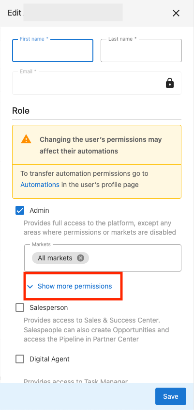
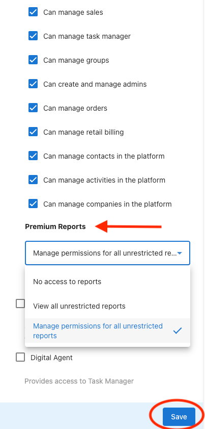

# Premium Reports Overview

Premium Reports allows you to elevate your reporting capabilities by providing you with access to intuitive reports that deliver detailed analytics about your organization.

## What Reports are available?

There are several different reports available at this moment with many more in the development stage! Here's a quick overview of what's currently available.

### Sales Activities By Salesperson

Gain deeper insights into the actions your sales teams are taking to connect and nurture prospects with this Premium Report! The Sales Activities Report tracks the number of activities being completed by each of your team members while providing you with visibility into exactly what activities they're doing (calls, emails, notes, and more)!

{/*  */}

Access the [Sales Activities By Salesperson documentation](/reports/premium-reports/sales-activities-by-salesperson) for more information!

### Sales Pipeline Performance

Get a real-time view of how your Sales team is performing with the Sales Pipeline Performance report! This report gives you valuable insights like average deal size, opportunities won, win rate, and much more! 

{/*  */}

Access the Sales Pipeline Performance documentation for more information!

### Billing

Stay on top of your Billing, Invoicing, Payments, and more with the Billing Report. Gain insights into valuable metrics like ARPU and Recurring Revenue at a glance while being able to filter on your regions, billing models, and more!

Access the Billing documentation for more information!

### Automations

The Automations report gives you a better understanding of how your Automations are running with reports on which Automations are running the most, and the success rates of your Automations.

Access the Automations documentation for more information!

### Invoicing & Payments

The Invoicing & Payments report provides you with a comprehensive overview of your organization's invoice and payment information. Gain insights into your paid, outstanding, and overdue invoices with this report.

Access the Invoicing & Payments documentation for more information!

### Accounts

Gain insights into your Accounts with the Accounts report. This report provides user-friendly breakdowns by assigned salesperson, plan, region, and more!

{/*  */}

Access the Accounts documentation for more information!

## How do I access the Premium Reports area?

If your organization has Premium Reports enabled, you can access them directly from the left sidebar of your Partner Center. Look for the "Premium Reports" option in your navigation.

## Who qualifies for Premium Reports?

Premium Reports are included as part of the Vendasta Platform for Growth and Scale partners. You can find more information about Vendasta's Platform Tiers on [our website](https://www.vendasta.com/platform/).

## I'm having trouble accessing my Premium Reports

Check out our [FAQ on troubleshooting Premium Reports access](/reports/premium-reports/faq-why-cant-i-access-my-premium-report) for help resolving common issues.