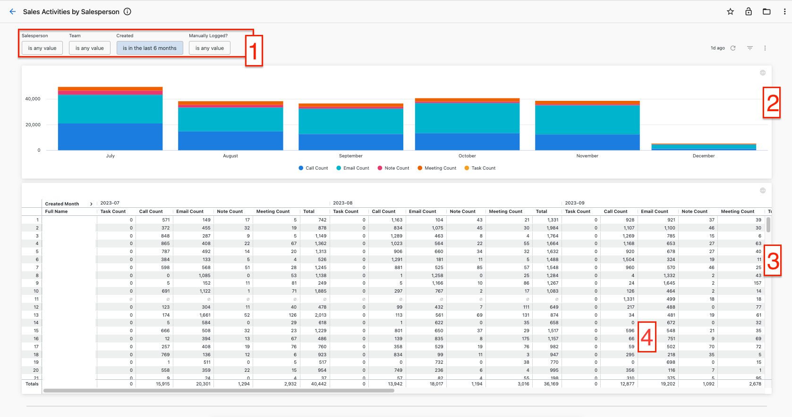
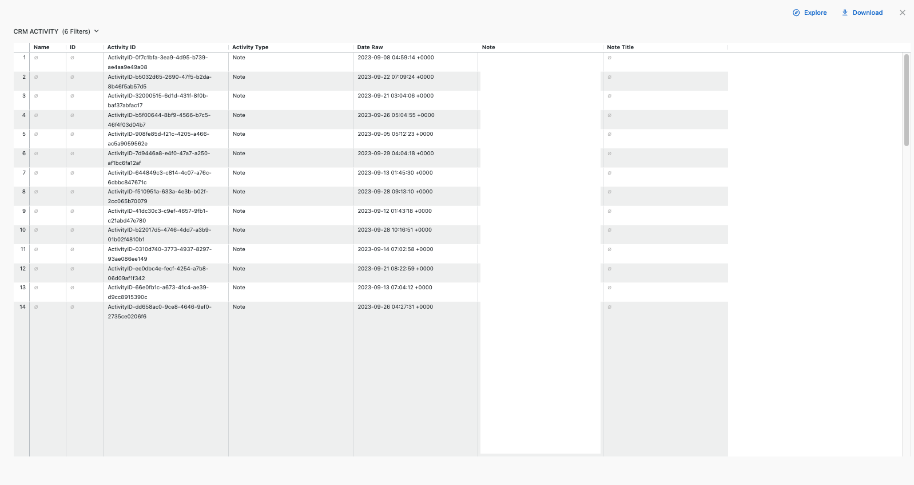
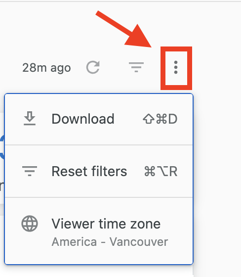

The Sales Activities by Salesperson report is a comprehensive tool that consolidates the multitude of customer interactions and efforts undertaken by the sales team each month.

1. You can hone in on sales activities during a certain period or look at a specific salesperson or team using the filters up at the top. You can also filter for activities that were logged manually versus activities that were automatically captured in the system.
2. The bar chart provides an easy way to keep track of sales activity aggregated numbers at a glance.
3. In the table, you can see the monthly activity counts per salesperson.
4. By clicking on the counts in the table, you will see a detailed view of all activities contributing to that count. You can also access the breakdown by clicking one of the slices in the bar chart.

To download the data in the report click on the three-dot icon over to the top right-hand side of the dashboard, followed by 'Download' to see the download options.

A dashboard is often constructed from a set of different data sources. There are data freshness labels at the bottom of each dashboard that indicate the following two things:

1. The refresh interval (text in bold and on top). This reflects how often the data source with the lowest refresh frequency gets updated.
2. The last refresh timestamp (text at the bottom). This reflects the earliest time when a data source was last updated in the dashboard.

