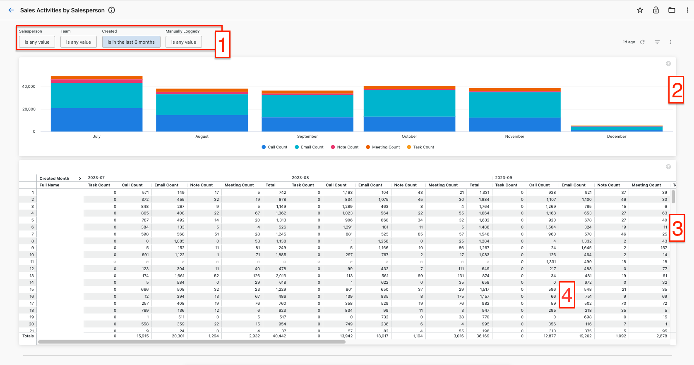
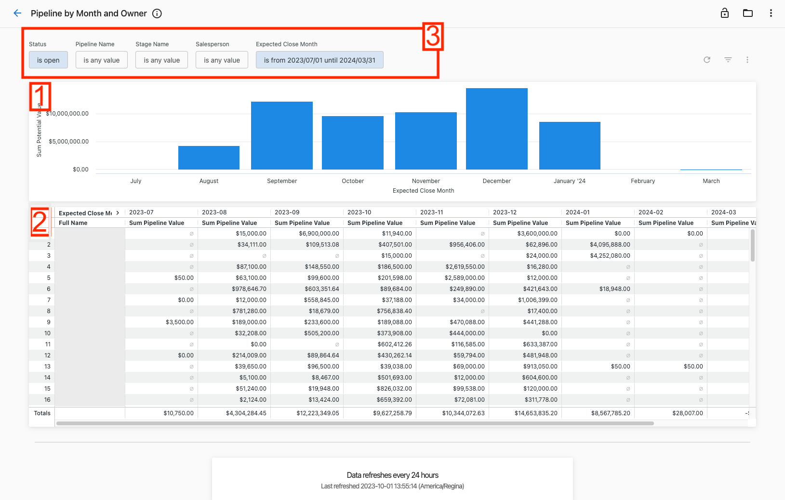
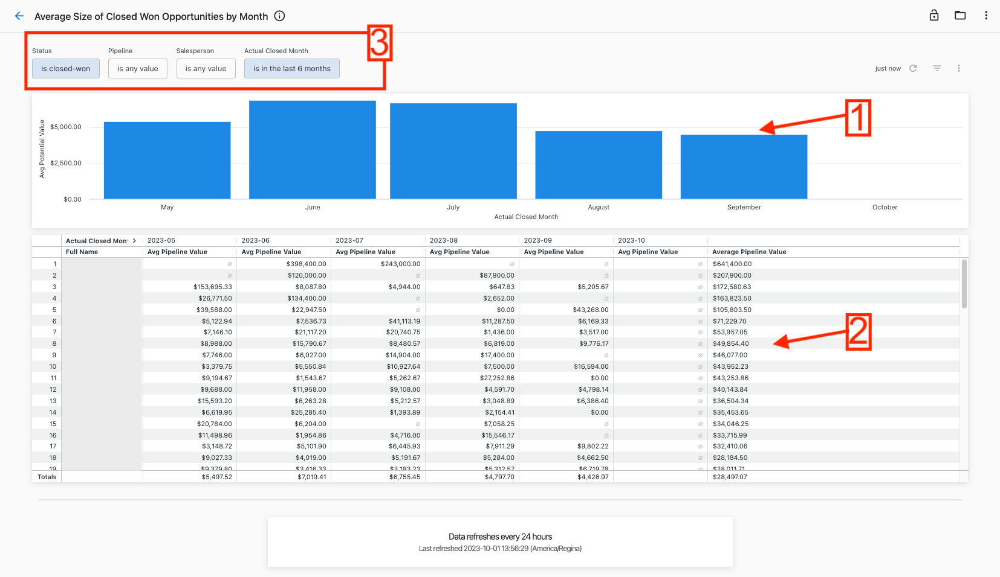
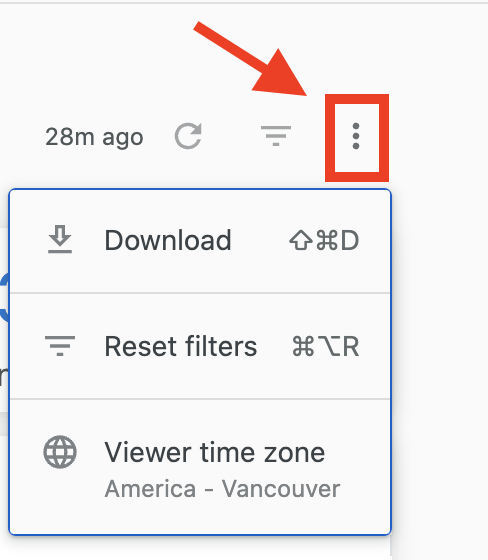

# Sales performance reports

Monitor and analyze your sales team's performance with comprehensive activity tracking and pipeline analysis. These reports provide insights into sales activities, opportunity progression, deal sizes, and team productivity.

## Sales activities by salesperson

Track customer interactions and sales efforts undertaken by your team each month with detailed activity breakdowns.

1. Filter by time period, specific salesperson, or team using the top filters
2. Choose between manually logged activities or automatically captured system activities
3. View aggregated activity numbers in the bar chart for quick insights
4. Review monthly activity counts per salesperson in the detailed table
5. Click table counts or chart slices to see detailed activity breakdowns

The detailed view shows all activities contributing to each count, providing visibility into specific customer interactions and sales efforts.

## Pipeline performance reports

### Account creation by salesperson

Monitor how many accounts were created each month, grouped by assigned salesperson to track new business generation.

1. Filter by creation period or specific salesperson using the top filters
2. View the aggregate trend of accounts created by month in the visualization
3. Review detailed monthly counts by salesperson in the table
4. Click numbers to see which specific accounts make up those counts

### Pipeline by month and owner

Track pipeline value for each month and owner to monitor sales progress and identify potential issues.

1. View total potential value for each month in the bar chart
2. Review detailed pipeline value per salesperson for each month in the table
3. Use filters to narrow by status, specific pipeline, stage name, salesperson, or expected close month

Sales managers can identify which salespeople are on track to meet goals and which need additional support, while spotting pipeline trends.

### Average closed won deal size

Analyze the average size of closed won opportunities each month to track deal progression and identify trends.

1. View average pipeline value trends in the monthly bar chart
2. Review detailed average pipeline values per salesperson in the table
3. See salesperson averages in the rightmost column and monthly averages in the bottom row
4. Filter by status, pipeline, salesperson, or actual close month

Use this data to compare average deal sizes over time and benchmark against other teams or industry standards.

### Long-term pipeline trends

Monitor pipeline size changes over time to track growth and identify trends in pipeline composition.

1. View unique opportunities at the beginning of each month broken down by pipeline stage
2. Track closed won counts for specific months
3. Monitor closed lost counts for specific months  
4. Filter by specific pipeline or actual close month to drill down

This report shows pipeline size on the 1st of each month grouped by historical stage, helping identify how pipeline composition changes over time and whether growth efforts are working.

### Stale opportunity identification

Identify opportunities that haven't been updated recently to ensure no deals are forgotten or neglected.

The Stale Dated Opportunities report helps sales teams follow up on potentially neglected opportunities and ensure active management of all deals in progress.

## Download options

Download sales performance data for further analysis:

**For complete reports:**
1. Click the three-dot icon in the top-right corner of any dashboard
2. Select **Download** to view available formats

**For specific data sets:**
- Click individual chart elements to access detailed breakdowns
- Use table filters to refine data before downloading

## Data freshness

Sales performance reports are updated daily at 12:00 AM UTC. Data freshness information appears at the bottom of each dashboard:

1. **Refresh interval** (bold text): How often the data source with lowest refresh frequency updates
2. **Last refresh timestamp** (bottom text): Earliest time when any data source was last updated

:::tip
Use sales performance reports to track individual and team productivity, identify coaching opportunities, and monitor pipeline health. Regular review helps ensure consistent sales activities and healthy deal progression.
:::

## Related articles

- [Premium reports overview](./overview.mdx) - Getting started with Premium Reports
- [Financial reports](./financial-reports.mdx) - Billing and accounts receivable analytics
- [Operations reports](./operations-reports.mdx) - Account connections and automation monitoring
