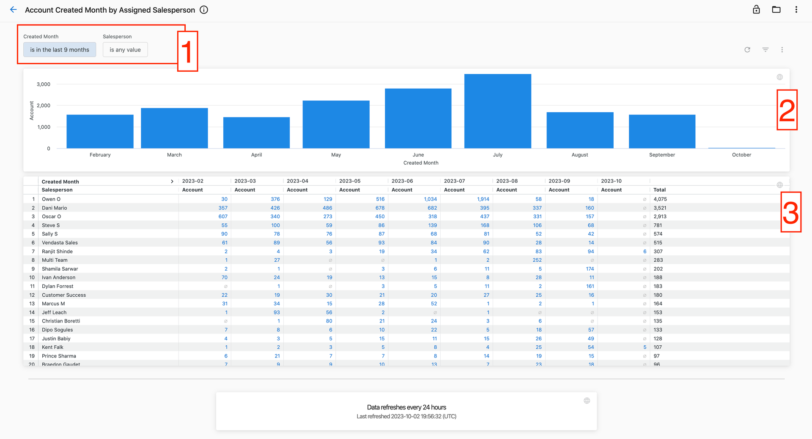
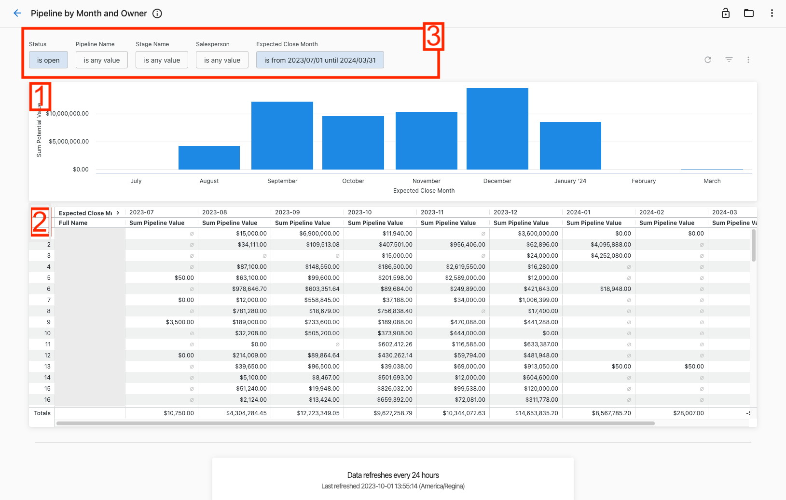
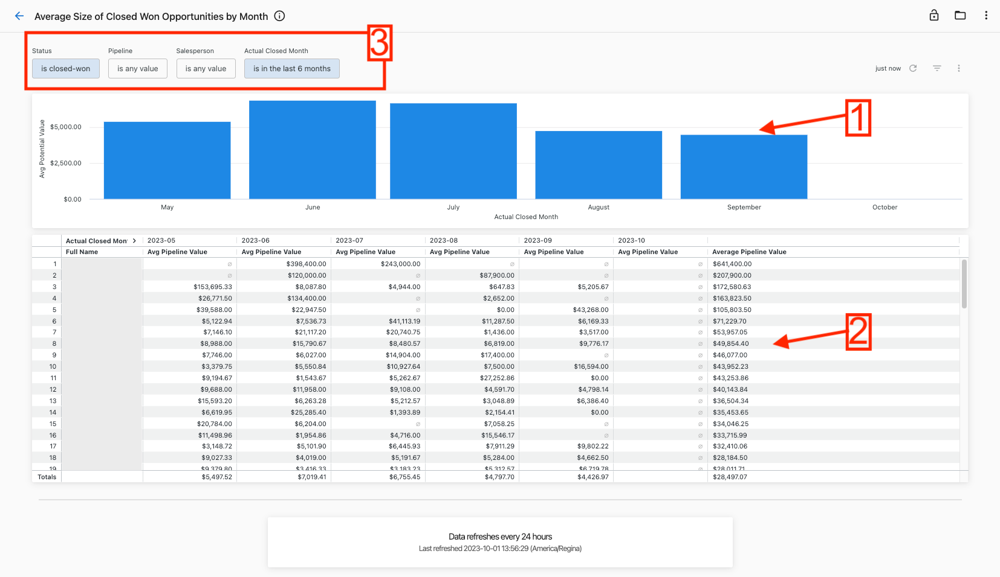
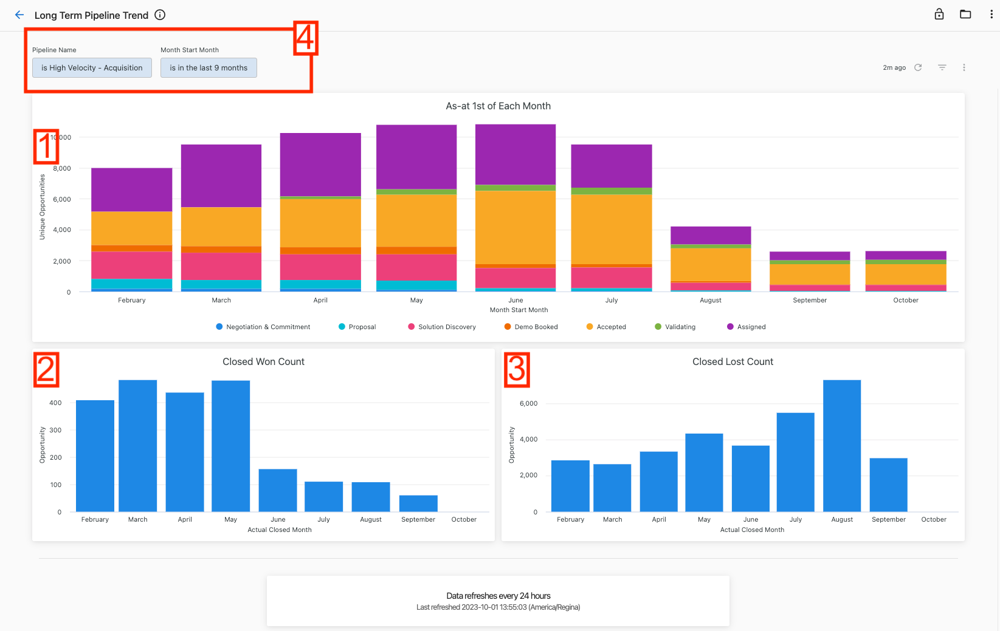

# Premium Reports: Sales Pipeline Performance

## Account Created Month by Assigned Salesperson Report

See how many accounts were created each month, grouped by the assigned salesperson.

1. You are able to hone in on accounts that were created during a certain period or look at a specific salesperson using the filters up at the top.
2. See the aggregate number of accounts created by month in this visualization to understand the trend.
3. See the number of accounts created each month by salespersons for months in the selected period in the table. You are able to click on the numbers here and see what accounts make up those numbers.

## Pipeline by Month and Owner Report

The Pipeline by Month and Owner report shows the pipeline for each month and owner. This report is useful for sales managers to track the progress of their team and identify any potential problems.

Sales managers can use this information to see which salespeople are on track to meet their goals and which salespeople need additional support. They can also use this information to identify any trends in the pipeline.

1. The bar chart shows the total potential value for each month.
2. The table provides a detailed view of the potential pipeline value per salesperson expected to close in a given month.
3. The filters at the top allow you to filter on the status, a specific pipeline, the stage name, a salesperson, and the expected close month to drill down the data.

## Average Size of Closed Won Opportunities by Month Report

The Average Size of Closed Won Opportunities by Month report shows the average size of closed won opportunities for each month. This report is useful for sales teams to track their progress and identify any trends.

Sales teams can use this information to see how their average deal size is changing over time. They can also use this information to compare their average deal size to other sales teams or to industry benchmarks.

1. The bar chart shows the average pipeline value for each month.
2. The table provides a detailed view of the average pipeline value for each salesperson in a given month. It also averages the pipeline value for a salesperson at the far right and also shows the average pipeline value for a given month.
3. The filters at the top allow you to filter on the status, a specific pipeline, a salesperson, and the actual close month to drill down the data.

## Long-term Pipeline Trend Report

The Long Term Pipeline Trend report shows the size of the sales pipeline over time. This report is useful for sales teams to track the growth of their pipeline and identify any trends.

The report shows the size of the pipeline on the 1st of each month and groups the information by the Historical Stage. This allows sales teams to see how the make-up of the pipeline has changed over time.

The report also shows the overall trend in the size of the pipeline. This allows sales teams to see if their efforts to grow the pipeline are working.

1. The bar chart provides the number of unique opportunities at the beginning of each month and their breakdown based on the pipeline stage.
2. The visualization provides the number of closed won counts in a specific month.
3. The bar chart provides the number of closed lost counts in a specific month.
4. The filters at the top allow you to filter on a specific pipeline and the actual close month to drill down the data.

## Stale Dated Opportunity Report

The Stale Dated Opportunities report identifies opportunities that have not been updated in a certain period of time. This report is useful for sales teams to identify opportunities that may have been forgotten or neglected.

Sales teams can use this information to follow up on stale opportunities and ensure that they are still being worked on.